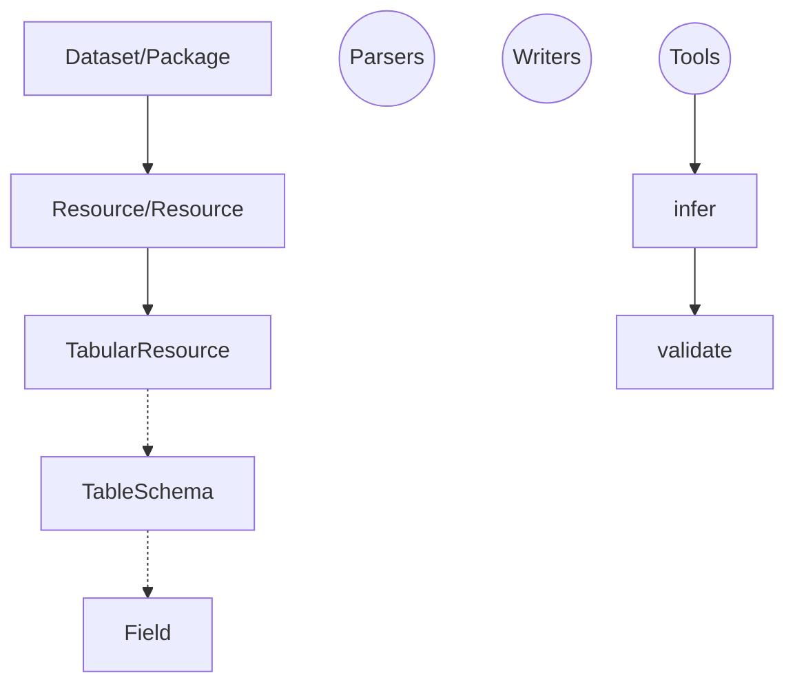
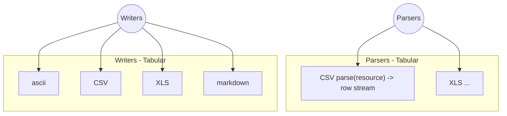
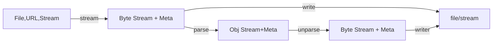

# Frictionless Data Lib Pattern

> See https://okfnlabs.org/blog/2018/02/15/design-pattern-for-a-core-data-library.html for original post
>
> See https://github.com/frictionlessdata/tableschema-js/issues/78 for original issue

This document outlines a simple design pattern for base "driver" style Frictionless libraries.

The pattern is focused on access and use of:

* individual resources (files,streams etc)
* collections of resources ("datasets")

Its primary operation is `open`:

```
resource = open('path/to/file.csv')
dataset = open('path/to/files/')
```

It defines a standardized "stream-plus-metadata" interface for file and dataset objects, along with methods for creating these from resource or dataset pointers such as file paths or urls.

```
resource = open('path/to/file.csv')
resource.stream()
resource.rows()
resource.descriptor
resource.descriptor.path
...
```

This pattern derives from many years experience working on data tools and projects like [Frictionless Data][]. Specifically:

[Frictionless Data]: https://frictionlessdata.io/

* **Data "plus"**: when you work with data you always find yourself needing the data itself plus a little bit more -- things like where the data came from on disk (or is going to), or how large it is. This pattern gives you that information in a standardized way.
* **Streams (and strings)**: streams are the standard way to access data (though strings are useful too) and you should get the same interface whether you've loaded data from online, on disk or inline; and, finally, we want both raw byte streams *and* (for tabular data) object/row streams aka iterators.
* **Building blocks**: most data wrangling, even in simple cases, involves building data processing pipelines. Pipelines need a standard stream-plus-metadata interface to pass data between steps in the pipeline. For example, suppose you want to load a csv file and convert to JSON and write to stdout: that's already three steps (load, convert, dump). Then suppose you want to delete the first 3 rows, delete the 2nd column. Now you have a more complex processing pipeline. 

<!--
```mermaid
graph TD

loader -- file pointer/stream + metadata -> op1
op1 -- file pointer/stream + metadata -> op2
op2 -- file pointer/stream + metadata -> writer
```
-->


<p style="text-align: center; font-style: italic">Fig 1: data pipelines and the stream-plus-metadata pattern</p>

The pattern leverages the Frictionless Data specs including [Data Resource][], [Table Schema][] and [Data Package][]. But it keeps metadata implicit rather than explicit and  focuses on giving users the simplest most direct interface possible (put most crudely: `open` then `stream`). You can find more about the connection with the [Frictionless Data][] tooling in the appendix.

Finally, we already have one working implementation of the pattern in javascript:

<https://github.com/datahq/data.js>

Work on a python implementation is underway (most of the code is already there in the python Data Package libraries).

[Data Resource]: https://frictionlessdata.io/specs/data-resource/
[Table Schema]: https://frictionlessdata.io/specs/table-schema/
[Data Package]: https://frictionlessdata.io/specs/data-package/
[CSV Dialect]: https://frictionlessdata.io/specs/csv-dialect/
[Frictionless Data]: https://frictionlessdata.io/


# Overview of the Pattern

The pattern is based on the following principles:

* Data wrangler focused: focus on the core data wrangler workflow: open a file and do something with it
* Zen-like: Simplicity and power. As simple as possible: does just what it needs and no more. 
* Use Streams: stream focused library, including object streams (aka iterators).

A minimal viable interface for the file case:

```javascript
// this example uses javascript but the example is generic

// data.js is just an illustrative name for the library
const data = require('data.js')

// path can be local or remote
// resource is now a data.Resource object
const resource = data.open(pathOrUrl)

// a byte stream
resource.stream()

// if this resource is tabular this will give me a row stream (iterator)
resource.rows()

// descriptor for this resource including info like size (if available)
// the descriptor follows the Data Resource specification
// (and if Tabular the Tabular Data Resource spec)
resource.descriptor
```

For datasets:

```javascript
// path or url to a directory (or datapackage.json)
// dataset is a data.Dataset object
// note: may rename to openDataset if need to disambiguate from open(resource)
const dataset = open(pathOrUrl)

// list of resources
dataset.resources

// readme (if README.md existed)
dataset.readme

// any metadata (either inferred or from datapackage.json)
// this follows the Data Package spec
dataset.descriptor
```

These interfaces can then form the standard basis for lots of additional functionality e.g.

```javascript
infer(resource) => inferred tableschema (and types) for the column

writer(resource) => stream (for saving to disk)

validate(resource) => validate a resource (assumes it has a tableschema)
```

# The Pattern in Detail

**Note: Support for Datasets is optional.** Supporting datasets is an added layer of complexity and some implementors MAY choose to support files only. If so, they MUST indicate this clearly.

## `open` method

The library MUST provide a method `open` which takes a locator to a file and returns a Resource object:

```javascript=
open(path/to/file.csv, [options]) => Resource object
```

`options` is a dictionary of keyword argument list of options. The library MUST support an option `basePath`. `basePath` is for cases where you want to create a Resource with a path that is relative to a base directory / path e.g.

```
resource = open('data.csv', {basePath: '/my/base/path'})
```

Will open the file: `/my/base/path/data.csv`

This functionality is mainly useful when using Resources as part of Datasets where it can be convenient for a  Resource to have a path relative to the directory of the Dataset. (See also Data Package and Data Resource in the Frictionless Data specs).


### Resource locators

Locators can be:

* A file path
* A URL
* Raw data in JSON format
* A Data Resource (in native language structure)

Implementors MUST support file paths, SHOULD support URLs and MAY support the last two.

```javascript
resource = open('/path/to/file.csv')

resource = open('https://example.com/data.xls')

// loading raw data
resource = open({
  name: 'mydata',
  data: { // can be any javascript - an object, an array or a string or ...
    a: 1,
    b: 2
  }
})

// Loading with a descriptor - this allows more fine-grained configuration
// The descriptor should follow the Frictionless Data Resource model
// http://specs.frictionlessdata.io/data-resource/
resource = open({
  // file or url path
  path: 'https://example.com/data.csv',
  // a Table Schema - https://specs.frictionlessdata.io/table-schema/
  schema: {
    fields: [
      ...
    ]
  }
  // CSV dialect - https://specs.frictionlessdata.io/csv-dialect/
  dialect: {
    // this is tab separated CSV/DSV
    delimiter: '\\t'
  }
})
```


## Resource

The Resource instance MUST have the following properties and methods

### Metadata: `descriptor`

Main metadata is available via the `descriptor`:

```javascript=
file.descriptor
```

The descriptor follows the Frictionless Data [Data Resource][] spec.

The descriptor metadata is a combination of the metadata passed in at Resource creation (if you created the Resource with a descriptor object) and auto-inferred information from the Resource path. This is the info that SHOULD be auto-inferred:

```
path: path this was instantiated with - may not be same as file.path (depending on basePath)
pathType: remote | local
name:   file name (without extension)
format: the extension
mediatype: mimetype based on file name and extension
```

In addition to this metadata there are certain properties which MAY be computed on demand and SHOULD be available as getters on the file object:

```javascript
// the full path to the file (using basepath)
const path = file.path

const size = file.size

// md5 hash of the file
const hash = file.hash

// file encoding
const encoding = file.encoding
```

**Note**: size, hash are not available for remote Resources (those created from urls).

### Accessing data

Accessing data in the file:

```javascript
// byte stream
file.stream()

// if file is tabular
// crude rows - no type casting etc
file.rows(cast=False, keyed=False, ...)

// entire file as a buffer/string (be careful with large files!)
file.buffer()

// (optional)
// if tabular return entire set of rows as an array
file.array()

// EXPERIMENTAL
// file object packed into a stream
// metadata is first line (\n separated)
// motivation: way to send object over single stdin/stdout pipe
file.packed()
```

#### `stream`

A raw byte stream:

```
stream()
```

#### `rows`

Get the rows for this file as an object stream / iterator.

```
file.rows(cast=False, keyed=False, ...) =>
  iterator with items [val1, val2, val3, ...]
```

* `keyed`: if `false` (default) returns rows as arrays i.e. [val1, val2, val3]. If `true` returns rows as objects i.e.. `{col1: val1, col2: val2, ...}`.
* `cast`: if `false` (default) returns values uncast. If true attempts to cast values either using best-effort or TableSchema if available
* `addRowNumber`: default `false`. Add first value or column `_id` to resulting rows with row number. [OPTIONAL for implementors]

**Note:** this method assumes underlying data is tabular. Library should raise appropriate error if called on a non-tabular file. It is also up to implementors what tabular formats they support (there are many). At a minimum the library MUST support CSV. It SHOULD support JSON and it MAY (it is desirable) support Excel.

##### Support for TableSchema and CSV Dialect

The library SHOULD support [Table Schema][] and [CSV Dialect][] in the `rows` method using metadata provided when the file was `open`ed: 

```javascript

// load a CSV with a non-standard dialect e.g. tab separated or semi-colon separated
resource = open({
  path: 'mydata.tsv'
  // Full support for http://specs.frictionlessdata.io/csv-dialect/
  dialect: {
    delimiter: '\\t' // for tabs or ';' for semi-colons etc
  }
})
file.rows() // use the dialect info in parsing the csv

// open a CSV with a Table Schema
resource = open({
  path: 'mydata.csv'
  // Full support for Table Schema https://specs.frictionlessdata.io/table-schema/
  schema: {
    fields: [
      {
        name: 'Column 1',
        type: 'integer'
      },
      ...
    ]
  }
})
```


## Dataset

A collection of data files with optional metadata.

Under the hood it heavily uses [Data Package][] formats and it natively supports Data Package formats including loading from `datapackage.json` files. However, it does not require knowledge or use of Data Packages.

A Dataset has two key properties:

```javascript=
// metadata
dataset.descriptor

// resources in the dataset
dataset.resources
```

### `open` for datasets

The library MUST provide a method `openDataset` that takes a locator to a dataset and returns a Dataset object:

```javascript=
openDataset(path/to/dataset/) => Dataset object
```

The library MAY overload the `open` method to support datasets as well as files:

```javascript=
open(path/to/dataset/) => Dataset object
```

*Note: overloading can be tricky as disambiguating locators for files from locators for datasets is not always trivial.*

#### Dataset Locators

`path/to/dataset` - can be one of:

- local path to Dataset
- remote url to Dataset
- descriptor object (i.e. datapackage.json)


### `descriptor`

A Dataset MUST have a `descriptor` which holds the Dataset metadata. The descriptor MUST follow the [Data Package][] spec.

The Dataset SHOULD have the convenience attribute `path` which is the path (remote or local) to this dataset.

### `identifier` (optional)

A Dataset MAY have a `identifier` property that encapsulates the location (or origin) of this Dataset. The locator property MUST have the following structure:

```
{
  name: <name>,   // computed from path
  owner: <owner>, // may be null
  path: <path>,   // computed path
  type: <type>,   // e.g. local, url, github, datahub, ... 
  original: <path>, // path (file or url) as originally supplied
  version: <version> // version as computed
}
```

*Note: the identifier is parsed from the locator passed into the open method. See the Data Package identifier spec https://frictionlessdata.io/specs/data-package-identifier/ and implementation in data.js library https://github.com/datahq/data.js#parsedatasetidentifier*

### README

The Dataset object MAY support a `readme` property which returns a string corresponding to the README for this Dataset (if it exists).

The readme content is taken from the README.md file located in the Dataset root directory, or, if that does not exist from the `readme` property on the descriptor. If neither of those exist the readme will be undefined or null.

### `files`

A Dataset MUST have `files` property which returns an array of the Resources contained in this Dataset:

```
dataset.files => Array(<Resource>)
```

### addResource

The library SHOULD implement an `addResource` method to add a `Resource` to a Dataset:

```
dataset.addResource(file)
```

* `file`: an already instantiated Resource object or a Resource descriptor

## Operators

Finally, we discuss some operators. These SHOULD not be in the core library but it is useful to be aware of them:

* `infer(file) => TableSchema`: infer the [Table Schema][] for a CSV file or other tabular file
  * `inferStructure(file)`: infer the structure i.e. [CSV Dialect][] of a CSV or other tabular file. In addition to CSV dialect properties this may include things like `skipRows` i.e. number of rows to skip
* `validate(file/dataset, metadataOnly=False)`: validate the data in a file e.g. against its schema 
  * `metadataOnly`: only validate the metadata e.g. against the [Data Package][] or [Data Resource][] schemas.
* `write(file/dataset)`: write a Resource or Dataset to disk


# Conclusion

In this document we've outlined a "Frictionless Data Library" pattern that standardizes the design of a "core" data library API focused on accessing files and datasets.

Almost all data wrangling work involves opening data streams and passing them between processes. Standardizing the API would have major benefits for tool creators and users, making it quicker and easier to develop tooling as well as making tooling more "plug and play".


# Appendix: Why we need a pattern like this

## All data wrangling tools need to load and then pass around "file-like objects" as they process data

All data tools need to access files/streams:

```
data = open(path/to/file.csv)
```

And so every programming language and every tool have a method for opening a file path and returning a byte-stream.

But ...

## A file is more than a byte stream: the stream may be structured and there is usually the need for associated metadata

Often we need more than just a byte stream, for example:

* We may want the stream to be structured: if it is a CSV file we're opening we'd like to get a stream of row objects not just a stream of bytes
* We may want file metadata to be available (where did the file come from, how big is the file, when was it last modified)
* We may want schema information: not just the CSV file but type information on its columns (this would allow us to reliably cast the CSV data to proper types when reading)
* And we may even want to add metadata ourselves (perhaps automatedly), for example guessing the types of the columns in a CSV

*A file is more than a byte stream: the stream may be structured and there is usually the need for associated metadata, at a minimum the name and size of the file but also extending to things like a file schema.*

## Tool authors find themselves inventing their own "stream-plus-metadata" objects ... but they are all different

Tool authors find themselves inventing their own file-like "stream-plus-metadata" objects to describe the files they open.

*Note: Many languages have "file-like" object that usually consists of a stream plus some metadata (e.g. python `file` object, Node Streams etc). But this is not standardized and is often inadequate so tool makers end up wrapping or replacing it.*

This is not just about opening files but about passing streams around with because most tools, even very simple ones, start to contain implicit mini data pipelines:

<!--
```mermaid
graph LR

file[Resource on Disk] --"open"-> fileobj[Stream / Resource-like Object]
fileobj --parse-> strstream[Structured Stream]
strstream -.-> other[More ...]
```
-->


These stream-plus-metadata objects contain implicit mini-metadata standards for describing files and collections of files ("datasets"). These mini-metadata standards look like [Data Resource][], [Table Schema][], [Data Package][] etc.

But these stream-plus-metadata objects and their mini-metadata are all a little different across the various languages and tools.

## Plus, many tools also need to access collection of files, i.e. datasets

Many tools want to access collections of files e.g. datasets:

```
dataset = open(/path/to/dataset)
```

Datasets already require some structure to list their collection of files and usually require some additional metadata ranging from where the dataset was loaded from to items such as its license.

You can even have datasets without multiple files when the file you are using is implicitly a dataset. For example, an Excel file is really a dataset if you think of each sheets as a separate file stream or think of an sqlite database.

## Having a common API pattern for files (stream-plus-metadata) and datasets would reduce duplication and support plug and play with tooling 

Standardizing the structure of these stream-plus-metadata file objects (and dataset objects), and building standard libraries to create them from file/dataset pointers would:

* Reduce repetition / allow for reuse across tools: at present, data wrangling tool write this themselves. They now have a common pattern and may even be able to use a common underlying library.
* Support plug and play: new wrangling can operate on these standard file and dataset objects. For example, an inference library that given a file object returns an inferred schema, or a converter that converts xls => csv. 

# Appendix: Design Principles

The pattern is based on the following principles:

* Data wrangler focused: focus on the core data wrangler workflow: open a file and do something with it
* Zen-like: Simplicity and power. As simple as possible: does just what it needs and no more. 
* Use Streams: stream focused library, including object streams.

## Orient to the data wrangler workflow

*See motivation section above*

* Open => Read / Stream
* [optional] Inspect
* Check
* Operate on
* Write

## Zen - maximum viable simplicity

As simple as possible. Does just what it needs and no more. Simple and powerful.

Zen =>

* "thin" (vs fat) objects: all complex operators such as infer or dump operate *on* objects rather than becoming part of them
* a single open method to get data (file or dataset)
* hide metadata by default (data package, data resource etc are in the background)

### Core objects should be kept as simple as possible (and no simpler)

=> Inversion of control where possible so that we don't end up with "fat" core classes e.g.

A. save data to disk should be separate objects that operate on the main objects rather than built into them e.g.
    
```
const writer = CSVWriter()
writer.writer(dataLibResourceObjectInstance, filePath, [options])
```

rather than e.g.

```
dataLibResourceObjectInstance.saveToCsv(filePath)
```

*If there is a simple way to invert dependency (i.e. not have all different dumper in main lib) but have a simple save method that would be fine.*

B. Similarly for parsers (though reading is so essential that read needs to be part of of the class)

C. infer, validate etc should operate *on* Resources rather than be part of it ...

```javascript=
const tableschema = infer(fileObj)
```

Rather than

```javascript=
fileObj.inferSchema()
```

## Use Streams

Streams are the natural way to handle data and it scales to large datasets.

The library should be stream focused library, including object streams.

# Appendix: Internal Library Structure Suggestions

*These are some suggestions for how implementors could structure their library internally. They are entirely optional.*

## Library Components

In top level library just have Dataset and Resource (+ TabularResource)





## Streams




open => yields descriptor and file stream
parse => yields file rows (internally uses parsers)
writer => writers

```javascript=
// aka write
writer(Resource) => readable stream

parser(Resource) => object stream
```

## Loaders/Parsers and Writers

Loaders/Parsers and Writers should be be an extensible list.

Inversion of control is important: the core library does **not** depend directly on parsers (that way we can hot swap and/or extend the list at runtime).

Parsers:

```javascript=
// file is a data.Resource object
parse(file) => row stream
```

Writers are similar:

```javascript=
// e.g. csv.js

// dump to CSV file
write(file, path) => null
```

Note we may want a writer for datasets as well e.g. a writer to datapackage.json or to sql or ...

```javascript
write(dataset, destination ...)
```

# Appendix: API with Data Package terminology

*In progress*


```javascript
// data.js is just an illustrative name for the library
var data = require('data.js')

// path can be local or remote
const resource = data.open(pathOrUrl)

// a byte stream
resource.stream()

// if this file is tabular this will give me a row stream (iterator)
resource.rows()
```

For packages

```javascript
// path or url to a directory (or datapackage.json)
const package = data.open(pathOrUrl)

// list of files
package.resources

// readme (if README.md exists or there is a description in the metadata)
package.readme

// any metadata (either inferred or from datapackage.json)
package.descriptor
```

# Appendix: Connection with Frictionless Data

I've distilled this pattern out of the work of myself and others who have worked on [Frictionless Data][] specs and tooling.

It is motivated by the following observations about the Data Package suite of libraries and their Table Schema, Data Resource and Data Package interfaces:

1. These libraries contain functions and metadata that standardize operations that are common to almost all data wrangling tools because almost all data wrangling tools need to handle files/streams and datasets and the core metadata is designed around describing files and datasets -- or inferring and validating that.
2. BUT: by presenting the underlying metadata such as Data Resource, Data Package front and centre and hiding the common operations (e.g. open this file) they make a rather **unnatural** interface for data wranglers. 
3. Most data wranglers start from an immediate need: display this csv on the command line, convert this excel file to csv etc. At the simplest, most data wrangling tools need some function like `open(file) => file-like object` where the file-like object can be be used for other tasks

> **Metaphorically: the current data package libraries put the skeleton (the metadata) "on the outside" and the "flesh" (the actual methods wranglers want to use) on the "inside" (they are implicit or hidden with the overall library)**

What follows from this insight is that we should invert this:

* "Put the flesh on the outside": Create a simple interface that addresses the common needs of data wranglers and data wrangler tooling e.g. `open(file)`
* Put the bones on the inside: leverage the Frictionless Data metadata structures but put them on the inside, out of sight but still available if needed.

*Note: it may be appropriate to continue to have a dedicated Data Package or Table Schema library but keep it **really** simple*

Here's how I put this in the original issue https://github.com/frictionlessdata/tableschema-js/issues/78:

> **People don't care about Data Packages / Resources, they care about opening a data file and doing something with it**
> 
> > *Data Packages / Resources come up because they are a nicely agreed metadata structure for all the stuff that comes up in the **background** when you do that.*
>
> Put crudely: Most people are doing stuff with a file (or dataset), and they want to grab it and read it preferably in a structured way e.g. as a row iterator -- sometimes inferring or specifying stuff a long the way e.g. encoding, formatting, field types.
>
> => **Our job is to help users to open that file (or dataset) and stream it as quickly as possible.**

### Recommendations for Frictionless Data community

Suggestions:

* Users want to do stuff with data fast. This implies that a library like tabulator is more immediately appropriate to end users than data-package or table-schema
* The current set of FD libraries is bewildering and confusing, especially for new users. There are several complementary libraries plus some of the API is pretty confusing (see appendix for more on this)

Recommendations:

* Have a primary "gateway" library oriented around reading and writing data and datasets.
* This can be based around a simplified Package and Resource interface and library
  * Move auxiliary functionality to libraries e.g. infer, 
  * Make parsers / loaders (and writers) to a plugin model so this can be extended easily
* Consider renaming Package and Resource to Dataset and File in the simple library as these are more accessible and common terms

### Why do it?

* Massively grow the potential audience: Create an interface non-DP fanatics can use and want to use (and DP ones too)
* Ease of use: easier for us and others to use
* Elegance: do it right - this is the elegant, functional, beautiful way to do this library

### Relation to Data Packages

* We use Data Package and Table Schema as the metadata model for data files and datasets
* Data Package libraries already implement APIs a bit like this and support many features we want (e.g. infer)
