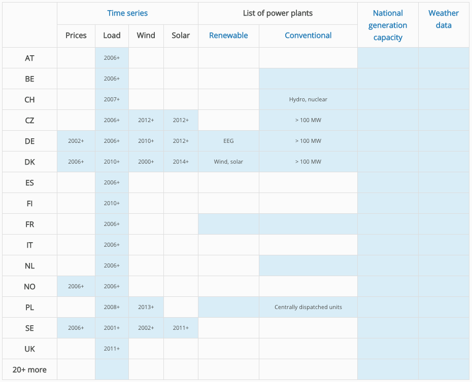

[Open Power System Data](http://open-power-system-data.org/) aims at providing a **free-of-charge** and **open** platform[^platform] that provides the data needed for power system analysis and modeling.

All of our project members are energy researchers.  We struggled collecting this kind of data in what is typically a very burdensome and lengthy process.  In doing my PhD, I spent the first year collecting data and realized that *not only had many others done that before, but that many others coming later would have to do it again*. This is arguably a huge waste of time and resources, so we thought we (Open Power System Data) should align ourselves and join forces to do this properly, once and for all, and in a free and open manner to be used by everyone.  We are funded for two years by the German government.  After starting work in 2015, we have about one more year to go.

On one hand, people who are interested in European power systems are lucky because a lot of data needed for that research is available.  If you work on, say, Chinese systems, and you are not employed at the Chinese power company, you probably won’t find anything.  On the other hand, if you search long enough (and you know where to look), you can find stuff online (and usually free of charge) on European power systems---not everything you want, but a
big chunk, so in that respect, we are all lucky.  However, this data is quite problematic for many reasons.

*Data availability overview on the platform*

Some of the problems we face in working with data include:

- varied data sources and formats
- licensing issues
- 'dirty' data

### Inconsistent Data Sources and formats

First, it is scattered throughout the Internet and very hard to Google.  For example, the Spanish government will only publish their data in the Spanish language, while the German government will publish only in German, so you need to speak 20 languages if we are talking about Europe.  Second, it is often of low quality.  For instance, we work with a lot with time series data---that is, hourly data for electricity generation and consumption.  Twice a year, during the shift between summer and winter, there is sort of an “extra” or “missing” hour to account for daylight savings time.  Every single data source has a different approach for how to handle that.  While some datasets just ignore it, some double the hours, while others call the third hour something like "3a" and "3b".  To align these data sources, you have to handle all these different approaches.  In addition, some data providers, for example, provide data in one format for the years 2010 and 2011, and then for 2012 and 2013 in a different format, and 2014 and 2015 in yet another format.  A lot of that data comes in little chunks, so some datasets have one file for everything (which is great) but then others provide files split by the year, the month, or even the day.  **If you are not familiar with programming, you can’t write scripts to download that, and you have to manually download three years of daily data files: thousands of files**. Worse, these files come in different formats: some companies and agencies provide CSV files, others Excel files, and still others provide formats which are not very broadly used (e.g. XML and NetCDF).

### Licensing Questions

And maybe least known, but really tricky for us is the fact that all those data are subject to copyright.  These data are open in the sense that they are on the Internet to be accessed freely, but they are not open in the legal sense; you are not allowed to use them or republish them or share them with others.  If you look at the terms of use that you agree on to download, it will usually says that all those data are subject to copyright and you are not allowed to do anything with them, essentially.

This last fact is somewhat surprising.  Mostly, the belief is that if something is free online then it’s “Open” but legally that, of course, doesn’t say anything; **just because something is on YouTube and you can access that for free, that doesn’t mean you can copy, resample, and sell it to someone.  And the same is true for data.** So, in the project, we are trying to convince these owners and suppliers of data to change their terms of use, provide good licenses, publish data under an open license, preferably, something like Creative Commons[^cc] or the ODbL[^odbl], or something else that people from the open world use.  That’s a very burdensome process; we just talked to four German transmission system operators and it took us a full year of meetings and emails to convince them.  They finally signed on to open licensing last month.

### 'Dirty' data aka the devil in the details

Some of the most annoying problems are not the major problems, but all these surprising minor problems.  As I mentioned earlier, I work a lot with time series data and there are so many weird mistakes, errors, or random facts in the data.  For example, we have one source where every day, the 24th hour of the day is *simply missing* so the days only have 23 hours.  Another weird phenomenon is that another data source, a huge data source that publishes a lot, only starts the year aligned on weeks, so if the first Monday falls on January 4th, they might miss the first four days of the year.  If you want to model energy consumption for a year, you can’t use the data at all because the first four days are missing.  So, nitty-gritty nasty stuff like this that makes work really burdensome if you look at this scale of numbers of information: you have to find these errors while looking at hundreds of thousands of data entry points.  There’s of course, nothing you can easily do manually.

Our target users are researchers, economists, or engineers interested in energy; they are mostly familiar with Excel, or some statistical software like R, SPSS, or STATA but they are not programmers or data scientists.  As a result, they are not experts in data handling and not trained in detecting errors, missing data, and correct interpolation.  If you know where to look to find gaps in your data, this is quickly done.  However, if you are doing this kind of data wrangling for the first time (and you don’t really want to do it, but rather you want to learn something about solar power in Switzerland) then this is, of course, a long detour for a lot of our users.

We collect time series data for renewable and thermal power plants, each of which we compile into a dataset that follows the specification for a Tabular Data Package[^tdp], consisting of a `datapackage.json` file for metadata and a CSV file containing the actual data. On top of this we include the same data in Excel format and also some differently structured CSV files to suit the needs of different user types.  We also implemented a framework that parses the content of the `datapackage.json` and renders it into a more human-readable form for our website.

Where the data in each column is homogeneous in terms of the original source, as is the case with time series data, the `datapackage.json` file is used to document the sources per column.

We started this project only knowing what we wanted to do in vague terms, but very little understanding of how to go about it, so we weren’t clear at all about how to publish this data.  The first idea that we had was to build a database without any of us knowing what a database actually was.

**Step-by-step, we realized we would like to offer a full “package” of all data that users can download in one click and have everything they need on their hard drive.** Sort of a full model input package of everything a researcher would like with the option to just delete (or simply ignore) the data that is not useful.

We had a first workshop[^firstworkshop] with potential users, and I think one of us, maybe it was Ingmar, Googled you and found out about the [Data Package specification](https://specs.frictionlessdata.io/data-package/). That it perfectly fit our needs was pretty evident within a few minutes, and we decided to go along with this.

A lot of our clients are practitioners that use Microsoft Excel as a standard tool.  If I look at a data source, and I open a well structured Excel sheet with colors and (visually) well structured tables, it makes it a lot easier for me to get a first glimpse of the data and an insight as to what’s in there, what’s not in there, its quality, how well it is documented, and so on.  So the one difficulty I see from a user perspective with the Data Package specification (at least, in the way we use it) is that CSV and JSON files take more than one click in a browser to get a human-readable, easily understandable, picture of the data.

The stuff that is convenient for humans to structure content---colors, headlines, bolding, the right number of decimals, different types of data sorted by blocks, with visual spaces in between; this stuff makes a table aesthetically convenient to read, but is totally unnecessary for being machine-readable.  The number one priority for us is to have the data in a format that’s machine-readable and my view is that Frictionless Data/Data Packages are perfect for this.  But from the *have-a-first-glimpse-at-the-data-as-a-human perspective*, having a nice colored Excel table, from my personal point of view, is still preferable.  We have decided in the end just to provide both.  We publish everything as a Data Package and on top of that we also publish the data in an Excel file for those who prefer it.  On top of that we publish everything in an SQLite database for our clients and users who would like it in an SQL database.

We also think there is potential to expand on the [Data Package Viewer](http://data.okfn.org/tools/view) tool provided by Open Knowledge International. In its current state, we cannot really use it, because it hangs on the big datasets we're working with.  So mainly, I would imagine that for large datasets, the Data Package Viewer should not try to show and visualize all data but just, for example, show a summary. Furthermore, it would be nice if it also offered possibilities to filter the datasets for downloading of subsets. The filter criteria could be specified as part of the `datapackage.json`.

The old data package viewer, referenced above, is now deprecated. The new data package viewer, available on [create.frictionlessdata.io](http://create.frictionlessdata.io), addresses the issues raised above.

Generally I think such an online Data Package viewer could be made more and more feature-rich as you go. It could, for example, also offer possibilities to download the data in alternative formats such as Excel or SQLite, which would be generated by the Data Package viewer automatically on the server-side (of course, the data would then need to be cached on the server side).

Advantages I see from those things are:

* Ease of use for data providers: Just provide the CSV with a proper description of all fields in the `datapackage.json`, and everything else is taken care of by the online Data Package viewer.
* Ease of use for data consumers: They get what they want (filtered) in the format they prefer.
* Implicitly that would also do a proper validation of the`datapackage.json`: Because if you have an error there, then things will also be messed up in the automatically generated files. So that also ensures good `datapackage.json` metadata quality in general which is important for all sorts of things you can do with Data Packages.

Regarding the data processing workflow we created, I would refer you to our processingscripts[^scripts] on GitHub. I talked a lot about time series data – this should give you an [overview](https://github.com/Open-Power-System-Data/time_series/blob/master/main.ipynb); here are the [processing details](https://github.com/Open-Power-System-Data/time_series/blob/master/processing.ipynb).

In the coming days, we are going to extend the geographic scope and other various details---user friendliness, interpolation, data quality issues---so no big changes, just further work in the same direction.

[^cc]: <https://creativecommons.org/>
[^odbl]: <http://opendatacommons.org/licenses/odbl/>
[^tdp]: Tabular Data Package specifications: <https://specs.frictionlessdata.io/tabular-data-package/>
[^firstworkshop]: First Workshop of Open Power System Data: <http://open-power-system-data.org/workshop-1/>
[^scripts]: GitHub repository: <https://github.com/Open-Power-System-Data>
[^platform]: Data Platform: <http://data.open-power-system-data.org/>