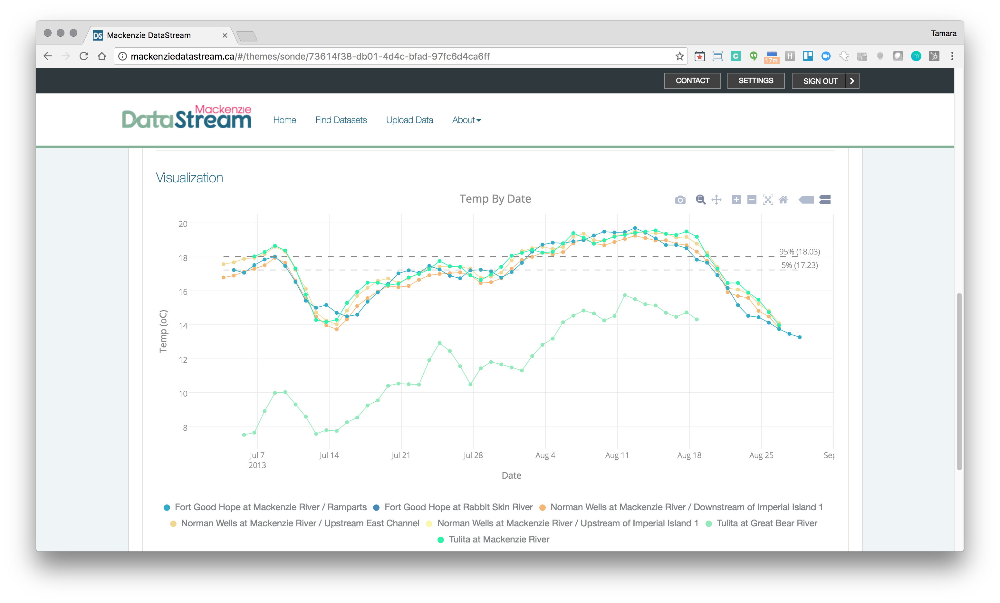

Tesera is an employee-owned company, founded in 1997.  Our focus is helping our clients create data-driven applications in the cloud.  We also maintain two core product lines in addition to our consulting practice.  [MRAT.ca](https://www.linkedin.com/showcase/municipal-risk-assessment-tool/about/) helps municipalities identify risk of basement flooding, while [forestinventory.ca](https://cran.r-project.org/web/packages/forestinventory/index.html) (High Resolution Inventory Services) enables forest and natural resource companies to access a new level of accuracy and precision in resource inventories and carbon measurement.

[](http://tesera.com/) <br/> *[MRAT.ca](https://www.linkedin.com/showcase/municipal-risk-assessment-tool/about/) and forestinventory.ca*

We deal with data from a variety of sources ranging from sample plots to in situ sensors. We grab samples and measurements to remotely sensed information from LiDAR, colour infrared and others.  Many proprietary specifications exist across those data sources, and to work around this, we’ve adopted CSV as our universal format.  We use Data Packages[^datapackages], CSV files, and  Table Schema[^tableschema] to create database tables, validate data schemas and domains, import data from S3[^amazons3] to PostgreSQL, DynamoDB[^amazondynamodb], and Elastic[^elastic].  In some cases we also use these Frictionless Data specs to move between application components, in particular where multiple technologies (Python, R, Javascript, and other) are utilized in a workflow.

We have adopted the Data Package standard as a simple, elegant way to describe and package our CSV data for interoperability between systems and components.  We use this in conjunction with the Table Schema which enables us to define rules and constraints[^tsconstraints] for each field in the CSV file.  With this in mind we have set up our workflows to essentially connect S3 buckets with analytical processes. We have written some simple open-source AWS Lambda[^amazonlambda] functions that let us easily invoke validation and sanitization at the end of each process on the backend.  We also expose this to the frontend of some of our applications so users can work through an import/contribution process where they are shown issues with their data that must be fixed before they can contribute.  **This helps us ensure good interoperable data at a foundational level, thereby making it easier to use for analysis, visualization, or modeling without extensive ad-hoc quality control.**

 <br/> *Example of validation error ("not a number") on import driven by Table Schema metadata*

We discovered Frictionless Data through GitHub by following Max Ogden and some of the interesting work he is doing with [Dat](http://datproject.org/).  We were looking for simpler, more usable alternatives to the “standards” web-services craze of the 2000s.  We had implemented a large interoperability hub for observation data called the [Water and Environmental hub (WEHUB)][^wehub] which supported various [OGC](http://www.opengeospatial.org/) standards ([WaterML](http://www.opengeospatial.org/standards/waterml), [SOS](http://www.opengeospatial.org/standards/sos)) which was supposed to make important information accessible to many stakeholders, but in reality, nobody was using it.  We were looking for a simpler way to enable data access and use for developers and downloaders alike.

We are especially keen on software that enables faster interoperability, especially within an AWS environment.  We envision a framework of loaders, validators, sanitizers, analyzers, and exporters, fundamentally based around Amazon S3, various databases, and Lambda or Elastic Container Service[^amazonec2] (for larger processes).  **Having supported a lot of clients with a lot of projects, our goal has been to remove the common grunt work associated with data workflows to enable effort to be prioritized towards the use and application of the data.**

For instance, every data portal needs a way to import data into the system and likely a way to export data from the system.  Depending on the complexity of the application and the size of the imports and exports, various approaches were utilized which directly leveraged the database or relied on various libraries.  *The friction required to load and begin to make use of the data often consumed a large portion of project budgets.* By moving towards common methods of import and export (as enabled by Data Package and Table Schema and deployed to Elastic Container Service and/or Lambda), we’ve been able to standardize that aspect of our data applications and not have to revisit it.

As the "Internet of Things" threatens to release yet another round of standards for essentially observation data, we hope to keep things simple and use what we have for these use cases as well.  Smaller imports and exports can readily be executed by Lambda; when they are more complex or resource-intensive, Lambda can trigger an ECS task to complete the work.

We developed some basic CSV to DynamoDB and ElasticSearch loaders in support of a Common Operating Picture toolset for the [Fort McMurray Wildfires](https://en.wikipedia.org/wiki/2016_Fort_McMurray_wildfire). In the coming days, we would like to clean those up, along with our existing RDS loaders and Lambda functions and start moving towards the framework described.  We are cleaning up and open sourcing a number of utilities to facilitate these workflows with the goal of being able to describe data types in CSV files, then automatically map them or input them into a model. There may be an opportunity to explicitly identify how spatial feature information is carried within a Data Package or Table Schema.

We are kind of excited about the method and framework itself to have almost [Zapier](https://zapier.com/)- or
[IFTTT](https://ifttt.com)-like capabilities for CSV data where we can rapidly accomplish many common use cases enabling resources to be prioritized to the business value.  On the application side, we have been getting pretty excited about ElasticSearch and Kibana[^kibana] and perhaps extending them to bring together more seamless exploration of large dynamic geospatial datasets, especially where the data is continuous/temporal in nature and existing GIS technology falls pretty flat.  This will be important as smart cities and "Internet of Things" use cases advance.

## Projects

*This next section will explore two Tesera-developed projects that employ the Frictionless Data specifications: the Provincial Growth and Yield Initiative Plot Sharing App (PGYI) and Mackenzie DataStream.*

### 1. Provincial Growth and Yield Initiative Plot Sharing App

<!-- <http://pgyi.tesera.com/> NB: Link not working --> 

 <br/> *The Provincial Growth and Yield Initiative Plot Sharing App*

With this app, we are enabling the 16 government and industrial members of [Forest Growth Organization of Western Canada (FGrOW)](https://fgrow.friresearch.ca/) to seamlessly share forest plot measurement data with each other and know that the data will be interoperable and meet their specifications.  Specifications were designed primarily with the data manager in mind and were formatted as a contribution guidelines document.  From this document, the [afgo-pgyi](https://github.com/tesera/datatheme-afgo-pgyi) "Data Theme" was created which contains the Data Package details as well as the several Table Schemas required to assemble a dataset.  Having access to this large and interoperable dataset will enable their members to improve their growth and yield models and respond to bioclimatic changes as they occur.

We supported FGrOW in creating a set of data standards and then created the Table Schemas to enable a validation workflow.  The members upload a set of relational CSV files which are packaged up as Data Packages, uploaded to S3, and then validated by the Lambda Data Package Validator.  The results of this initial validation are returned to the user as errors (cannot proceed) or warnings (something is wrong but it can be accepted).

 <br/> *PGYI import violations*

At this stage the data is considered imported.  If there are no errors the user is able to stage their dataset which uses the Lambda RDS Loader to import the Data Package into an RDS PostGreSQL instance. This triggers a number of more sophisticated validation functions relating to tree growth rates, measurement impossibilities, and sanity checks at the database level.

 <br/> *PGYI staging violations*

Having previously ensured the data meets the Table Schema and was loaded successfully, we have confidence in executing custom database functions without having to handle endless data anomalies and exceptions.  A simple example check to see if species changes between measurements can be illustrated below:

```
CREATE OR REPLACE FUNCTION staging.get_upload_trees_species_violations(in_upload_id text)
RETURNS SETOF staging.violation AS $$

BEGIN
   -- RULE 1: tree species should not change over time
   RETURN QUERY

       SELECT
           '0'::text,
           staged_tree.upload_id,

           staged_tree.source_row_index,
           'trees'::text,
           array_to_string(ARRAY[staged_tree.company, staged_tree.company_plot_number, staged_tree.tree_number::text], '-'),

           'trees.species.change'::text,
           'warning'::text,
           format('Tree species changed from %s to %s', committed_tree.species, staged_tree.species)

       FROM staging.staged_trees staged_tree
       INNER JOIN staging.committed_trees committed_tree
       USING (company, company_plot_number, tree_number)

       WHERE staged_tree.upload_id = in_upload_id
           AND (staged_tree.species NOTNULL AND staged_tree.species <>'No')
           AND staged_tree.species != committed_tree.species;

END;
$$ LANGUAGE plpgsql;
```

Again the user is presented with violations as errors or warnings and can they can choose to commit the plots without errors into the shared database.  Essentially this three step workflow from imported, to staged, to committed allows FGroW to ensure quality data that will be useful for their modeling and analysis purposes.

FGroW has built a database that currently has 2400 permanent sample plots each containing many trees and all together 10s of millions of measurements across a wide variety of strata including various natural regions and natural sub-regions.  This database provides the numeric power to produce and refine better growth models and enable companies to adopt their planning and management to real conditions.

There are many cases where industries might wish to bring together measurement data in a consistent way to maximize their productivity. **One of the more obvious examples is in agriculture where precision information is increasingly collected at the local or individual farm level, but bringing this information together in aggregate would produce new and greater insight with regard to productivity, broad scale change, and perhaps adaption to climate change strategies.**

### 2. Mackenzie DataStream

<http://www.mackenziedatastream.org/>

 <br/> *Mackenzie DataStream App*

[Mackenzie DataStream](http://www.mackenziedatastream.org/) is an open access platform for exploring and sharing water data in the Mackenzie River Basin.  DataStream's mission is to promote knowledge sharing and advance collaborative and evidence-based decision making throughout the Basin.  The Mackenzie River Basin is extremely large, measuring 1.8 million square kilometers and as such monitoring is a large challenge.  To overcome this challenge, water quality monitoring is carried out by a variety of partners which include communities and Aboriginal, territorial, and federal governments.  With multiple parties collecting and sharing information, Mackenzie DataStream had to overcome challenges of trust and interoperability.

 <br/> *The Mackenzie River Basin*

Tesera leveraged the Data Package standard as an easy way for Government and community partners alike to import data into the system.  We used Table Schema to define the structure and constraints of the Data Themes which we represented in a simple visible way.

 <br/> *Table fields and validation rules derived from Table Schema*

The backend on this system also relies on the Data Package Validator and the Relational Database Loader.  The observation data is then exposed to the client via a simple [Express.js](http://expressjs.com/) API as JSON.  The Frictionless Data specifications help us ensure clean consistent data and make visualization a breeze.  We push the data to [Plotly](https://plot.ly/) to build the charts as it provides lots of options for scientific plotting, as well as a good api, at a minimal cost.

 <br/> *Mackenzie DataStream visualization example*

The Mackenzie DataStream is gaining momentum and partners.  The [Fort Nelson First Nation](http://www.fortnelsonfirstnation.org/) has joined on as a contributing partner and the [Government of Northwest Territories](http://www.gov.nt.ca/) is looking to apply DataStream to a few other datatypes and bringing on some addition partners in water permitting and cumulative effects monitoring.  We think of this as a simple and effective way to make environmental monitoring data more accessible.

 <br/> *Mackenzie DataStream environmental observation data*

There are many ways to monitor the environment, but bringing the data together according to standards, ensuring that it is loaded correctly, and making it accessible via a simple API seems pretty universal.  We are working through a UX/UI overhaul and then hope to open source the entire DataStream application for other organizations that are collecting environmental observation data and looking to increase its utility to citizens, scientists, and consultants alike.

 <br/> *Mackenzie DataStream summary statistics*

[^jupyter]: Jupyter Notebook: <http://jupyter.org/>
[^resource]: Data Package Resource: <https://specs.frictionlessdata.io/data-package/#resource-information>
[^numpy]: NumPy: Python package for scientific computing: <http://www.numpy.org>
[^pandas]: Pandas: Python package for data analysis: <http://pandas.pydata.org/>
[^datapackages]: Data Packages: <https://specs.frictionlessdata.io/data-package/>
[^goodtables]: goodtables: <http://try.goodtables.io>
[^tableschema]: Table Schema: <https://specs.frictionlessdata.io/table-schema/>
[^amazons3]: Amazon Simple Storage Service (Amazon S3): <https://aws.amazon.com/s3/>
[^amazonlambda]: Amazon AWS Lambda: <https://aws.amazon.com/lambda/>
[^github]: GitHub: <https://github.com/>
[^amazonec2]: Amazon EC2: Virtual Server Hosting: <https://aws.amazon.com/ec2/>
[^amazondynamodb]: Amazon DynamoDB: <https://aws.amazon.com/dynamodb/>
[^elastic]: Elastic Search: <https://www.elastic.co/products/elasticsearch>
[^kibana]: Kibana: <https://www.elastic.co/products/kibana>
[^r]: The R Project for Statistical Computing: <https://www.r-project.org/>
[^tsconstraints]: Table Schema Field Constraints: <https://specs.frictionlessdata.io/table-schema/#constraints>
[^wehub]: Water and Environmental Hub: <http://watercanada.net/2013/>
