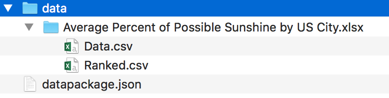
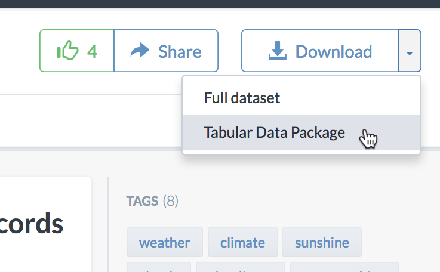

At [data.world][dataworld], we deal with a great diversity of data, both in terms of content and in terms of source format - most people working with data are emailing each other spreadsheets or CSVs, and not formally defining schema or semantics for what’s contained in these data files.

When [data.world][dataworld] ingests tabular data, we “virtualize” the tables away from their source format, and build layers of type and semantic information on top of the raw data. What this allows us to do is to produce a clean Tabular Data Package[^tdp] for any dataset, whether the input is CSV files, Excel Spreadsheets, JSON data, SQLite Database files - any format that we know how to extract tabular information from - we can present it as cleaned-up CSV data with a `datapackage.json` that describes the schema and metadata of the contents.

   *Tabular Data Package structure on disk*

We would also like to see graph data packages developed as part of the Frictionless Data specifications, or “Universal Data Packages” that can encapsulate both tabular and graph data.  It would be great to be able to present tabular and graph data in the same package and develop software that knows how to use these things together.

To elaborate on this, it makes a lot of sense to normalize tabular data down to clean, well-formed CSVs or data that is more graph-like, and to normalize it to a standard format.  RDF[^rdf] is a well-established and standardized format, with many serialized forms that could be used interchangeably (RDF XML, Turtle, N-Triples, or JSON-LD, for example).  The metadata in the `datapackage.json` would be extremely minimal, since the schema for RDF data is encoded into the data file itself.  It might be helpful to use the `datapackage.json` descriptor to catalog the standard taxonomies and ontologies that were in use, for example, it would be useful to know if a file contained SKOS[^skos] vocabularies, or OWL[^owl] classes.

In the coming days, we want to continue to enrich the metadata we include in Tabular Data Packages exported from [data.world][dataworld], and we’re looking  into using `datapackage.json` as an import format as well as an export option.

[data.world][dataworld] works with lots of data across many domains - what’s great about Frictionless Data is that it's a lightweight set of content specifications that can be a starting point for building domain-specific content standards - it really helps with the “first mile” of standardizing data and making it interoperable.

   *Tabular datasets can be downloaded as Tabular Data Packages*

In a certain sense, a Tabular Data Package is sort of like an open-source, cross-platform, accessible replacement for spreadsheets that can act as a “binder” for several related tables of data.  **I could easily imagine web or desktop-based tools that look and function much like a traditional spreadsheet, but  use Data Packages as their serialization format.**

To read more about Data Package integration at [data.world][dataworld], read our post: [Try This: Frictionless data.world](https://meta.data.world/try-this-frictionless-data-world-ad36b6422ceb#.rbbf8k40t).  Sign up, and starting playing with data.

[dataworld]: https://data.world
[^package]: Tabular Data Package: [/data-package/#tabular-data-package](/data-package/#tabular-data-package)
[^datapackage]: Data Packages: [/data-package](/data-package)
[^rdf]: RDF: Resource Description Framework: <https://www.w3.org/RDF/>
[^tdp]: Tabular Data Package specifications: [https://specs.frictionlessdata.io/tabular-data-package](https://specs.frictionlessdata.io/tabular-data-package)
[^skos]: SKOS: Simple Knowledge Organization System: <https://www.w3.org/2004/02/skos/>
[^owl]: OWL Web Ontology Language: <https://www.w3.org/TR/owl-ref/>
