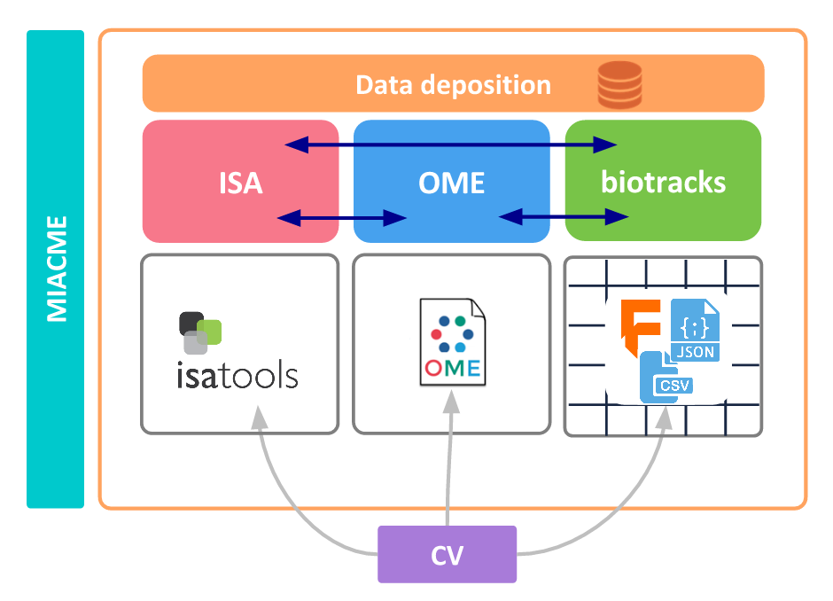

Researchers worldwide try to understand how cells move, a process extremely important for many physiological and pathological conditions. [Cell migration](https://en.wikipedia.org/wiki/Cell_migration) is in fact involved in many processes, like wound healing,neuronal development and cancer invasion. The [Cell Migration Standardization Organization](https://cmso.science/) (CMSO) is a community building standards for cell migration data, in order to enable data sharing in the field. The organization has three main working groups:

- Minimal reporting requirement (developing [MIACME](https://github.com/CellMigStandOrg/MIACME), i.e. the Minimum Information About a Cell Migration Experiment)
- Controlled Vocabularies
- Data Formats and APIs

In our last working group, we discussed where the Data Package specifications[^datapackages] could be used or expanded for the definition of a standard format and the corresponding libraries to interact with these standards. In particular, we have started to address the standardization of cell tracking data. This is data produced using tracking software that reconstructs cell movement in time based on images from a microscope.

   _In pink, the [ISA](http://isa-tools.org/) (Investigation Study Assay) model to annotate the experimental metadata; in blue, the [OME](http://www.openmicroscopy.org/) (Open Microscopy Environment) model for the imaging data; in green, our biotracks format based on the Data Package specification for the analytics data (cell tracking, positions, features etc.);in purple, CV: Controlled Vocabulary; and in turquoise, [MIACME](https://github.com/CellMigStandOrg/MIACME): Minimum Information About a Cell Migration Experiment. [CC BY-SA 4.0](https://creativecommons.org/licenses/by-sa/4.0/) Credit: Paola Masuzzo (text) and CMSO (diagram)._

CMSO deals specifically with cell migration data (a subject of cell biology). Our main challenge lies in the heterogeneity of the data. This diversity has its origin in two factors:

- **Experimentally**: Cell migration data can be produced using many diverse techniques (imaging, non-imaging, dynamic, static, high-throughput/screening, etc.)
- **Analytically**: These data are produced using many diverse software packages, each of these writing data to specific (sometimes proprietary) file formats.

This diversity hampers (or at least makes very difficult) procedures like meta-analysis, data integration, data mining, and last but not least, data _reproducibility_.

CMSO has developed and is about to release the first specification of a [Cell Tracking format](https://cellmigstandorg.github.io/Tracks/). This specification is built on a tabular representation, i.e. data are stored in tables. Current v0.1 of this specification can be seen at [here](https://cellmigstandorg.github.io/Tracks/v0.1/).

CMSO is using the _Tabular_ Data Package[^tdp] specification to represent cell migration-derived tracking data, as illustrated
[here](https://github.com/CellMigStandOrg/biotracks/). The specification is used for two goals:

1. **Create a Data Package representation** where the data---in our case objects (e.g. cells detected in microscopy images), links and optionally tracks---are stored in CSV files, while metadata and schema[^tableschema] information are stored in a JSON file.
2. **Write** this Data Package to a pandas[^pandas] dataframe, to aid quick inspection and visualization.

You can see some examples [here](https://github.com/CellMigStandOrg/biotracks/tree/master/examples).

I am an Open Science fan and advocate, so I try to keep up to date with the initiatives of the
[Open Knowledge International](https://okfn.org) teams. I think I first became aware of Frictionless Data when I saw a tweet and I checked the specs out. Also, CMSO really wanted to keep a possible specification and file format light and simple. So different people of the team must have googled for 'CSV and JSON formats' or something like that, and Frictionless Data popped out :).

I have opened a couple of issues on the [GitHub page of the spec](https://github.com/frictionlessdata/specs), detailing what I would like to see developed in the Frictionless Data project. The CMSO is not sure yet if the Data Package representation will be the one we’ll go for in the very end, because we would first like to know how sustainable/sustained this spec will be in the future.

CMSO is looking into expanding the [list of examples](https://github.com/CellMigStandOrg/biotracks/tree/master/examples) we have so far in terms of tracking software. Personally, I would like to choose a reference data set (a live-cell, time-lapse microscopy data set), and run different cell tracking algorithms/software packages on it. Then I want to put the results into a common, light and easy-to-interpret CSV+JSON format (the biotracks format), and show people how data containerization[^philosophy] can be the way to go to enable research data exchange and knowledge discovery at large.

With most other specifications, cell tracking data are stored in tabular format, but metadata are never kept together with the data, which makes data interpretation and sharing very difficult. The Frictionless Data specifications take good care of this aspect. Some other formats are based on XML[^xml] annotation, which certainly does the job, but are perhaps heavier (even though perhaps more sustainable in the long term). I hate Excel formats, and unfortunately I need to parse those too. I love the integration with Python[^python] and the pandas[^pandas] system, this is a big plus when doing data science.

As a researcher, I mostly deal with research data. I am pretty sure if this could work for cell migration data, it could work for many cell biology disciplines as well. I recommend speaking to more researchers and data producers to determine additional use cases!

[^pandas]: Pandas: Python package for data analysis: <http://pandas.pydata.org/>
[^datapackages]: Data Package: [https://specs.frictionlessdata.io/data-package](https://specs.frictionlessdata.io/data-package)
[^xml]: Extensible Markup Language: <https://en.wikipedia.org/wiki/XML>
[^tdp]: Tabular Data Package: [https://specs.frictionlessdata.io/tabular-data-package](https://specs.frictionlessdata.io/tabular-data-package)
[^tableschema]: Table Schema: [https://specs.frictionlessdata.io/table-schema](https://specs.frictionlessdata.io/table-schema)
[^philosophy]: Design Philosophy: [specs](https://specs.frictionlessdata.io/)
[^python]: Data Package-aware libraries in Python: <https://github.com/frictionlessdata/datapackage-py>, <https://github.com/frictionlessdata/tableschema-py>, <https://github.com/frictionlessdata/goodtables-py>
