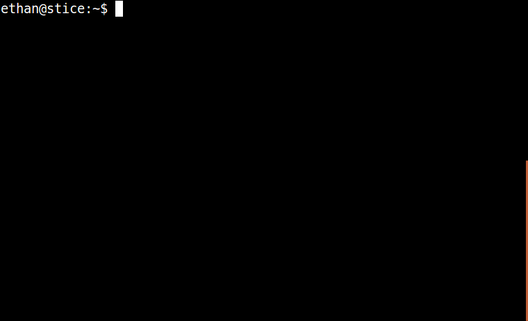

[The Data Retriever](http://www.data-retriever.org/) automates the tasks of finding, downloading, and cleaning up publicly available data, and then stores them in a variety of databases and file formats. This lets data analysts spend less time cleaning up and managing data, and more time analyzing it.

We originally built the Data Retriever starting in 2010 with a focus on ecological data. Over time, we realized that the common challenges with finding downloading, and cleaning up ecological data applied to data in most other fields, so we rebranded and starting integrating data from other fields as well.

The Data Retriever is primarily focused on *tabular* data, but we’re starting work on supporting spatial data as well.

   *The Data Retriever automatically installing the [BBS (USGS North American Breeding Bird Survey)](https://www.pwrc.usgs.gov/bbs/) dataset*

Data is often messy and needs cleaning and restructuring before it can be effectively used. It is often not feasible to modify and redistribute the data due to licensing and other limitations (Editor's note: see our [Open Power System Data case study](/blog/2016/11/15/open-power-system-data/) for more on this).

We need to make it as easy as possible for contributors to [add new datasets](https://retriever.readthedocs.io/en/latest/retriever.lib.html#retriever-lib-package). For relatively clean datasets this means having a simple, easy-to-work-with metadata standard to describe existing data. The description for each dataset is written in a single file which gets read by our plugin infrastructure.

To describe the structure of simple data, we originally created a YAML-like[^yaml] metadata structure.  When the Data Package[^datapackage] specs were created by [Open Knowledge International](https://okfn.org/), we decided to switch over to using this standard so that others could benefit from the metadata we were creating and so that we could benefit from th standards-based infrastructure[^software] being created around the specs.

The transition to the Data Package specification was fairly smooth as most of the fields we needed were already included in the specs. The only thing that we needed to add were fields for restructuring poorly formatted data since the spec assumes the data is well structured to begin with. For example, we use custom fields for describing how to convert [**wide** data to **long** data](https://en.wikipedia.org/wiki/Wide_and_narrow_data).

We first learned about Frictionless Data through the [announcement](https://blog.okfn.org/2016/02/29/sloan-foundation-funds-frictionless-data-tooling-and-engagement-at-open-knowledge/) of their funding by the Sloan Foundation. Going forward, we would love to see the Data Package spec expanded to include information about "imperfections" in data. It currently assumes that the person creating the metadata can modify the raw data files to comply with the standard rules of data structure. However this doesn’t work if someone else is distributing the data, which is a very common use
case.

The expansion of the standard would include things like a way to indicate wide versus long data with enough information to uniquely describe how to translate from one to the other as well as information on single tables that are composed from data in many separate files. We have already been adding new fields to the JSON to accomplish some of these things and would be happy to be part of a larger dialog about implementing them more widely. For the wide-data-to-long-data example mentioned above, we use `ct_column` and `ct_names` fields and a `ct-type` type to indicate how to transform the data into a properly normalized form.

The other thing we’ve come across is the need to develop a clear specification for [semantic versioning](http://semver.org/) of Data Packages. The specification includes an optional `version` field[^version] for keeping track to changes to the package. This version has a standard structure from semantic versioning in software that includes major, minor, and patch level changes. Unlike in software there is no clearly established standard for what changes in different version numbers indicate. Since we work with a lot of different datasets, we’ve been changing a lot of version numbers over the last year; this has lead us to [open a discussion with the OKFN team](https://github.com/frictionlessdata/specs/issues/421) about developing a standard to apply to these changes.

Our next big step is working on the challenge of **simple data integration**. One of the major challenges data analysts have after they have cleaned up and prepared individual data sources is combining them. General solutions to the data integration problem (e.g. linked data approaches) have proven to difficult but we are approaching the problem by tackling a small number of common use cases and involving humans in the metadata development describing the linkages between datasets.

The major specification that is available for ecological data is the [Ecological Metadata Language (EML)](https://knb.ecoinformatics.org/#external//emlparser/docs/index.html). It is an XML[^xml] based spec that includes a lot of information specific to ecological datasets. The nice thing about EML---which is also its challenge---is that it is very comprehensive. This gives it a lot of strength in a linked data context, but also means that it is difficult to drive adoption by users.

The Frictionless Data specifications line up better with our approach to data[^philosophy], which is to complement lightweight computational methods with human contributions to make data easier to work with quickly.

Community contributions to our work are welcome. We work hard to make all of our development efforts open and inclusive (see our [Code of Conduct](https://github.com/weecology/retriever/blob/master/docs/code_of_conduct.rst)) and love it when new developers, data scientists, and domain specialists [contribute](http://www.data-retriever.org/#contribute). A contribution can be as easy as adding a new dataset by following [a set of prompts](https://retriever.readthedocs.io/en/latest/retriever.lib.html#retriever-lib-package) to create a new JSON file and submitting a [PR](https://help.github.com/articles/about-pull-requests/) on GitHub, or even just opening an issue to tell us about a dataset that would be useful to you. So, [open an issue](http://github.com/weecology/retriever/issues/new), submit a PR, or stop by our [Gitter chat channel](https://gitter.im/weecology/retriever) and say "Hi". We also participate in [Google Summer of Code](https://developers.google.com/open-source/gsoc/), which is a great opportunity for students interested in being directly supported to work on the project.

[^pandas]: Pandas: Python package for data analysis: <http://pandas.pydata.org/>
[^datapackage]: Data Package: [https://specs.frictionlessdata.io/data-package](https://specs.frictionlessdata.io/data-package)
[^xml]: Extensible Markup Language: <https://en.wikipedia.org/wiki/XML>
[^tdp]: Tabular Data Package: [https://specs.frictionlessdata.io/tabular-data-package](https://specs.frictionlessdata.io/tabular-data-package)
[^tableschema]: Table Schema: [https://specs.frictionlessdata.io/table-schema](https://specs.frictionlessdata.io/table-schema)
[^philosophy]: Design Philosophy: [/specs/#design-philosophy](https://specs.frictionlessdata.io/#design-philosophy)
[^python]: Data Package-aware libraries in Python: <https://github.com/frictionlessdata/datapackage-py>, <https://github.com/frictionlessdata/tableschema-py>, <https://github.com/frictionlessdata/goodtables-py>
[^version]: Data Package version field: [/specs/#version](https://specs.frictionlessdata.io/patterns/#data-package-version)
[^yaml]: YAML Ain't Markup Language: <https://en.wikipedia.org/wiki/YAML>
