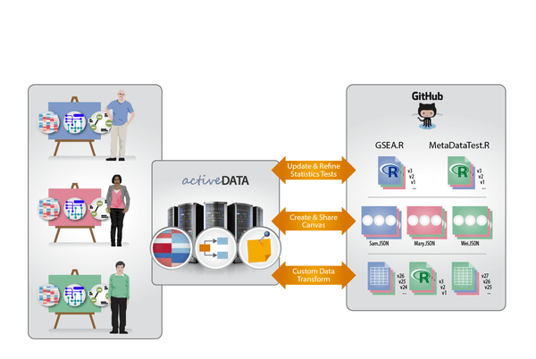

## Context

### Problem We Were Trying To Solve

Sam Payne and his team at the Pacific Northwest National Laboratory (PNNL) have designed an application called [Active Data Biology](https://adbio.pnnl.gov/) (ADBio) which is an interactive web-based suite of tools for analyzing high-throughput omics (a set of related fields of study in biology).  The goal is to visualize and analyze datasets while still enabling seamless collaboration between computational and non-computational domain experts.  The tool provides several views on the same data facilitating different avenues of investigation.

One of the high level goals of ADBio was to make collaborative data analysis work in a similar manner to collaborative software development (versioned, asynchronous, flexible, sharable, global). You can read more of the motivation in the Open Knowledge International blog post [Git for Data Analysis – why version control is essential for collaboration and for gaining public trust](https://blog.okfn.org/2016/11/29/git-for-data-analysis-why-version-control-is-essential-collaboration-public-trust/) written by Sam Payne as part of the pilot.  To facilitate this goal, Sam and his team used version-controlled repositories as the storage mechanism for all required resources. Data, software (for conducting analyses), and insights (gained from these analyses) for the project all get checked into the same repository.  ADBio pulls data and software directly from the repository and serves up an interactive visualization for data exploration. Any insight you choose to record gets checked back into the repository.



When we were first approached by Sam and his team, they outlined several use cases for which it might be valuable to have formal Data Package support (with the benefit of the associated tooling) within their framework.  In the end, we decided to work on the first: *validating metadata associated with ADBio repositories*.

### Use Case: Validating Metadata

To initiate a project in Active Data Biology, users start with a dataset of quantitative molecular measurements across multiple samples combined with metadata for each sample.  Each repository on ADBio contains these two types of files. For clinical experiments, the metadata may include information about a participant’s age, gender, disease stage, etc. For an environmental experiment, this may be geographical location, temperature, time of day, etc. One [example](https://github.com/ActiveDataBio/ADB-User-Study/blob/master/metadata.tsv) of a metadata file can be found at on the ADB-User-Study project repository under the [ActiveDataBio organization on GitHub](https://github.com/ActiveDataBio/).

The metadata file can be updated or expanded during the course of analysis. This is currently not easily done within ADBio. Moreover, the researchers lacked any formal schema describing the metadata file and its contents. It was suggested that having a Data Package formalizing the metadata file would be a benefit.  This would also enable validation of the contents, according to the schema stored as part of the Data Package. Finally, the researchers also requested the development of a web UI to edit the metadata file that would be an application within the ADBio suite. Users could then update the schema online, and it would be versioned through GitHub like everything else. Scenario

A user gets updated survival information for patients in a clinical study and wants to update the metadata associated with this experiment. Within ADBio, the user opens the "Metadata" app and enters new information into the user interface. When finished, user clicks a ‘save’ button and the data is validated against the schema. If it fails, the specific cells are highlighted and annotated with failure codes. If it passes, the new metadata file is checked into the repository with a user-specified comment for the commit message.

## The Work

### What Did We Do

This was a valuable pilot for several reasons.  For one, the researchers interests in openness and the value of public, versioned infrastructure like GitHub for tabular, flat file datasets aligned well with the overall interests of the project.  OKI’s first step was to start a new repository to track progress [in the open](https://github.com/frictionlessdata/pilot-pnnl).  In addition, OKI also created their own ["fork" (i.e. versioned copy) of the repository](https://github.com/frictionlessdata/ADB-User-Study) in which PNNL stored their exemplar metadata file.

### Data

The `metadata.tsv` file is specially formatted compared to other TSV (tab-separated values) files in that it contains two extra rows below the header for describing a column’s *methods* and *descriptions*. While this is a neat way of storing metadata for each column, it is not particularly standard as ordinarily, we would expect all rows below the header contain actual data.  Nevertheless, it provided a great start to the development of a custom schema.  We used the information stored in these rows to generate a [Table Schema](https://specs.frictionlessdata.io/table-schema/) for the data compatible with our software ([the schema](https://github.com/frictionlessdata/ADB-User-Study/blob/master/metadata-schema.json)).

For instance, if a column in the original metadata.tsv file had the text `categorical` in its `#methods` row, we knew that this translated very well to our [enum (short for enumerated list) constraint](https://specs.frictionlessdata.io/table-schema/#constraints). However, this was not enough.  We had to infer from the values below in the dataset which values were actually valid categorical values for that column.  So, for example, the `PlatinumStatus` column could only be one of `Resistant`, `Sensitive`, or `Tooearly` leading to the following constraint definition in Table Schema:

```
"constraints": {
    "enum": [
        "Resistant",
        "Sensitive",
        "Tooearly"
    ]
}
```

More straightforward was the translation of the `#descriptions` row; each description was translated directly into a [description attribute](https://specs.frictionlessdata.io/table-schema/#description) on the column:

```
"description": "It describes whether the patient was resistant to platinum (chemotherapy) treatment",
```

What the `metadata.tsv` file did not record at all was any information about the "type" of value expected for each column.  For instance, the `days_to_death` column would never contain a value that was of a "geopoint" type, but rather always a number (and a whole number at that).  Likewise, the `additional_immuno_therapy` column would always be a True/False (i.e. boolean) value.  With PNNL’s domain expertise, OKI added these expectations to the schema so that `days_to_death` could be relied upon to always be an integer and `additional_immuno_therapy` a boolean (True/False) value.

```
{
    "name": "additional_immuno_therapy",
    "type": "boolean"
}
```

Up to this point, the dataset provided by PNNL was adequately described by our specifications.  One challenge was how to deal, though, with the many missing values in the dataset.  While we had discussion on the [topic](https://github.com/frictionlessdata/specs/issues/97), we had not yet established a formal way of specifying.  In part due to observed usage and the needs of the pilot, we formalized an approach to recording information about which values signal missing data in [mid-August 2016](https://twitter.com/OKFNLabs/status/765568650699018241). We added this information to the Table Schema:

```
"missingValues": [
    "[Not Applicable]",
    "[Not Available]",
    "[Pending]"
]
```

### Software

Goodtables had [existed](http://okfnlabs.org/blog/2015/02/20/introducing-goodtables.html) as a Python library and web application developed by Open Knowledge International to support the validation of tabular datasets both in terms of structure and also with respect to a published schema as described above. This software was put to good use in a local government context.

For this pilot, and in coordination with other work in the project, we took the opportunity to drastically improve the software to support the online, automated validation referenced in the above use case.  We took as inspiration the workflow in use in software development environments around the world---continuous automated testing---and applied to data.  This involved not only updating the Python library to reflect the specification development to date, but the design of a new data publishing workflow that is applicable beyond PNNL’s needs. It is designed to be extensible, so that custom checks and custom backends (e.g. other places where one might publish a dataset) can take advantage of this workflow.  For example, in addition to datasets stored on GitHub, the new goodtables supports the automated validation of datasets stored on S3 and we are currently working on validation of datasets stored on CKAN.

Goodtables supports validation of tabular data in GitHub repositories to solve the use case for Active Data Biology.  On every update to the dataset, a validation task is run on the stored data.

## Review

### How Effective Was It

The omics team at PNNL are still investigating the use of goodtables.io for their use case, but early reports are positive:

> We created a schema and started testing it. So far so good! I think this is going to work for a lot of projects which want to store data in a repo.

As a real test of the generality of goodtables, we also tried to apply it to another project. This second project is a public repository describing measurements of metabolites in ion mobility mass spectrometry. Here, we are again using flat files for structured data. The data is actually a library of information describing metabolites, and we know that the library will be growing. So it was very similar to the ADBio project, in that the curated data would be continually updated. (see <https://github.com/PNNL-Comp-Mass-Spec/MetabolomicsCCS> for the project itself, and <https://github.com/PNNL-Comp-Mass-Spec/metaboliteValidation> for a validation script that leverages goodtables).

Of course, technical issues that they have encountered have been translated in GitHub issues and are being addressed:

- <https://github.com/frictionlessdata/goodtables.io/issues/233>
- <https://github.com/frictionlessdata/goodtables.io/pull/235>
- <https://github.com/frictionlessdata/goodtables.io/issues/232>
