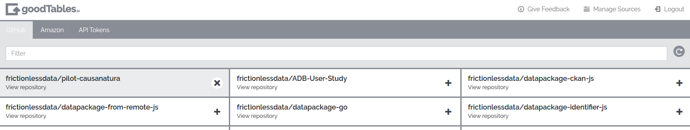
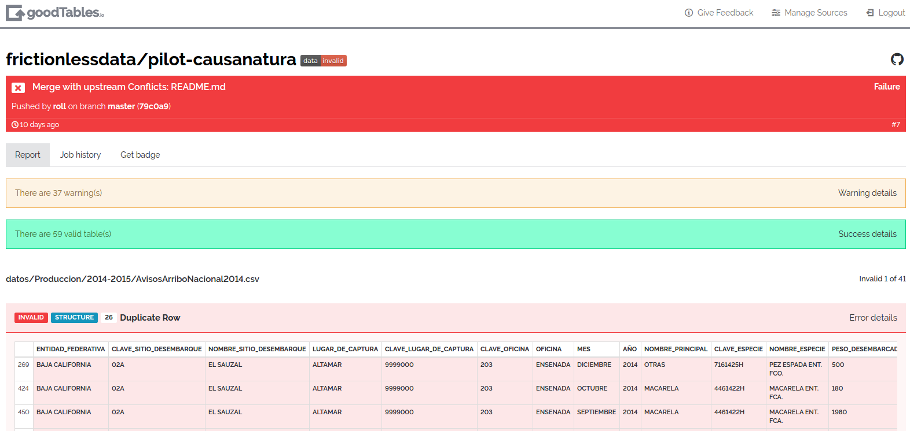
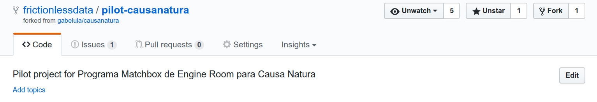
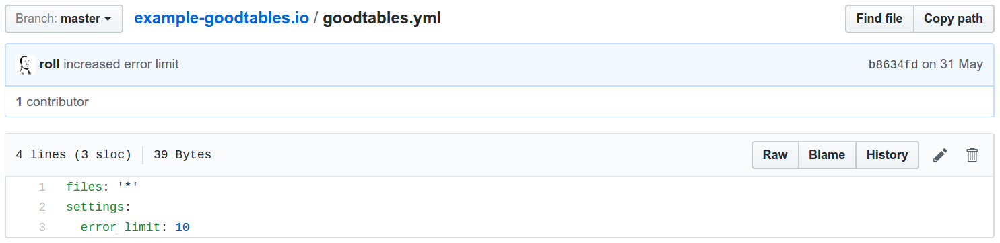
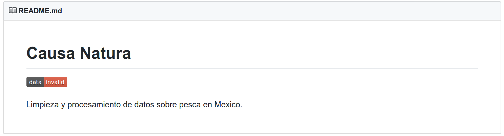

## Context

Causa Natura is a non-profit organization based in Mexico. It supports public policies to allow management of natural resources respecting human rights, equity, efficiency and sustainability. This project, “Pescando Datos” seeks to advocate for improved public policies for more than just subsidies allocation, through the collection of, analysis, and visualization of data around subsidies available to fishing communities in Mexico.

After an extended period of analysis a web platform is being built in order to explore data and visualize it with launch due for later in 2017. Following a meeting at csv,conf after a presentation by Adrià Mercader on [‘Continuous Data Validation for Everybody’](https://www.youtube.com/watch?v=Gk2F4hncAgY&index=35&list=PLg5zZXwt2ZW5UIz13oI56vfZjF6mvpIXN) we have piloted with Causa Natura to explore how our goodtables service can support the project. We spoke to Eduardo Rolón, Executive Director of Causa Natura and Gabriela Rodriguez who is working on the platform.

### Problem We Were Trying To Solve

Causa Natura are making a lot of freedom of Information requests in Mexico on information  to do with fishers in order to understand how policies are impacting people. The data is needed to support a range of stakeholders from the many co-op fisher communities to advocacy organisations.

> Eduardo Rolón: Advocacy organizations, either from CSOs or from the fisheries sector may be more interested in data that evaluates and supports policy recommendations. Fisher communities have more immediate needs, such as how to obtain better governmental services and support.

> Gabriela Rodriguez: The data is important to us because Campaigns and decisions will be made based on the analysis on the data Causa Natura collected. To be able to do the required analysis we need good data.

> Gabriela Rodriguez: Currently, there is a tedious process of cleaning to give us data that can be worked on. Much of the data Causa Natura was using came as PDFs and needed to be processed. We process a lot of PDFs and Excel files and there are a lot of problems getting the OCR to capture the information correctly to csv. For example, names are not consistent and this causes us a lot of problems.

## The Work

### Software

goodtables was an existing Python library and web application developed by Open Knowledge International to support the validation of tabular datasets both in terms of structure and also with respect to a published schema as described above. We introduced goodtables in a [blog post](http://okfnlabs.org/blog/2015/02/20/introducing-goodtables.html) earlier this year.

On top of that, Open Knowledge International has developed goodtables.io, a web service for a continuous data validation that connects to different data sources to generate structure and content reports.

### What Did We Do

Let’s see how goodtables.io has helped to identify source and structural errors in the  Causa Natura pilot dataset:

After we’ve signed in, we synchronize our GitHub repositories and activate the repository we want to validate (https://github.com/frictionlessdata/pilot-causanatura):

Once the repository is activated, every time there is an update on the data hosted on GitHub, the service will generate a validation report. This is how one of these reports looks like:

Here, we see that there are 59 valid tables, but the report has  identified source and structural errors in 41 of the other tables hosted on the repository, including:

* duplicate rows
* duplicate headers
* blank rows
* missing values

The full list of checks exercised by goodtables.io can be found in the [Data Quality Spec](https://github.com/frictionlessdata/data-quality-spec/blob/master/spec.json). And the full report can be found [here](http://goodtables.io/github/frictionlessdata/pilot-causanatura/jobs/7).

After identifying errors we went back do a manual cleanup of the data. As we mentioned, there is no need to run goodtables.io validation manually - it happens on any GitHub push for all activated repositories:

If we need to customize a validation process we can put a goodtables.yml configuration file on the repository root, allowing us to tweak settings like the actual checks to perform, limit of rows to check, etc:

And instant feedback is available via GitHub commit statuses and a goodtables.io badge that can be included in the README file:

## Review

> Gabriela Rodriguez: Right now I have not been using it extensively yet but I have a lot of faith that it could get incorporated in the process of importing data into the Github repository. It should be easy to introduce into our workflow. I really like the process of hooks after git-push as I’m trying to get the organization to use Github for new data. I really like the validation part and that a report is generated each time data is pushed. This is very important and very useful. This makes it easier for the people who are doing the cleaning of data who may not have experience with GitHub.

> Gabriela Rodriguez: The web interface needs a lot of usability work. But the idea is awesome.  There are problems and it is kind of hard to use at the moment as it takes a long time to sync repositories and the process is not clear, but i think it has a huge potential to make a difference to the work we are doing, mostly if people use Github to store data then it could make a difference.

## Next Steps

### Areas for further work

> Gabriela Rodriguez: With continuous integration it would be very helpful to be notified with messages about the problems in the data. Perhaps emails notifications would be a good way to go, or integrations with other programs - Slack for example - would be fantastic.

One thing to note is that all the errors shown following the analysis refer to the structure of the data files (missing headers, duplicate rows, etc). Including schema validation against some of the files would be a very logical next step in testing whether the contents of the data are what is expected). We are now planning to work with Causa Natura to take the steps to identify a subset of the data and create a base schema/data package that will be easily expandable and extendable.

### Find Out More

To explore for the yourself and collaborate, see the Pescando Datos project on [github](https://github.com/pescandodatos/datos) and our goodtables  [reports](http://goodtables.io/github/frictionlessdata/pilot-causanatura) from the project.
