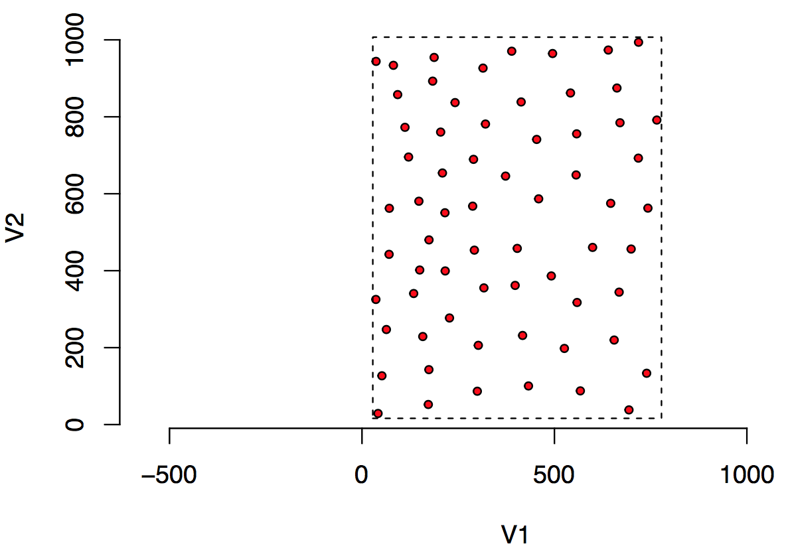

## Context

### Problem We Were Trying To Solve

Stephen Eglen was looking to investigate the applicability of the Data Package concept to facilitate data reuse in the field of Computational Neuroscience. The following figure describes the kind of data he is collecting.  He was eventually seeking to get around 100–160 fields like this. Each circle is a cell drawn approximately to scale. The units of measurement are microns (micrometers).



The basic data are quite simple: two columns of numbers that describes the center of each circle where each circle represents a [retinal ganglion cell](https://en.wikipedia.org/wiki/Retinal_ganglion_cell).  The metadata that adds context to this data are as follows: the radius of each circle is 10um representing the average radius of this cell type; the dashed line represents the sample window which is the region of space within which the cells were sampled; the species from which the cells were sampled is a cat.

The key question posed by the collection of such data in large quantities is “where to store all these metadata”. More formally, Stephen wanted a way to include the following metadata with sampled data:

 1. Cell type: on center retinal ganglion cells
 2. Species: cat
 3. Radius of <a href="https://en.wikipedia.org/wiki/Soma_(biology)">soma</a>: 10 um
 4. Citation to original paper where data were presented: Wässle H, Boycott BB, Illing RB (1981) Morphology and mosaic of on- and off-beta cells in the cat retina and some functional considerations. Proc R Soc Lond B Biol Sci 212:177–195.
 5. Unit of measurement: micron.
 6. (Optionally) A raw image from where the data where taken. e.g. http://www.damtp.cam.ac.uk/user/sje30/data/mosaics/w81_scan/w81all.png

The long-term goal was to build a website/repository containing about 100+ examples of these “retinal mosaics”. The website would allow people to view the mosaics, download the data files, or run online some simple analysis.

## The Work

### What Did We Do

The Data Package specification is meant to be a container for data providing a consistent interface to tabular data. The Data Package specification outlines a number of different fields that can be stored within a descriptor file, `datapackage.json`. For instance, for this example, we can assign a title to this Data Package by setting the field `title` to “Example Retinal Mosaic”:

`"title" : "Example Retinal Mosaic"`

We can also, for instance, set a `homepage` for the dataset which is a URL for the home on the web that is related to this Data Package.

`"homepage": "http://www.damtp.cam.ac.uk/user/sje30/data/mosaics/w81_scan/"`

Some of the other metadata Stephen required do not, however, map well to existing specified fields in a Data Package.  For instance, as the Data Package is not specialized for storing biological data, there is no field for “species”.  (The Digital Curation Centre maintains a database of domain-specific metadata standards for biology and other fields.)  The specification is intended to be quite flexible in these circumstances:

>Adherence to the specification does not imply that additional, non-specified properties cannot be used: a descriptor MAY include any number of properties in additional to those described as required and optional properties […] This flexibility enables specific communities to extend Data Packages as appropriate for the data they manage.

As an example, we stored the radius in a new field called `soma-radius` in the “root” level of the Data Package:

`"soma-radius": 10`

While there are many different ways in which this particular element of metadata could have been stored, this was a good start that would allow easy iteration.  In storing this metadata in the datapackage.json, Data Package-aware tooling could read it with the data.

For example, using the Data Package library (“datapkg”) written by ROpenSci, we can replace multiple calls to the data input functions (in this case, Stephen used the `read.table()` and `scan()` functions with a single call to `datapkg_read()` and store the result in a new object which combines both metadata and data called rmdp.

```r
# install_github("frictionlessdata/datapackage-r")
library(datapkg)
rmdp <- datapkg_read()

# read soma radius from rmdp
soma.rad = rmdp$`soma-radius`

# read other metadata from the same object
on <- rmdp$data$points
w <- rmdp$data$window

# plot
plot(on, type='n', asp=1, bty='n')
symbols(on, circles=rep(soma.rad, nrow(on)), add=TRUE,inch=FALSE, bg="red") rect(w[[1]], w[[3]], w[[2]], w[[4]], lty=2)
```

Below is the annotated datapackage.json with the metadata at the top followed by the resource information. As a start, we have included information on cell type, species, and units in the description, but we can easily create new fields to store these fields in a more structured way as we did with `soma-radius`:

```json
{
    "name": "example-retinal-mosaic",
    "title": "Example Retinal Mosaic",
    "Homepage": "http://www.damtp.cam.ac.uk/user/sje30/data/mosaics/w81_scan/",
    "Image": "http://www.damtp.cam.ac.uk/user/sje30/data/mosaics/w81_scan/w81all.png",
    "description": "This is an example retinal mosaic Data Package.",
    "cell type": "on center",
    "soma-radius": 10
}
```

I’ve used a `sources` array with a single source object:

```json
{
  "sources": [{
    "name": "Wässle H, Boycott BB, Illing RB (1981) Morphology and mosaic of on- and off-beta cells in the cat retina and some functional considerations. Proc R Soc Lond B Biol Sci 212:177–195."
  }]
}
```

The `resources` array in datapackage.json listed the files in the original datasets with `dialect` and `schema` information included. We named the first resource “points” with the filename set in `path`.  Because it is a space-delimited tabular file without a header, we needed to pass that information to the `dialect` attribute so that `datapkg_read()` can read the file. The `schema` attribute specifies the `type` of all the values in the table (e.g. “number”) as well as additional `constraints` on the value. Stephen noted that you can’t have an x coordinate without the y, so we have set `required` to true for both fields. In addition, Stephen noted that the “window” rectangle is a simple validation on the data, so I have translated the x and y bounds of the window to constraining conditions on each column. We do understand that assessing the validity of such data can be more complicated, however.

```json
{
  "resources": [
    {
      "name": "points",
      "path": "w81s1on.txt",
      "dialect": {
        "delimiter": "\t",
        "header": false
      },
      "schema": {
        "fields": [
          {
            "name": "x",
            "type": "number",
            "constraints": {
              "required": true,
              "minimum": 28.08,
              "maximum": 778.08
            }
          },
          {
            "name": "y",
            "type": "number",
            "constraints": {
              "required": true,
              "minimum": 16.2,
              "maximum": 1007.02
            }
          }
        ]
      }
    }
  ]
}
```

For the completeness of the example, we have also added a resource for the “window” rectangle even though (a) we have already stored this data in the `constraints` key of the points matrix and (b) it is ideally stored as a vector not a data frame. The benefit of this method is the ability to load all the data files at once and reference them from a common datapackage.

```json
{
  "name": "window",
  "path": "w81s1w.txt",
  "dialect": {
    "delimiter": "\t",
    "header": false
  },
  "schema": {
    "fields": [
       {
        "name": "xmin",
        "type": "number"
       },
       {
         "name": "xmax",
         "type": "number"
       },
       {
         "name": "ymin",
         "type": "number"
       },
       {
         "name": "ymax",
         "type": "number"
       }
    ]
  }
}
```

## Review

### How Effective Was It

The pilot tackled an interesting use case: providing a generic “home” for metadata related to an experiment,
in a way that is clear and easy to read without the overhead of a more advanced, domain-specific specification.
In a more complicated example, storing the metadata with the data for each sample---paired with a tool that could
read this metadata---could provide an “object-oriented” style of working with experimental data.

We have not tried this out on multiple samples (this is forthcoming), so we don’t have much information yet on
the usefulness of this approach, but the exercise raised several important issues to potentially address with the
Data Package format:

 1. Stephen’s request for a specified location for storing units in a structured way comes up often: https://github.com/frictionlessdata/specs/issues/216
 2. More iterations, with more of a variety of data sources could help in trialling this
 3. Stephen wanted to store a non-tabular data file (an image) with the tabular datasets that comprise his datasets.  This is currently not allowed, but the subsequent definition of a Tabular Data Resource could pave the way for a method of specifying types of different resources and the kind of processing, validation or otherwise, that could be done with each.

## Next Steps

### Areas for future work

Stephen now has about 100 retinal mosaics that might make for a nice use case of the Data Package. In addition, The Frictionless Data Tool Fund has funded the development of the next version of the R Data Package. This will make some of the improvements brought to the Data Package specifications  in the past few months available in the R library.
