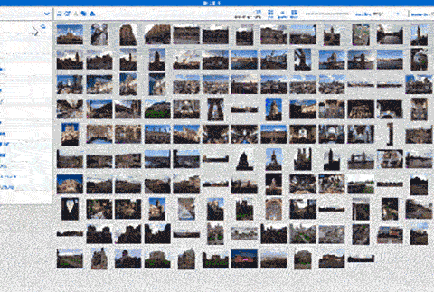
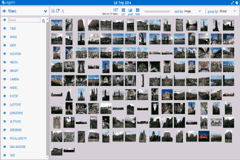

[Zegami](https://www.zegami.com) makes information more visual and accessible, enabling intuitive exploration, search and discovery of large data sets. Zegami combines the power of machine learning and human pattern recognition to reveal hidden insights and new perspectives.

   *image search on Zegami*

It provides a more powerful tool for visual data than what’s possible with spreadsheets or typical business intelligence tools. By presenting data within a single field of view, Zegami enables users to easily discover patterns and correlations. Facilitating new insights and discoveries that would otherwise not be possible.

   *metadata search on Zegami*

For Zegami to shine, our users need to be able to easily import their data so they can get actionable insight with minimal fuss. In building an analytics platform we face the unique challenge of having to support a wide variety of data sources and formats. The challenge is compounded by the fact that the data we deal with is rarely clean.

At the onset, we also faced the challenge of how best to store and transmit data between our components and micro-services. In addition to an open, extensible and simple yet powerful data format, we wanted one that can preserve data types and formatting, and be parsed by all the client applications we use, which includes server-side applications, web clients and visualisation frameworks.

We first heard about messytables[^messytables] and of the data protocols site (currently Frictionless Data Specifications[^specs]) through a lightning talk at EuroSciPy 2015. This meant when we searched for various things around jsontableschema (now tableschema[^tableschema]), we landed on the Frictionless Data project.

We are currently using the specifications in the following ways:

- We use tabulator.Stream[^tabulator] to parse data on our back end.
- We use schema infer from tableschema-py[^tableschemapy] to store an extended json table schema to represent data structures in our system. We are also developing custom json parsers using json paths and the ijson library

In the coming days, We plan on using
- datapackage-pipelines[^dpp] as a spec for the way we treat joins and multi-step data operations in our system
- tabulator in a polyglot persistence scenario[^polyglot] - storing data in both storage buckets and either elasticsearch[^elasticsearch] or another column store like [druid.io](http://druid.io).

Moving forward it would be interesting to see tableschema and tabulator as a communication protocol over websockets. This would allow for a really smooth experience when using handsontable[^handsontable] spreadsheets with a datapackage of some kind. A socket-to-socket version of datapackage-pipelines which runs on container orchestration systems would also be interesting. There are few protocols similar to datapackage-pipelines, such as Dask[^dask] which, although similar, is not serialisable and therefor unsuitable for applications where front end communication is necessary or where the pipelines need to be used by non-coders.

We are also keen to know more about repositories around the world that use datapackages[^datapackage] so that we can import the data and show users and owners of those repositories the benefits of browsing and visualising data in Zegami.

In terms of other potential use cases, it would be useful to create a python-based alternative to the dreamfactory API server[^dreamfactory]. [wqio](http://wq.io/) is one example, but it is quite hard to use and a lighter version would be great. Perhaps CKAN[^ckan] datastore could be licensed in a more open way?

In terms of the next steps for us, we are currently working on a SaaS implementation of Zegami which will dramatically reduce the effort required in order to start working with Zegami. We are then planning on developing a series of APIs so developers can create their own data transformation pipelines. One of our developers, Andrew Stretton, will be running Frictionless Data sessions at PyData London[^pydata] on Tuesday, October 3 and PyCon UK[^pyconuk] on Friday, October 27.

[^messytables]: Library for parsing messy tabular data: <https://github.com/okfn/messytables>
[^specs]: Frictionless Data Specifications: [specs](https://specs.frictionlessdata.io/)
[^tableschema]: Table Schema: [https://specs.frictionlessdata.io/table-schema](https://specs.frictionlessdata.io/table-schema)
[^tabulator]:Tabulator:  library for reading and writing tabular data <https://github.com/frictionlessdata/tabulator-py>
[^polyglot]: Polyglot Persistence: <https://en.wikipedia.org/wiki/Polyglot_persistence>
[^tableschemapy]: Table Schema Python Library: <https://github.com/frictionlessdata/tableschema-py>
[^elasticsearch]: Elastic Search: <https://www.elastic.co/products/elasticsearch>
[^handsontable]: Handsontable: Javascript spreadsheet component for web apps: <https://handsontable.com>
[^dpp]: Data Package Pipelines: <https://github.com/frictionlessdata/datapackage-pipelines>
[^dask]:Dask Custom Graphs: <http://dask.pydata.org/en/latest/custom-graphs.html>
[^datapackage]: Data Packages: [https://specs.frictionlessdata.io/data-package](https://specs.frictionlessdata.io/data-package)
[^dreamfactory]: Dream Factory: <https://www.dreamfactory.com/>
[^ckan]: CKAN: Open Source Data Portal Platform: <https://ckan.org>
[^pydata]: PyData London, October 2017 Meetup: <https://www.meetup.com/PyData-London-Meetup/events/243584161/>
[^pyconuk]: PyCon UK 2017 Schedule: <http://2017.pyconuk.org/schedule/>
