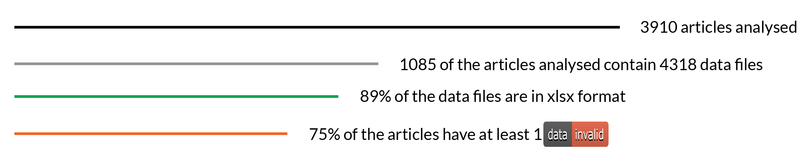
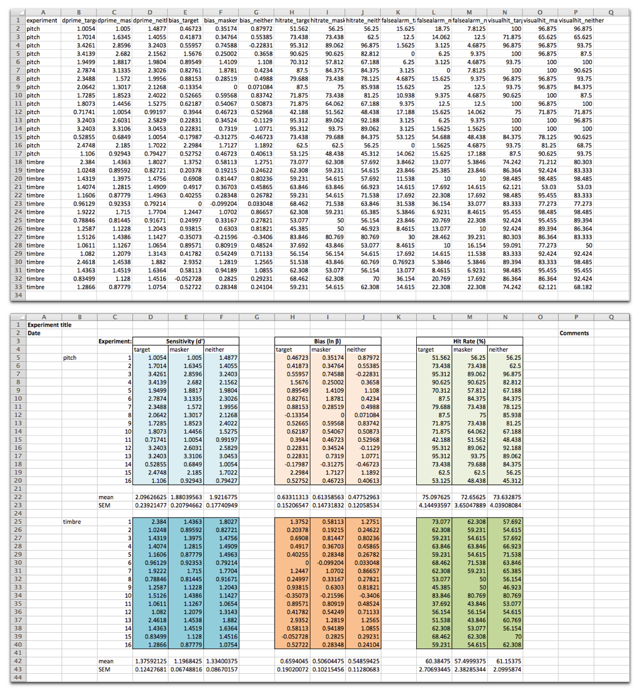

## Context

[eLife](https://elifesciences.org/) is a non-profit organisation with a mission  to help scientists accelerate discovery by operating a platform for research communication that encourages and recognises the most responsible behaviours in science. eLife publishes important research in all areas of life and biomedical sciences. The research is selected and evaluated by working scientists and is made freely available to all readers.

### Problem We Were Trying To Solve

Having met at csv,conf,v3 in Portland in May 2017, eLife's [Naomi Penfold](https://www.youtube.com/watch?v=YYWNSWNq-do&list=PLg5zZXwt2ZW5UIz13oI56vfZjF6mvpIXN&index=27) and Open Knowledge International's [Adrià Mercader](https://www.youtube.com/watch?v=Gk2F4hncAgY&index=35&list=PLg5zZXwt2ZW5UIz13oI56vfZjF6mvpIXN) determined that eLife would be a good candidate for a Frictionless Data pilot. eLife has a strong emphasis on research data, and stood to benefit from the data validation service offered by Frictionless Data's goodtables.

## The Work
In order to assess the potential for a goodtables integration at eLife, we first needed to measure the quality of source data shared directly through eLife.

### Software
 To explore the data published in the eLife platform we used the goodtables library[^gt-py]. Both the goodtables python library and web service[^gtweb] were developed by Open Knowledge International to support the validation of tabular datasets both in terms of structure and also with respect to a published schema. You can read more about them [in this introductory blog post](http://okfnlabs.org/blog/2015/02/20/introducing-goodtables.html).

### What Did We Do

The first stage was to perform validation on all files made available through the eLife API in order to generate a report on data quality - this would allow us to understand the current state of eLife-published data and present the possibility of doing more exciting things with the data such as more comprehensive tests or visualisations.

The process:

* We downloaded a big subset of the articles metadata made available via the eLife public API[^eLife-api].
* We parsed all metadata files in order to extract the data files linked to each article, regardless of whether it was an additional file or a figure source. This gave us a direct link to each data file linked to the parent article.
* We then ran the validation process on each file, storing the resulting report for future analysis.

All scripts used in the process as well as the outputs can be found in [our pilot repository](https://github.com/frictionlessdata/pilot-elife).

Here are some high-level statistics for the process:

We analyzed 3910 articles, 1085 of which had data files. The most common format was Microsoft Excel Open XML Format Spreadsheet (xlsx), with 89% of all 4318 files being published on this format. Older versions of Excel and CSV files made up the rest.

 *A summary of the eLife research articles analysed as part of the Frictionless Data pilot work*

In terms of  validation, more than 75% of the articles analyzed contained at least one invalid file. Of course valid data is an arbitrary term based on the tests that are set within goodtables and results need to be reviewed to adjust  the checks performed. For instance errors raised by blank rows are really common on Excel files as people add a title on the first row, leaving an empty row before the data, or empty rows are detected at the end of the sheet.

Other errors raised that might actually point to genuine errors included duplicated headers, extra headers, missing values,  incorrect format values (e.g. date format instead of gene name) to give just some examples. Here’s a summary of the raw number of errors encountered. For a more complete description of each error, see the Data Quality Spec[^dq-spec]:

| Error Type        | Count |
|-------------------|-------|
| Blank rows        | 45748 |
| Duplicate rows    | 9384  |
| Duplicate headers | 6672  |
| Blank headers     | 2479  |
| Missing values    | 1032  |
| Extra values      | 39    |
| Source errors     | 11    |
| Format errors     | 4     |

## Review
### How Effective Was It
Following analysis of a sample of the results, the vast majority of the errors appear to be due to the data being presented in nice-looking tables, using formatting to make particular elements more visually clear, as opposed to a machine-readable format:

 *Data from Maddox et al. was shared in a machine-readable format (top), and adapted here to demonstrate how such data are often shared in a format that looks nice to the human reader (bottom).
Source: Source data
The data file is presented as is and adapted from Maddox et al. eLife 2015;4:e04995 under the Creative Commons Attribution License (CC BY 4.0).*

This is not limited to the academic field of course, and the tendency to present data in spreadsheets so it is visually appealing is perhaps more prevalent in other areas. Perhaps because consumers of the data are even less likely to have the data processed by machines or because the data is collated by people with no experience of having to use it in their work.

In general the eLife datasets had better quality than for instance those created by government organisations, where structural issues like missing headers, extra cells, etc are much more common. So although the results here have been good, the community could derive substantial benefit from researchers going that extra mile to make files more machine-friendly and embrace more robust data description techniques like Data Packages.

Because these types of ‘errors’ are so common we have introduced default `ignore blank rows` and `ignore duplicate rows` options in [our standalone validator](https://try.goodtables.io) since this helps bring more complex errors to the surface and focusses attention on the errors which may be less trivial to resolve. Excluding duplicate and blank rows as well as duplicate headers (the most common but also relatively simple errors), 6.4% (277/4318) of data files had errors remaining, affecting 10% of research articles (112/1085).

Having said this, the relevance of these errors should not be underplayed as `blank rows`, `duplicate rows` and other human-centered formatting preferences can still result in errors that prevent machine readability. Although the errors were often minor and easy to fix in our case, these seemingly simple errors can be obstructive to anyone trying to reuse data in a more computational workflow. Any computational analysis software, such as R[^rlang], requires that all column headers are variables and rows are individual observations i.e. we need variables in columns and observations in rows for any R analysis.

Much less frequent errors were related to difficulties retrieving and opening data files. It was certainly helpful to flag articles with files that were not actually possible to open (source-error), and the eLife production team are resolving these issues. While only representing a small number of datasets, this is one use key case for goodtables: enabling publishers to regularly check continued data availability after publication.

The use case for authors is clear — to identify how a dataset could be reshaped to make it reusable. However, this demands extra work if reshaping is a job added at the point of sharing work. In fact, it is important that any issues are resolved before final publication, to avoid adding updated versions of publications/datasets. Tools that reduce this burden by making it easy to quickly edit a datafile to resolve the errors are of interest moving forward. In the meantime, it may be helpful to consider some key best practises as datasets are collected.

Overall, the findings from this pilot demonstrate that there are different ways of producing data for sharing: datasets are predominantly presented in an Excel file with human aesthetics in mind, rather than structured for use by a statistical program. We found few issues with the data itself beyond presentation preferences. This is encouraging and is a great starting point for venturing forward with helping researchers to make greater use of open data.

## Next Steps
### Areas for further work

Libraries such as goodtables help to flag the gap between the current situation and the ideal situation, which is machine-readability. Most of the issues identified by goodtables in the datasets shared with eLife relate to structuring the data for human visual consumption: adding space around the table, merging header cells, etc. We encourage researchers to make data as easy to consume as possible, and recognise that datasets built primarily to look good to humans may only be sufficient for low-level reuse.

Moving forward, we are interested in tools and workflows that help to improve data quality earlier in the research lifecycle or make it easy to reshape at the point of sharing or reuse.

## Find Out More
https://github.com/frictionlessdata/pilot-elife

Parts of this post are [cross-posted](https://elifesciences.org/labs/b6de9fb0/data-reusability-a-pilot-with-goodtables) on eLife Labs[^elifelabs].

[^pasquetto]: Irene V. Pasquetto , Bernadette M. Randles, and Christine L. Borgman, On the Reuse of Scientific Data: <https://datascience.codata.org/articles/10.5334/dsj-2017-008/>
[^gtweb]: goodtables web service: <http://goodtables.io>
[^gt-py]: goodtables Python library: <http://github.com/frictionlessdata/goodtables-py>
[^csv]: csv,conf,v3: <http://csvconf.com>
[^eLife-api]: eLife Public API: <https://api.elifesciences.org/>
[^elife-repo]: eLife Frictionless Data pilot repository on Github: <https://github.com/frictionlessdata/pilot-elife>
[^dq-spec]: Data Quality Spec: <https://github.com/frictionlessdata/data-quality-spec/blob/master/spec.json>
[^rlang]: R Programming Language: Popular open-source programming language and platform for data analysis: <https://www.r-project.org>
[^elifelabs]: eLife Labs: <https://elifesciences.org/labs>
