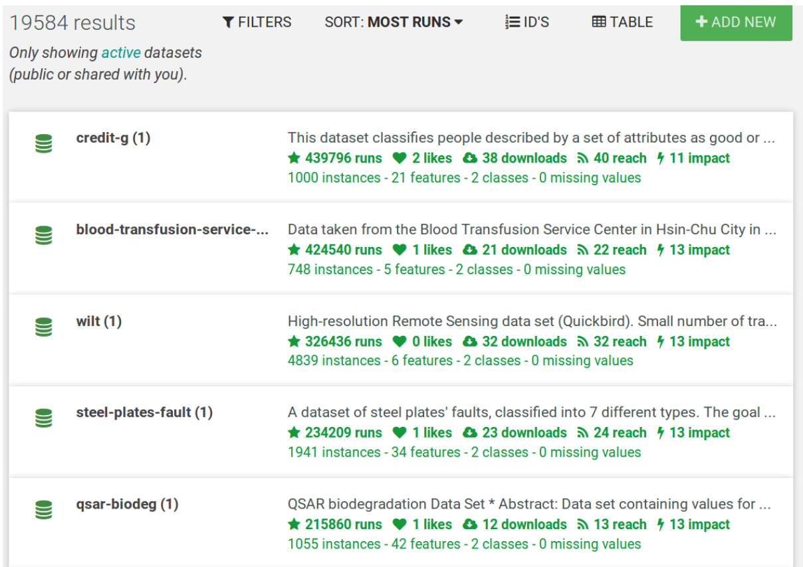

[OpenML](http://openml.org) is an online platform and service for machine learning, whose goal is to make machine learning and data analysis simple, accessible, collaborative and open with an optimal division of labour between computers and humans. People can upload and share data sets and questions (prediction tasks) on OpenML  that they then collaboratively  solve using machine learning algorithms.

*A brief introduction to openML*

We offer [open source tools](https://www.openml.org/guide/api) to download data into your [favorite machine learning environments](https://www.openml.org/guide/integrations) and work with it. You can then upload your results back onto the platform so that others can learn from you. If you have data, you can use OpenML to get insights on what machine learning method works well to answer your question. Machine Learners can use OpenML to find interesting data sets and questions that are relevant for others and also for machine learning research (e.g. learning how algorithms behave on different types of data sets).

Users typically store their data in all kinds of formats, which makes it hard to simplify the data upload process on OpenML. Currently we only allow data in ARFF format. We are looking to make it as easy as possible for users to upload data, download and work with data from OpenML while keeping the datasets in machine readable formats and availing metadata in easy to read formats for our users. We also like to avail datasets from other services on OpenML. Most of these external sources currently contain data in varied formats, but some i.e. [data.world](https://data.world/) have started adopting and using [data packages](https://specs.frictionlessdata.io/data-package/). You can read more about data.world’s adoption and use of data packages [here](/blog/2017/04/11/dataworld/) and [here](https://meta.data.world/try-this-frictionless-data-world-ad36b6422ceb).

*Learn how to upload data on OpenML in 1 minute*

We first heard about the Frictionless Data project through [School of Data](https://schoolofdata.org). One of the OpenML core members is also involved in School of Data and used data packages in one of the open data workshops from School of Data Switzerland.  In the coming months, we are looking to adopt [Frictionless Data specifications](https://specs.frictionlessdata.io/) to improve user friendliness on OpenML. We hope to make it possible for users to upload and connect datasets in [data packages format](https://specs.frictionlessdata.io/data-package/). This will be a great shift because it would enable people to easily build and share machine learning models trained on any dataset in the frictionless data ecosystem.

OpenML currently works with tabular data in Attribute Relation File Format ([ARFF](https://weka.wikispaces.com/ARFF+%28stable+version%29)) accompanied by metadata in an XML or JSON file. It is actually very similar to Frictionless Data’s [tabular data package](https://specs.frictionlessdata.io/tabular-data-package/) specification, but with ARFF instead of csv.

 *Image of dataset list on OpenML*

ARFF (Attribute-Relation File Format) is a CSV file with a header that  lists the names of the attributes (columns) and their data types. Especially the latter is very important to do data analysis. For instance, say that you have a column with values 1,2,3. It is very important to know whether that is just a number (1,2,3 ice creams), a rank (1st, 2nd, 3rd place), or a category (item 1, item 2, item 3). This is missing from CSV data. ARFF also allows to connect multiple tables together, although we don’t really use this right now.

*Image of a dataset overview on openML*

The metadata is free-form information about the dataset. It is mostly key-value data, although some values are more structured. It is stored in our database and exported to simple JSON or XML. [Here’s an example]( https://www.openml.org/d/2/json). It covers basic information (textual description of the dataset, owner, format, license, et al) as well as statistics (number of instances, number of features, number of  missing values, details about the data distribution, and results of simple machine learning algorithms run on the data), and summary statistics (mainly used for the quick overview plots).

We firmly believe that  if data packages become the go-to specification for sharing data in scientific communities, accessibility to data that’s currently ‘hidden’ in data platforms and university libraries will improve vastly, and are keen to adopt and use the specification on OpenML in the coming months.

Interested in contributing to our quest to adopt the [data package specification](https://specs.frictionlessdata.io/data-package/) as an import and export option for data on the OpenML platform? [Start here](https://github.com/openml/OpenML/issues/482).
