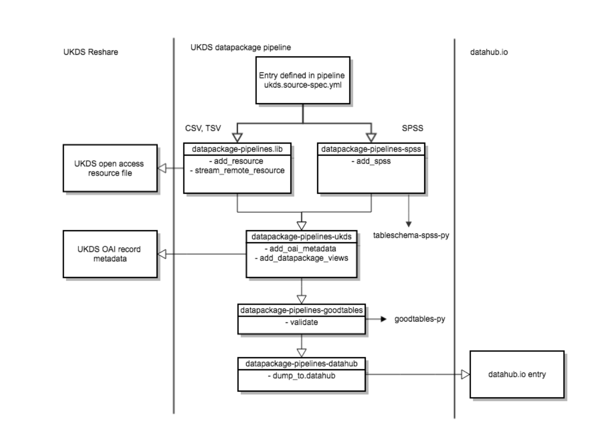
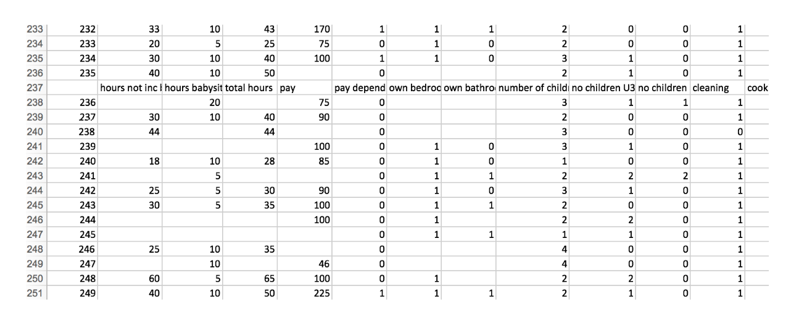
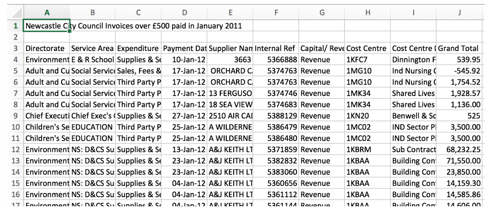

The UK Data Service, like many other research repository services, employs a range of closed source software solutions for the publication and consumption of research data. The data itself is often published in closed and proprietary data formats, and the data is not always, or purposefully, published in a way that enables data reuse.

Based on an initial exploration of user need, we identified, together with the UK Data Service, the following areas for a Frictionless Data pilot:

* Conversion of data and metadata to open formats using open source tools.
* Use the Frictionless Data toolchain to assess and report on data quality (as a proxy for reusability).
* Demonstrate the possibility of generating visualizations from source data and metadata, described with Frictionless Data specifications.
* Host the data with all these attributes (open formats, reusable quality, visualized) on an open source platform for data.

We worked with data that was publicly accessible, and therefore in its post-publication phase. This also informed the way we designed the work, as a set of connected processing and transport steps, very much outside of the publication process itself. While this was acceptable for the scope of the pilot, the real power of the approach we demonstrate here is in integrating it with pre-publication phases of data, via a combined automated and manually curated data process. Indeed, we can see via this pilot the potential to streamline the workflow demonstrated into a complete research data publication process, and would welcome the opportunity to conduct one or more pilots that build on this approach, deeply integrated into pre-publication data workflows.

## Context

The UK Data Service offers an online repository where researchers can archive, publish and share research data, called [Reshare](http://reshare.ukdataservice.ac.uk/). Reshare exposes an [OAI-PMH](https://www.openarchives.org/pmh/) endpoint to facilitate metadata harvesting.

[datahub.io](http://datahub.io/) is a data workflows web application build around the modular Frictionless Data toolchain, designed to find, share and publish high quality data online. Each entry has a ‘Showcase’ to display data package properties, and preview data with tables and simple visualisations. As well as the Showcase, [datahub.io](http://datahub.io/) provides straight-forward direct access to import data into a variety of tools used by researchers; R, Pandas, Python, JavaScript, and SQL. [Frictionless Data Data Packages](https://specs.frictionlessdata.io/data-package/) can be pushed to datahub.io to create dataset entries.

### Problem We Were Trying To Solve

We want to investigate the use of the Data Package concept, and Frictionless Data software to facilitate the reuse of data archived in Reshare.

We are especially interested in trialling pipelines to automate data harvesting from UKDS into [datahub.io](http://datahub.io/) using Frictionless Data software such as [datapackage-pipelines](https://github.com/frictionlessdata/datapackage-pipelines), and creating appropriate processors to translate widely used statistics file formats, such as [SPSS](https://www.ibm.com/analytics/us/en/technology/spss/), to text-based tabular data formats such as CSV.

We chose the Data Package Pipelines library because it provides us with a well tested and mature framework of established processors to work with tabular data from a variety of sources and formats. Custom processors can easily be added to extend pipeline functionality. Pipelines can be configured using a simple declarative specification. Other tools supporting the underlying Frictionless Data specifications, such as [tableschema](https://github.com/frictionlessdata/tableschema-py/) and [goodtables](https://github.com/frictionlessdata/tableschema-py/) can be easily integrated as appropriate.

In this pilot we are trialling tools to:

* automate data harvesting from UKDS, to [datahub.io](http://datahub.io/), through a data package pipeline.
* translate binary data formats (SPSS) to text-based tabular formats.
* validate tabular data harvested from UKDS with goodtables.
* fix or workaround common data issues identified from validation report, in the source-spec
 * correct file encoding
 * skip non-data rows
 * skip specified validation checks (duplicate-rows)
 * specify header rows in csv files
 * explicitly defining tabular headers
* trial the [datahub.io](http://datahub.io/) API with real-world data
* use the Showcase features of [datahub.io](http://datahub.io/) to provide instance data previews and visualisations.

### The Work

#### What Did We Do

During the pilot, we focussed on creating a reusable pipeline of processors to harvest data and dataset metadata from the UKDS Reshare service, and output valid Data Packages with tabular resources. Each pipeline processor step was created as a separate module to facilitate testing and reuse in other similar pipelines.

UKDS datasets were selected from [the UKDS list](http://reshare.ukdataservice.ac.uk/cgi/stats/report/most_popular_eprints). Entries were selected based on the data format we intended to write processors for (.csv, .tsv, xls, or .sav), how the dataset might help demonstrate various aspects of the pipeline, and how well they might lend themselves to visualisation on [datahub.io](http://datahub.io/).

Below is an outline of the pipeline flow from UKDS Reshare Archive to [datahub.io](http://datahub.io/) entry:


*pipeline flow from UKDS Reshare Archive to [datahub.io](http://datahub.io/)*

##### Specifying an Entry

We wanted to ensure that each UKDS dataset to be maintained on [datahub.io](http://datahub.io/) could be easily configured to specify where to harvest its resource data and dataset metadata. We also wanted to add other configuration details to help customise the pipeline to work with tricky resources, and view specifications for subsequent visualisation on [datahub.io](http://datahub.io/).

The source-spec for each Reshare entry defines a list of URLs for each resource in the dataset that we’re interested in harvesting, and the resource format (csv, tsv, xls, or spss).

If an OAI ID is provided, it will be used to harvest dataset metadata from the Reshare OAI endpoint.

As well as defining source locations, we also want to provide a way to customise downstream processor behaviour, to help work around potential resource issues.

Below is an example yaml source-spec for two entries, demonstrating various configuration options.

```yaml
entries:

  civil-servant-survey:   # entry name
    source:               # a list of sources
      - url: http://reshare.ukdataservice.ac.uk/851401/10/Coded_SurveyData.csv
        format: csv
      - url: http://reshare.ukdataservice.ac.uk/851401/2/key%20%283%29.csv
        format: csv
    goodtables:           # custom processor config for goodtables
      skip_checks:
        - duplicate-row
    oai-id: 851401        # OAI ID to harvest dataset metadata

  uk-gov-petitions:
    source:
      - url: http://reshare.ukdataservice.ac.uk/851614/1/gov_pet_metadata.tab
        format: tsv
        tabulator:        # custom processor config for tabulator
          encoding: utf-8 # explicitly define source file encoding
          headers:        # explicitly define missing column headers
            - id
            - title
            - department
            - starting
            - closing
    oai-id: 851614
    views:
      - views/petitions-view.json
```

Sources in the first entry, *civil-servant-survey*, contain duplicate rows, which would normally fail goodtables validation. Here we will allow the `duplicate-row` check to be skipped.

The source in the second entry has the wrong character encoding and no headers declared. We can fix these issues to allow the pipeline to process the resource by explicitly specifying the file encoding, and declaring the column headers.

#### Data Set and Resource Harvest

We identified that Reshare has an OAI-PMH2 compatible endpoint to harvest information about each Reshare data set. So we created an `ukds.add_oai_metadata` pipeline processor. OAI metadata is compatible with Dublin Core Elements, and the processor translates this into Data Package compatible properties.

Resources are added to the newly created Data Package and downloaded from the URLs defined in the yaml configuration. We support adding SPSS (.sav), CSV, TSV and XLS file formats.

To support the widely used SPSS format, we created an `spss.add_spss processor` that makes use of the [tableschema-spss](https://github.com/frictionlessdata/tableschema-spss-py) plugin to read SPSS files and create tableschema descriptors from them.

#### Validation Reports and Common Issues

To help ensure data quality, we want to validate the harvested tabular data before continuing the pipeline. We created a [`goodtables.validate` processor](https://github.com/frictionlessdata/datapackage-pipelines-goodtables), which will write a validation report for each resource. If a resource fails to validate against its schema, or has other data issues, the pipeline will fail. Errors can be identified from validation reports, fixed, and the pipeline re-run.

Below are examples of  issues revealed by validation that can occur when working with real-world data.

##### “Au pairing after the au pair scheme”: specifying a xls sheet, and working around non-data rows

The [“Au Pairing” dataset](http://reshare.ukdataservice.ac.uk/851656/) has a single .xls resource we’re interested in harvesting. The file contains four sheets, and we’re interested in the second one, which contains the data. So we specify our entry:

```yaml
au-pairing:
    source:
      - url: http://reshare.ukdataservice.ac.uk/851656/6/GumtreeAds_AuPairsAnalysis1.xls
        format: xls
        tabulator:
          sheet: 2  # use sheet 2 in the file
    oai-id: 851656
```

Notice we have indicated which sheet in the file to use.

The data sheet has a single header row, but it also has this header row repeated at intervals throughout the data, presumably to aid the human reader when reviewing the data manually.


*screengrab of the UKDS "Au Pairing" datasheet*

For machine processing, this isn’t ideal. In fact, it will fail our goodtables validation processor with the following (truncated) report:

```yaml
{
    "time": 0.466,
    "valid": false,
    "error-count": 13,
    "table-count": 1,
    "tables": [
        {
            ...
            "errors": [
                {
                    "code": "duplicate-row",
                    "message": "Row 347 is duplicated to row(s) 236",
                    "row-number": 347,
                    "column-number": null,
                    "row": [
                        "happy/energetic/caring/loving outlook required",
                        "CV requested",
                        "gender specified",
                        "cooking",
                        ...
                    ]
                },
                ...
            ]
        }
    ],
    ...
}
```

You can find the full report [here](https://gist.github.com/brew/8401e2875ec6d829baf95b79cd677e28).

The report tells us there are 13 errors, and lists where they are. In this case they indicate that duplicate rows are present (the repeated header). This can either be fixed within Reshare, or we can add a parameter to our entry specification to skip each row that contains the duplicate header:

```yaml
au-pairing:
    source:
      - url: http://reshare.ukdataservice.ac.uk/851656/6/GumtreeAds_AuPairsAnalysis1.xls
        format: xls
        tabulator:
          sheet: 2
          skip_rows: [237, 292, 348, 402, 458, 511, 564, 618, 673, 726, 779, 832, 886, 937, 990]
    goodtables:
      skip_checks:
        - duplicate-row
    oai-id: 851656
```

Above we’ve added a `skip_rows` parameter with a list of row numbers to skip when generating the data package. We also instruct goodtables to skip the `duplicate-row` check.
The outputted csv resource file will no longer contain rows with the duplicate header.

##### “UK government petitions”: wrong file encoding, and specifying missing headers

The “[gov.uk](http://gov.uk/) petitions” dataset has a TSV data file we’re interested in. However, it has been saved with the wrong character encoding and attempting to open may return an error, or display some characters incorrectly.

Additionally, there is no header row specified at the top of the file, so the resulting data package won’t have the correct header information in the resource’s schema.

We can fix both of these issues in our entry specification:

```yaml
uk-gov-petitions:
    source:
      - url: http://reshare.ukdataservice.ac.uk/851614/1/gov_pet_metadata.tab
        format: tsv
        tabulator:
          encoding: utf-8  # specify file encoding
          headers:         # define missing headers
            - id
            - title
            - department
            - starting
            - closing
    oai-id: 851614
```

Above, we have defined the character encoding we want to use when opening the file, and we’ve explicitly defined the headers to use. These headers will be added to the first row of the outputted csv resource file in the data package.

We can also use the `headers` parameter to define which row contains header information. By default this is the first row. However, sometimes a data file will have the headers on a different row:


*screengrab of the UKDS "Government Petitions" datasheet*

This example file has its headers defined in row three, with other information, and an empty row in the first two rows. We can tell our pipeline which row contains headers by specifying it in the entry configuration:

```yaml
example-entry:
    source:
      - url: http://www.newcastle.gov.uk/sites/drupalncc.newcastle.gov.uk/files/wwwfileroot/your-council/local_transparency/january_2012.csv
        format: csv
        tabulator:
          headers: 3  # specifying which row contains headers
```

#### Add Data Package Views

View specs can be added to the data package to enable [datahub.io](http://datahub.io/) to create visualisations from resource data in the data package. The `views` property is a list of file paths to json files containing [view-spec](https://specs.frictionlessdata.io/views/) compatible views.

Currently, [datahub.io](http://datahub.io/) supports views written either with a ‘simple’ views-spec, or using Vega (v 2.6.5). See [datahub.io docs](https://datahub.io/docs/features/views) for more details about the supported views-spec.

#### Push to [datahub.io](http://datahub.io/)

Once the harvesting pipeline has been run the resulting data packages are pushed to [datahub.io](http://datahub.io/) using the [`datahub.dump.to_datahub`](https://github.com/datahq/datahub-cli) processor.

This creates or updates an entry for the package on datahub. If a view has been defined in the entry configuration, this will be created on the [datahub.io](http://datahub.io/) entry Showcase page.

### Review

We were able to demonstrate that a data processing pipeline using Frictionless Data tools can facilitate the automated harvesting, validation, transformation, and upload to a data package-compatible third-party service, based on a simple configuration.

### Next Steps

The pilot data package pipeline runs locally in a development environment, but given each processor has been written as a separate module, these could be used within any pipeline. [datahub.io](http://datahub.io/) uses datapackage-pipelines within its infrastructure, and the processors developed for this project could be used within [datahub.io](http://datahub.io/) itself to facilitate the automatic harvesting of datasets from OAI-PMH enabled data sources.

Once a pipeline is in place, it can be scheduled to run each day (or week, month, etc.). This would ensure [datahub.io](http://datahub.io/) is up-to-date with data on UKDS Reshare.

Working with ‘real-world’ data from UKDS Reshare has helped to identify and prioritise improvements and future features for [datahub.io](http://datahub.io/).

### Additional Resources

* [The main code repository for this pilot](https://github.com/frictionlessdata/pilot-ukds).
* [A framework for processing data packages in pipelines of modular components](https://github.com/frictionlessdata/datapackage-pipelines).
* [A Data Package Pipelines processor for SPSS file formats](https://github.com/frictionlessdata/datapackage-pipelines-spss).
* [A Data Package Pipelines processor for validating tabular data using goodtables-py](https://github.com/frictionlessdata/datapackage-pipelines-goodtables).
* [A Data Package Pipelines processor to push data packages to datahub.io](https://github.com/datahq/datapackage-pipelines-datahub).