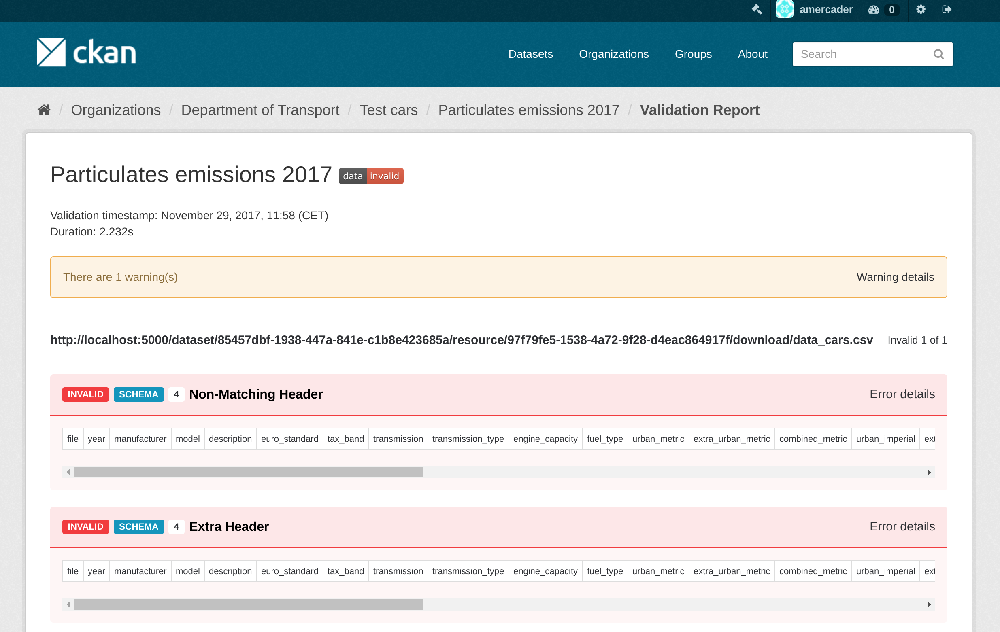
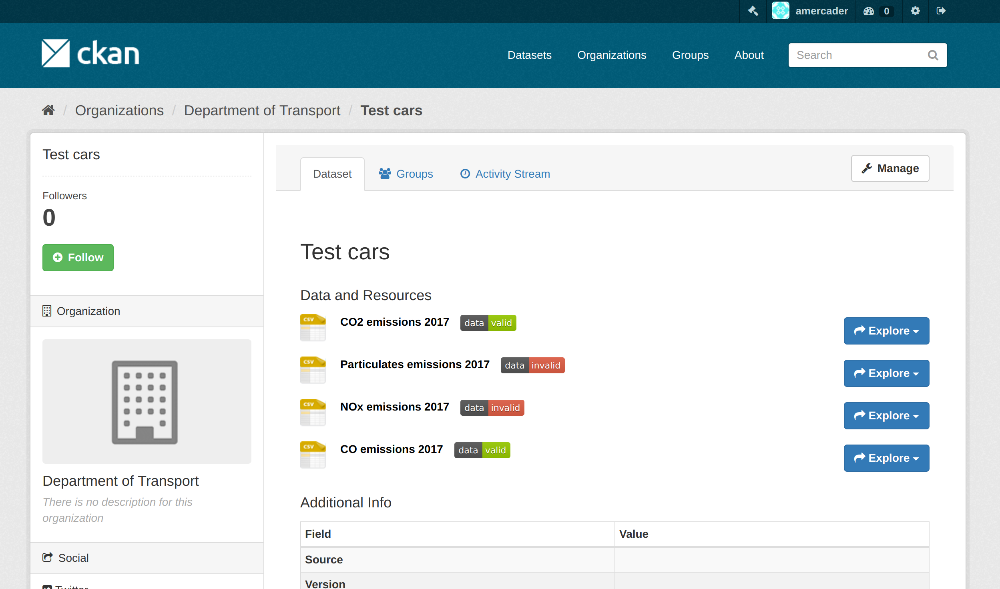
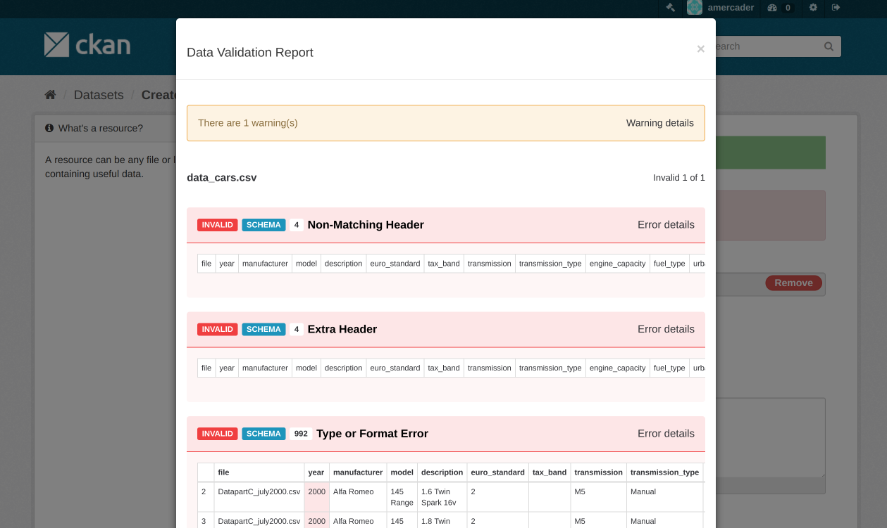

## Context

One of the main goals of the Frictionless Data project is to help improve data quality by providing easy to integrate libraries and services for data validation. We have integrated data validation seamlessly with different backends like GitHub and Amazon S3 via the online service [goodtables.io](https://goodtables.io/), but we also wanted to explore closer integrations with other platforms.

An obvious choice for that are Open Data portals. They are still one of the main forms of dissemination of Open Data, especially for governments and other organizations. They provide a single entry point to data relating to a particular region or thematic area and provide users with tools to discover and access different datasets. On the backend, publishers also have tools available for the validation and publication of datasets.

Data Quality varies widely across different portals, reflecting the publication processes and requirements of the hosting organizations. In general, it is difficult for users to assess the quality of the data and there is a lack of descriptors for the actual data fields. At the publisher level, while strong emphasis has been put in metadata standards and interoperability, publishers don’t generally have the same help or guidance when dealing with data quality or description.

We believe that data quality in Open Data portals can have a central place on both these fronts, user-centric and publisher-centric, and we started this pilot to showcase a possible implementation.

To field test our implementation we chose the [Western Pennsylvania Regional Data Center](https://www.wprdc.org) (WPRDC), managed by the [University of Pittsburgh Center for Urban and Social Research](http://ucsur.pitt.edu/). The Regional Data Center made for a good pilot as the project team takes an agile approach to managing their own CKAN instance along with support from OpenGov, members of the CKAN association. As the open data repository is used by a diverse array of data publishers (including project partners Allegheny County and the City of Pittsburgh), the Regional Data Center provides a good test case for testing the implementation across a variety of data types and publishing processes. WPRDC is a great example of a well managed Open Data portal, where datasets are actively maintained and the portal itself is just one component of a wider Open Data strategy. It also provides a good variety of publishers, including public sector agencies, academic institutions, and nonprofit organizations. The project’s partnership with the Digital Scholarship Services team at the University Library System also provides data management expertise not typically available in many open data implementations.

## The Work

### What Did We Do

The portal software that we chose for this pilot is [CKAN](https://ckan.org), the world's leading open source software for Open Data portals ([source](https://github.com/jalbertbowden/open-library/blob/master/lib/d2.1-state-of-the-art-report-and-evaluation-of-existing-open-data-platforms-2015-01-06-route-to-pa.pdf)). Open Knowledge International initially fostered the CKAN project and is now a member of the [CKAN Association](https://ckan.org/about/association/).

We created [ckanext-validation](https://github.com/frictionlessdata/ckanext-validation), a CKAN extension that provides a low level API and readily available features for data validation and reporting that can be added to any CKAN instance. This is powered by [goodtables](https://github.com/frictionlessdata/goodtables-py), a library developed by Open Knowledge International to support the validation of tabular datasets.

The extension allows users to perform data validation against any tabular resource, such as CSV or Excel files. This generates a report that is stored against a particular resource, describing issues found with the data, both at the structural level (missing headers, blank rows, etc) and at the data schema level (wrong data types, values out of range etc).

*data validation on CKAN made possible by ckanext-validation extension*

This provides a good overview of the quality of the data to users but also to publishers so they can improve the quality of the data file by addressing these issues. The reports can be easily accessed via badges that provide a quick visual indication of the quality of the data file.

*badges indicating quality of data files on CKAN*

There are two default modes for performing the data validation when creating or updating resources. Data validation can be automatically performed in the background asynchronously or as part of the dataset creation in the user interface. In this case the validation will be performed immediately after uploading or linking to a new tabular file, giving quick feedback to publishers.

*data validation on upload or linking to a new tabular file on CKAN*

The extension adds functionality to provide a [schema](https://specs.frictionlessdata.io/table-schema/) for the data that describes the expected fields and types as well as other constraints, allowing to perform validation on the actual contents of the data. Additionally the schema is also stored with the resource metadata, so it can be displayed in the UI or accessed via the API.

The extension also provides some utility commands for CKAN maintainers, including the generation of [reports](https://github.com/frictionlessdata/ckanext-validation#data-validation-reports) showing the number of valid and invalid tabular files, a breakdown of the error types and links to the individual resources. This gives maintainers a snapshot of the general quality of  the data hosted in their CKAN instance at any given moment in time.

As mentioned before, we field tested the validation extension on the Western Pennsylvania Regional Data Center (WPRDC). At the moment of the import the portal hosted 258 datasets. Out of these, 221 datasets had tabular resources, totalling 626 files (mainly CSV and XLSX files).  Taking into account that we only performed the default validation that only includes structural checks (ie not schema-based ones) these are the results:

>466 resources - validation success

>156 resources - validation failure

>4 resources - validation error

The errors found are due to current limitations in the validation extension with large files.

Here’s a breakdown of the formats:

|      | Valid resources | Invalid / Errored resources |
|:----:|:---------------:|:---------------------------:|
| CSV  | 443             | 64                          |
| XLSX | 21              | 57                          |
| XLS  | 2               | 39                          |

And of the error types (more information about each error type can be found in the [Data Quality Specification](https://github.com/frictionlessdata/data-quality-spec/blob/master/spec.json)):

| Type of Error    | Error Count |
|------------------|-------------|
| Blank row        | 19654       |
| Duplicate row    | 810         |
| Blank header     | 299         |
| Duplicate header | 270         |
| Source error     | 30          |
| Extra value      | 11          |
| Format error     | 9           |
| HTTP error       | 2           |
| Missing value    | 1           |

The highest number of errors are obviously caused by blank and duplicate rows. These are generally caused by Excel adding extra rows at the end of the file or by publishers formatting the files for human rather than machine consumption. Examples of this include adding a title in the first cell (like in this case: [portal page](https://data.wprdc.org/dataset/046e5b6a-0f90-4f8e-8c16-14057fd8872e/resource/b4aa617d-1cb8-42d0-8eb6-b650097cf2bf) | [file](https://data.wprdc.org/dataset/046e5b6a-0f90-4f8e-8c16-14057fd8872e/resource/b4aa617d-1cb8-42d0-8eb6-b650097cf2bf/download/30-day-blotter-data-dictionary.xlsx)) or even more complex layouts ([portal page](https://data.wprdc.org/dataset/9c4eab3b-e05d-4af8-ad18-76e4c1a71a74/resource/21a032e9-6345-42b3-b61e-10de29280946) | [file](https://data.wprdc.org/dataset/9c4eab3b-e05d-4af8-ad18-76e4c1a71a74/resource/21a032e9-6345-42b3-b61e-10de29280946/download/permitsummaryissuedmarch2015.xlsx)), with logos and links. Blank and duplicate header errors like on this case ([portal page](https://data.wprdc.org/dataset/543ae03d-3ef4-45c7-b766-2ed49338120f/resource/f587d617-7afa-4e79-8010-c0d2bdff4c04) | [file](https://data.wprdc.org/dataset/543ae03d-3ef4-45c7-b766-2ed49338120f/resource/f587d617-7afa-4e79-8010-c0d2bdff4c04/download/opendata-citiparks---summer-meal-sites-2015.csv)) are also normally caused by Excel storing extra empty columns (and something that can not be noticed directly from Excel).

These errors are  easy to spot and fix manually once the file has been opened for inspection but this is still an extra step that data consumers need to perform before using the data on their own processes. It is also true that they are errors that could be easily fixed automatically as part of a pre-process of data cleanup before publication. Perhaps this is something that could be developed in the validation extension in the future.

Other less common errors include Source errors, which include errors that prevented the file from being read by goodtables, like encoding issues or HTTP responses or HTML files incorrectly being marked as Excel files (like in this case: [portal page](https://data.wprdc.org/dataset/9c4eab3b-e05d-4af8-ad18-76e4c1a71a74/resource/9ea45609-e3b0-445a-8ace-0addb973fdf5) | [file](https://data.wprdc.org/dataset/9c4eab3b-e05d-4af8-ad18-76e4c1a71a74/resource/9ea45609-e3b0-445a-8ace-0addb973fdf5/download/plipublicwebsitemonthlysummaryaugust2017.xls)). Extra value errors are generally caused by not properly quoting fields that contain commas, thus breaking the parser (example: [portal page](https://data.wprdc.org/dataset/3130f583-9499-472b-bb5a-f63a6ff6059a/resource/12d9e6e1-3657-4cad-a430-119d34b1a5b2) | [file](https://data.wprdc.org/dataset/3130f583-9499-472b-bb5a-f63a6ff6059a/resource/12d9e6e1-3657-4cad-a430-119d34b1a5b2/download/crashdatadictionary.csv)).

Format errors are caused by labelling incorrectly the format of the hosted file, for instance CSV when it links to an Excel file ([portal page](https://data.wprdc.org/dataset/669b2409-bb4b-46e5-9d91-c36876b58a17/resource/e919ecd3-bb11-4883-a041-bded25dc651c) | [file](https://data.wprdc.org/dataset/669b2409-bb4b-46e5-9d91-c36876b58a17/resource/e919ecd3-bb11-4883-a041-bded25dc651c/download/2016-cveu-inspections.xlsx)), CSV linking to HTML ([portal page](https://data.wprdc.org/dataset/libraries/resource/14babf3f-4932-4828-8b49-3c9a03bae6d0) | [file](https://wprdc-maps.carto.com/u/wprdc/builder/1142950f-f054-4b3f-8c52-2f020e23cf78/embed)) or XLS linking to XLSX ([portal page](https://data.wprdc.org/dataset/40188e1c-6d2e-4f20-9391-607bd3054949/resource/cf0617a1-b950-4aa7-a36d-dc9da412ddf7) | [file](https://data.wprdc.org/dataset/40188e1c-6d2e-4f20-9391-607bd3054949/resource/cf0617a1-b950-4aa7-a36d-dc9da412ddf7/download/transportation.xls)). These are all easily fixed at the metadata level.

Finally HTTP errors just show that the linked file hosted elsewhere does not exist or has been moved.

Again, it is important to stress that the checks performed are just [basic and structural checks](https://github.com/frictionlessdata/goodtables-py#validation) that affect the general availability of the file and its general structure. The addition of standardized schemas would allow for a more thorough and precise validation, checking the data contents and ensuring that this is what was expected.

Also it is interesting to note that WPRDC has the excellent good practice of publishing data dictionaries describing the contents of the data files. These are generally published in CSV format and they themselves can present validation errors as well. As we saw before, using the validation extension we can assign a schema defined in the Table Schema spec to a resource. This will be used during the validation, but the information could also be used to render it nicely on the UI or export it consistently as a CSV or PDF file.

All the generated reports can be further analyzed using the output files stored [in this repository](https://github.com/frictionlessdata/pilot-wprdc).

Additionally, to help browse the validation reports created from the WPRDC site we have set up a demo site that mirrors the datasets, organizations and groups hosted there (at the time we did the import).

All tabular resources have the validation report attached, that can be accessed clicking on the data valid / invalid badges.

## Next Steps

### Areas for further work

The validation extension for CKAN currently provides a very basic workflow for validation at creation and update time: basically if the validation fails in any way you are not allowed to create or edit the dataset. Maintainers can define a set of default validation options to make it more permissive but even so some publishers probably wouldn’t want to enforce all validation checks before allowing the creation of a dataset, or just apply validation to datasets from a particular organization or type. Of course the [underlying API](https://github.com/frictionlessdata/ckanext-validation#action-functions) is available for extension developers to implement these workflows, but the validation extension itself could provide some of them.

The user interface for defining the validation options can definitely be improved, and we are planning to integrate a [Schema Creator](https://github.com/frictionlessdata/ckanext-validation/issues/10) to make easier for publishers to describe their data with a schema based on the actual fields on the file. If the resource has a schema assigned, this information can be presented nicely on the UI to the users and exported in different formats.

The validation extension is a first iteration to demonstrate the capabilities of integrating data validation directly into CKAN, but we are keen to know about different ways in which this could be expanded or integrated in other workflows, so any feedback or thoughts is appreciated.

### Additional Resources

* Check the [full documentation](https://github.com/frictionlessdata/ckanext-validation/blob/master/README.md#how-it-works) for ckanext-validation, covering all details on how to install it and configure it, features and available API

* Source material:
 * [ckanext-validation codebase](https://github.com/frictionlessdata/ckanext-validation)
 * [Western Pennsylvania Regional Data Center Github repository](https://github.com/frictionlessdata/pilot-wprdc)