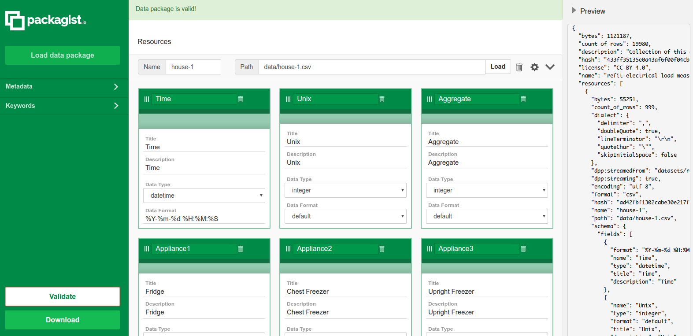

# DM4T Pilot

## Pilot Name
Data Management for TEDDINET (DM4T)

## Authors
Julian Padget (DM4T), Dan Fowler (OKI), Evgeny Karev (OKI)

## Field
Energy Data

## FD Tech Involved
- Frictionless Data specs: http://specs.frictionlessdata.io/
- Data Package Pipelines: https://github.com/frictionlessdata/datapackage-pipelines
- Goodtables: https://github.com/frictionlessdata/goodtables-py

`packagist` has now moved to [create.frictionlessdata.io](http://create.frictionlessdata.io)

## Context

### Problem We Were Trying To Solve

Open Knowledge International and the Data Management for TEDDINET project (DM4T) agreed to work together on a proof-of-concept pilot to attempt to use Frictionless Data approaches to address some of the data legacy issues facing the TEDDINET project, a research network addressing the challenges of transforming energy demand in our buildings, as a key component of the transition to an affordable, low carbon energy system. The problem as described on the DM4T Website:

>The Engineering and Physical Sciences Research Council (EPSRC), the UK's main agency for funding research in engineering and the physical sciences, funded 22 projects over two calls in 2010 and 2012 to investigate Transforming Energy Demand through Digital Innovation' (TEDDI) as a means to find out how people use energy in homes and what can be done reduce energy consumption. A lot of data is being collected at different levels of detail in a variety of housing throughout the UK, but the level of detail are largely defined by the needs of each individual project. At the same time, the Research Councils UK (RCUK) are defining guidelines for what happens to data generated by projects they fund which require researchers to take concrete actions to store, preserve, and document their data for future reference.

>The problem, however, is that there is relatively little awareness, limited experience and only emerging practice of how to incorporate data management into much of physical science research. This is in contrast to established procedures for data formats and sharing in the biosciences, stemming from international collaboration on the Human Genome Project, and in the social sciences, where data from national surveys, including census data, have been centrally archived for many years. Consequently, current solutions may be able to meet a minimal interpretation of the requirements, but not effectively deliver the desired data legacy.

The DM4T group selected three suitable datasets to on which to base this work and provided domain knowledge to ensure the pilot is applicable to real use cases.

Output was tracked here: https://github.com/frictionlessdata/pilot-dm4t/issues

## The work

We will use the `refit-cleaned` dataset to show the Frictionless Data specs and software capabilities. For this work, we limited the size of this dataset in order to preserve a reasonable showcasing time. However, by design the Frictionless Data software has a very good scalability and this process could be reproduced for the whole dataset. But for now it is worth noting that the speed for such a big datasets could be a bottle neck for a research work.

### REFIT: Electrical Load Measurements (Cleaned)

> Link to the dataset: https://github.com/frictionlessdata/pilot-dm4t/tree/delivery/datasets/refit-cleaned

For each house in the study, this dataset consists of granular readings of electrical load.  There were 20 houses in total, and each house had a different mix of devices plugged into the electrical load sensor.  The dataset was distributed as a zipped file (~500MB) containing 20 CSVs with a combined ~120 million rows.

```
Time,Unix,Aggregate,Appliance1,Appliance2,Appliance3,Appliance4,Appliance5,Appliance6,Appliance7,Appliance8,Appliance9
2013-10-09 13:06:17,1381323977,523,74,0,69,0,0,0,0,0,1
2013-10-09 13:06:31,1381323991,526,75,0,69,0,0,0,0,0,1
2013-10-09 13:06:46,1381324006,540,74,0,68,0,0,0,0,0,1
2013-10-09 13:07:01,1381324021,532,74,0,68,0,0,0,0,0,1
2013-10-09 13:07:15,1381324035,540,74,0,69,0,0,0,0,0,1
2013-10-09 13:07:18,1381324038,539,74,0,69,0,0,0,0,0,1
2013-10-09 13:07:30,1381324050,537,74,0,69,0,0,0,0,0,1
2013-10-09 13:07:32,1381324052,537,74,0,69,0,0,0,0,0,1
2013-10-09 13:07:44,1381324064,548,74,0,69,0,0,0,0,0,1
```

Given that these datasets were already provided in well structured CSV files, it was straightforward to translate the data dictionary found in the dataset’s README into the relevant fields in the datapackage.json.  We did not need to alter the CSVs that comprise the dataset.

### Creating a data package using Datapackage Pipelines

> Link to the Datapackage Pipelines project: https://github.com/frictionlessdata/datapackage-pipelines

Datapackage Pipelines is a framework for declarative stream-processing of tabular data. It is built upon the concepts and tooling of the Frictionless Data project. The basic concept in this framework is the pipeline. A pipeline has a list of processing steps, and it generates a single data package as its output. Pipelines are defined in a declarative way, not in code. One or more pipelines can be defined in a `pipeline-spec.yaml` file. This file specifies the list of processors (referenced by name) and their execution parameters.

One of the main purposes of the Frictionless Data project is data containerization. It means that instead of having two separated data knowledge sources (data files and text readme), we're going to put both of them into a container based on the `Data Package` specification. This allows us to:

- Ensure that the dataset description is shipped with the data files
- Provide column data type information to allow type validation
- Use the Frictionless Data tooling for reading and validating datasets
- Enable usage of other software which supports Frictionless Data specifications

First, we used the `datapackage-pipeline` library to create a data package from the raw dataset. We need a declarative file called `datapackage-pipelines.yaml` to describe data transformations steps:

> datapackage-pipelines.yaml

```yaml
refit-cleaned:
  pipeline:
    - run: add_metadata
      parameters:
        name: refit-electrical-load-measurements
        title: 'REFIT: Electrical Load Measurements'
        license: CC-BY-4.0
        description: Collection of this dataset was supported by the Engineering and Physical Sciences Research Council (EPSRC) via the project entitled Personalised Retrofit Decision Support Tools for UK Homes using Smart Home Technology (REFIT), which is a collaboration among the Universities of Strathclyde, Loughborough and East Anglia. The dataset includes data from 20 households from the Loughborough area over the period 2013 - 2015. Additional information about REFIT is available from www.refitsmarthomes.org.
        sources:
          -
            title: 'REFIT: Electrical Load Measurements (Cleaned)'
            web: 'https://pure.strath.ac.uk/portal/en/datasets/refit-electrical-load-measurements-cleaned(9ab14b0e-19ac-4279-938f-27f643078cec).html'
            email: researchdataproject@strath.ac.uk
    - run: add_resource
      parameters:
        name: 'house-1'
        url: 'datasets/refit-cleaned/House_1.csv'
        format: csv

    # Other resources are omitted

    - run: stream_remote_resources
    - run: set_types
      parameters:
        resources: "house-[0-9]{1,2}"
        types:
          "Time":
            type: datetime
            format: "fmt:%Y-%m-%d %H:%M:%S"
          Unix:
            type: integer
          Aggregate:
            type: integer
          "Appliance[1-9]":
            type: integer
    - run: processors.modify_descriptions
      parameters:
        resources: house-1
        descriptions:
          Appliance1:
            description: Fridge
          Appliance2:
            description: Chest Freezer
          Appliance3:
            description: Upright Freezer
          Appliance4:
            description: Tumble Dryer
          Appliance5:
            descripion: Washing Machine
          Appliance6:
            description: Dishwasher
          Appliance7:
            description: Computer Site
          Appliance8:
            description: Television Site
          Appliance9:
            description: Electric Heater

    # Other resources are omitted

    - run: dump.to_path
      parameters:
          out-path: packages/refit-cleaned
```

The process follows contains these steps:
- Create the data package metadata
- Add all data files from the disc
- Start resources streaming into the data package
- Update resources descriptions using a custom processor
- Save the data package to the disc

Now we're ready to run this pipeline:

```bash
$ dpp run ./refit-cleaned
```

After this step we have a data package containing a descriptor:

> packages/refit-cleaned/datapakcage.json

```json
{
  "bytes": 1121187,
  "count_of_rows": 19980,
  "description": "Collection of this dataset was supported by the Engineering and Physical Sciences Research Council (EPSRC) via the project entitled Personalised Retrofit Decision Support Tools for UK Homes using Smart Home Technology (REFIT), which is a collaboration among the Universities of Strathclyde, Loughborough and East Anglia. The dataset includes data from 20 households from the Loughborough area over the period 2013 - 2015. Additional information about REFIT is available from www.refitsmarthomes.org.",
  "hash": "433ff35135e0a43af6f00f04cb8e666d",
  "license": "CC-BY-4.0",
  "name": "refit-electrical-load-measurements",
  "resources": [
    {
      "bytes": 55251,
      "count_of_rows": 999,
      "dialect": {
        "delimiter": ",",
        "doubleQuote": true,
        "lineTerminator": "\r\n",
        "quoteChar": "\"",
        "skipInitialSpace": false
      },
      "dpp:streamedFrom": "datasets/refit-cleaned/House_1.csv",
      "dpp:streaming": true,
      "encoding": "utf-8",
      "format": "csv",
      "hash": "ad42fbf1302cabe30e217ff105d5a7fd",
      "name": "house-1",
      "path": "data/house-1.csv",
      "schema": {
        "fields": [
          {
            "format": "%Y-%m-%d %H:%M:%S",
            "name": "Time",
            "type": "datetime"
          },
          {
            "name": "Unix",
            "type": "integer"
          },
          {
            "name": "Aggregate",
            "type": "integer"
          },
          {
            "description": "Fridge",
            "name": "Appliance1",
            "type": "integer"
          },
          {
            "description": "Chest Freezer",
            "name": "Appliance2",
            "type": "integer"
          },
          {
            "description": "Upright Freezer",
            "name": "Appliance3",
            "type": "integer"
          },
          {
            "description": "Tumble Dryer",
            "name": "Appliance4",
            "type": "integer"
          },
          {
            "descripion": "Washing Machine",
            "name": "Appliance5",
            "type": "integer"
          },
          {
            "description": "Dishwasher",
            "name": "Appliance6",
            "type": "integer"
          },
          {
            "description": "Computer Site",
            "name": "Appliance7",
            "type": "integer"
          },
          {
            "description": "Television Site",
            "name": "Appliance8",
            "type": "integer"
          },
          {
            "description": "Electric Heater",
            "name": "Appliance9",
            "type": "integer"
          }
        ]
      }
    },

    # Other resources is omitted

  ]
}
```

And a list of data files linked in the descriptor:

```bash
$ ls packages/refit-cleaned/data
house-10.csv  house-13.csv  house-17.csv  house-1.csv   house-2.csv  house-5.csv  house-8.csv
house-11.csv  house-15.csv  house-18.csv  house-20.csv  house-3.csv  house-6.csv  house-9.csv
house-12.csv  house-16.csv  house-19.csv  house-21.csv  house-4.csv  house-7.csv
```

### Validating a data package using Goodtables

Goodtables is a software family for tabular data validation. It's available as a Python library, a command line tool, [web application](https://try.goodtables.io/) and [continuous validation service](https://goodtables.io/).

The main features of Goodtables are:

- Structural checks: Ensure that there are no empty rows, no blank headers, etc.
- Content checks: Ensure that the values have the correct types ("string", "number", "date", etc.), that their format is valid ("string must be an e-mail"), and that they respect the constraints ("age must be a number greater than 18").
- Support for multiple tabular formats: CSV, Excel files, LibreOffice, Data Package, etc.
- Parallelized validations for multi-table datasets

Because we have provided data types for the columns at the wrapping stage, here we validate both the data structure and compliance to the data types using the Goodtables command line interface:

```bash
$ goodtables packages/refit-cleaned/datapackage.json
DATASET
=======
{'error-count': 0,
 'preset': 'datapackage',
 'table-count': 20,
 'time': 4.694,
 'valid': True}
```

### Modifying a data package using Packagist

If we need to modify our data package, we could use the [Packagist](https://create.frictionlessdata.io/). It incorporates a straightforward UI to modify and validate data package descriptors. With its easy to use interface we are able to:

- Load/validate/save a data package
- Update a data package metadata
- Add/remove/modify data package resources
- Add/remove/modify data resource fields
- Set type/format for data values



On the figure above we have loaded the `refit-cleaned` data package into the Packagist UI to make changes to the data package as needed.

### Publishing a data package to Amazon S3

> Link to the published package: https://s3.eu-central-1.amazonaws.com/pilot-dm4t/pilot-dm4t/packages/refit-cleaned/datapackage.json

In this section we will show how  data packages can be moved from one data storage system to another. This is possible because it has been containerised.

One important feature of the `datapackage-pipelines` project that it works as a conveyor. We could push our data package not only to the local disc but to other destinations. For example to the Amazon S3:

> pipelines-spec.yml

```yaml
refit-cleaned:

    # Initial steps are omitted

    - run: aws.dump.to_s3
      parameters:
        bucket: pilot-dm4t
        path: pilot-dm4t/packages/refit-cleaned
```

Running this command again:

```bash
$ dpp run ./refit-cleaned
```

And now our data package is published to Amazon the S3 remote storage:


### Getting insight from data using Python libraries

> Link to the demostration script: https://github.com/frictionlessdata/pilot-dm4t/blob/delivery/scripts/refit-cleaned.py

The Frictionless Data projects provides various Python (along with other 8 languages) libraries to work with data package programatically. We used the `datapackage` library to analyse the `refit-cleaned` data package:

```python
import datetime
import statistics
from datapackage import Package

# Get aggregates
consumption = {}
package = Package('packages/refit-cleaned/datapackage.json')
for resource in package.resources:
    for row in resource.iter(keyed=True):
        hour = row['Time'].hour
        consumption.setdefault(hour, [])
        consumption[hour].append(row['Aggregate'])

# Get averages
for hour in consumption:
    consumption[hour] = statistics.mean(consumption[hour])

# Print results
for hour in sorted(consumption):
    print('Average consumption at %02d hours: %.0f' % (hour, consumption[hour]))
```

Now we could run it in the command line:

```bash
$ python examles/refit-cleaned.py
Average consumption at 00 hours: 232
Average consumption at 01 hours: 213
Average consumption at 02 hours: 247
Average consumption at 03 hours: 335
Average consumption at 04 hours: 215
Average consumption at 05 hours: 690
Average consumption at 06 hours: 722
Average consumption at 07 hours: 648
Average consumption at 08 hours: 506
Average consumption at 09 hours: 464
Average consumption at 10 hours: 364
Average consumption at 11 hours: 569
Average consumption at 12 hours: 520
Average consumption at 13 hours: 497
Average consumption at 14 hours: 380
Average consumption at 15 hours: 383
Average consumption at 16 hours: 459
Average consumption at 17 hours: 945
Average consumption at 18 hours: 733
Average consumption at 19 hours: 732
Average consumption at 20 hours: 471
Average consumption at 21 hours: 478
Average consumption at 22 hours: 325
Average consumption at 23 hours: 231
```

Here we we're able to get the averages for electricity consumption grouped by hour. We could have achieved this in different ways, but using the Frictionless Data specs and software provides some important advantages:

- The fact that we have data wrapped into a data package has allowed us to validate and read the data already converted for its correct types (e.g native python `datetime` object). No need for any kind of string parsing.
- The Frictionless Data software uses file streams under the hood. This means that only the current row is kept in memory, so we're able to handle datasets bigger than the available RAM memory.

### Exporting data to an ElasticSearch cluster

> Link to the export script: https://github.com/frictionlessdata/pilot-dm4t/blob/delivery/scripts/refit-cleaned.py

The Frictionless Data software provides plugins to export data to various backends like SQL, BigQuery etc. We will export the first resource from our data package for future analysis:

```python
from elasticsearch import Elasticsearch
from datapackage import Package
from tableschema_elasticsearch import Storage

# Get resource
package = Package('packages/refit-cleaned/datapackage.json')
resource = package.get_resource('house-1')

# Create storage
engine = Elasticsearch()
storage = Storage(engine)

# Write data
storage.create('refit-cleaned', [('house-1', resource.schema.descriptor)])
list(storage.write('refit-cleaned', 'house-1', resource.read(keyed=True), ['Unix']))

```

Now we are able to check that our documents are indexed:

```bash
$ http http://localhost:9200/_cat/indices?v
```

### Getting insight from data using Kibana

To demonstrate how the Frictionless Data specs and software empower the usage of other analytics tools, we will use ElasticSearch/Kibana project. On the previous step we have imported our data package into an ElasticSearch cluster. It allows us to visualize data using a simple UI:


In this screenshot we see the distribution of the average electricity comsumption. This is just an example of what you can do by having the ability to easily load datasets into other analytical software.

## Review

### The results

In this pilot, we have been able to demonstrate the the following:

- Packaging the `refit-cleaned` dataset as a data package using the Data Package Pipelines library
- Validating the data package using the Goodtables library
- Modifying data packages metadata using the Packagist UI
- Uploading the dataset to Amazon S3 and ElasticSearch cluster using Frictionless Data tools
- Reading and analysing in Python the created Data Package using the Frictionless Data library

### Current limitations

The central challenge of working with these datasets is the size. Publishing the results of these research projects as flat files for immediate analysis is beneficial, however, the scale of each of these datasets (gigabytes of data, millions of rows) is a challenge to deal with no matter how you are storing. Processing this data through Data Package pipelines takes a long time.

### Next Steps

- Improve the speed of the data package creation step

### Find Out More

- https://github.com/frictionlessdata/pilot-pnnl

### Source Material

- https://app.hubspot.com/sales/2281421/deal/146418008
- https://discuss.okfn.org/c/working-groups/open-archaeology
- https://github.com/frictionlessdata/pilot-open-archaeology