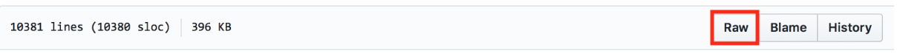
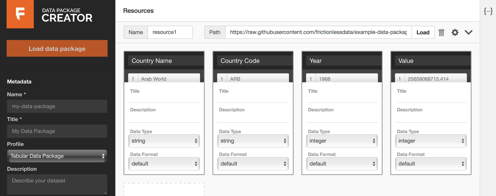
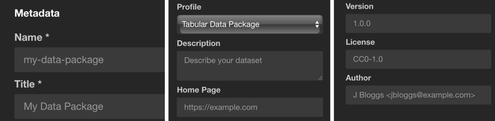
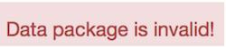

When sharing multiple datasets on a specific subject with a varied audience, it is important to ensure that whoever accesses the data understands the context around it, and can quickly access licensing and other attribution information.

In this section, you will learn how to collate related datasets in one place, and easily create a schema that contains descriptive metadata for your data collection.

## Write a Table Schema

Simply put, a schema is a blueprint that tells us how your data is structured, and what type of content is to be expected in it. You can think of it as a data dictionary. Having a table schema at hand makes it possible to run more precise validation checks on your data, both at a structural and content level.

For this section, we will use the [Data Package Creator](https://create.frictionlessdata.io) and [Gross Domestic Product dataset for all countries (1960 - 2014)](http://datahub.io/core/gdp).

**Data Package** is a format that makes it possible to put your data collection and relevant information that provides context about your data in one container before you share it. All contextual information, such as metadata and your data schema, is published in a JSON file named *datapackage.json*.

**Data Package Creator** is an online service that facilitates the creation and editing of data packages. The service automatically generates a *datapackage.json* file for you as you add and edit data that is part of your data collection. We refer to each piece of data in a data collection as a **data resource**.

[Data Package Creator](https://create.frictionlessdata.io) loads with dummy data to make it easy to understand how metadata and sample resources help generate the *datapackage.json* file. There are three ways in which a user can add data resources on [Data Package Creator](https://create.frictionlessdata.io):

1. Provide a hyperlink to your data resource (highly recommended).

  If your data resource is publicly available, like on GitHub or in a data repository, simply obtain the URL and paste it in the **Path** section. To learn how to publish your data resource online, check the publish your dataset section.

2. Create your data resource within the service.

  If your data resource isn't published online, you'll have to define its fields from scratch. Depending on how complex is your data, this can be time consuming, but it's still easier than creating the descriptor JSON file from scratch.This option is time consuming, as a user has to manually create each field of a data resource. However, this is simpler than learning how to create a JSON file from scratch.

3. **Load a Data Package** option

  With this option, you can load a pre-existing *datapackage.json* file to view and edit its metadata and resource fields.
***
Let's use our [Gross Domestic Product dataset for all countries (1960 - 2014)](https://github.com/frictionlessdata/example-data-packages/blob/master/gross-domestic-product-all/data/gdp.csv) dataset, which is publicly available on GitHub.

Obtain a link to the raw CSV file by clicking on the Raw button at the top right corner of the GitHub file preview page, as shown in figure 1 below. The resulting hyperlink looks like `https://raw.githubusercontent.com/datasets/continent-codes/master/data/continent-codes.csv`

<figure>
  
  <figcaption>
    Figure 1: Above, raw button highlighted in red.
  </figcaption>
</figure>

Paste your hyperlink in the *Path* section and click on the *Load* button. Each column in your table translates to a *field*. You should be prompted to add all fields identified in your data resource, as in Figure 2 below. Click on the prompt to load the fields.

<figure>
  
  <figcaption>
    Figure 2: annotated in red, a prompt to add all fields inferred from your data resource.
  </figcaption>
</figure>

The page that follows looks like Figure 3 below. Each column from the GDP dataset has been mapped to a *field*. The data type for each column has been inferred correctly, and we can preview data under each field by hovering over the field name. It is also possible to edit all sections of our data resource’s fields as we can see below.

<figure>
  
  <figcaption>
    Figure 3: all fields inferred from your data resource.
  </figcaption>
</figure>

You can now edit data types and formats as necessary, and optionally add titles and descriptive information to your fields. For example, the data type for our {Year} field should be ***year*** and not ***integer***. Our {Value} column has numeric information with decimal places.

By definition, values under the ***integer*** data type are whole numbers. The ***number*** data type is more appropriate for the {Value} column. When in doubt about what data type to use, consult the [Table Schema data types cheat sheet](https://specs.frictionlessdata.io/table-schema/#types-and-formats).

Click on the  icon to pick a suitable profile for your data resource. [Here’s more information about Frictionless Data profiles](https://specs.frictionlessdata.io/profiles/).

If your dataset has other data resources, add them by scrolling to the bottom of the page, clicking on Add Resource, and repeating the same process as we just did.

If your dataset has other data resources, add them by scrolling to the bottom of the page, clicking on **Add Resource**, and repeating the same process as we just did.

<figure>
  
  <figcaption>
    Figure 4: Prompt to add more data resources.
  </figcaption>
</figure>

## Add your dataset's metadata

In the previous section, we described metadata for each of our datasets, but we're still missing metadata for our collection of datasets. You can add it via the **Metadata** section on the left side bar, describing things like the dataset name, description, author, license, etc.

<figure>
  
</figure>

The **Profile** section under metadata allows us to specify what kind of data collection we are packaging.
* *Data Package*
This is the base, more general profile. Use it if your dataset contains resources of mixed formats, like tabular and geographical data. The base requirement for a valid Data Package profile is the *datapackage.json* file. See the [Data Package specification](https://specs.frictionlessdata.io/data-package/) for more information.

* *Tabular Data Package*
If your data contains only tabular resources like CSVs and spreadsheets, use the Tabular Data Package profile. See the [Tabular Data Package specification](https://specs.frictionlessdata.io/tabular-data-package/) for more information.
* *Fiscal Data Package*
If your data contains fiscal information like budgets and expenditure data, use the  Fiscal Data Package profile. See the [Fiscal Data Package specification](https://specs.frictionlessdata.io/fiscal-data-package/) for more information.

In our example, as we only have a CSV data resource, the *Tabular Data Package* profile is the best option.

In the **Keywords** section, you can add any keywords that helps make your data collection more discoverable. For our dataset, we might use the keywords *GDP, National Accounts, National GDP, Regional GDP*. Other datasets could include the country name, dataset area (e.g. "health" or "environmental"), etc.

Now that we have created a Data Package, we can **Validate** or **Download** it. But first, let’s see what our datapackage.json file looks like. With every addition and modification, the [Data Package Creator](https://create.frictionlessdata.io) has been populating the *datapackage.json* file for us. Click on the **{···}** icon to view the *datapackage.json* file. As you can see below, any edit we make to the description of the Value field reflects on the JSON file in real time.

The **Validate** button allows us to confirm whether we chose the correct Profile for our Data Package. The two possible outcomes at this stage are:

<figure>
  
</figure>

This message appears when there is some validation error like if we miss some required attribute (e.g. the data package name), or have picked an incorrect profile (e.g. Tabular Data Package with geographical data).. Review the metadata and profiles to find the mistake and try validating again.

<figure>
  
</figure>

All good! This message means that your data package is valid, and we can download it.

## Download your Data Package

As we said earlier, the base requirement for a valid Data Package profile is the *datapackage.json* file, which contains your data schema and metadata. We call this the descriptor file. You can download your descriptor file by clicking on the **Download** button.

* If your data resources, like ours, were linked from an online public source, sharing the *datapackage.json* file is sufficient, since it contains URLs to your data resources.

* If you manually created a data resource and its fields, remember to add all your data resources and the downloaded *datapackage.json* file in one folder before sharing it.

The way to structure your dataset depends on your data, and what extra artifacts it contains (e.g. images, scripts, reports, etc.). In this section, we'll show a complete example with:

* **Data files**: The files with the actual data (e.g. CSV, XLS, GeoJSON, ...)
* **Documentation**: How was the data collected, any caveats, how to update it, etc.
* **Metadata**: Where the data comes from, what's in the files, what's their source and license, etc.
* **Scripts**: Software scripts that were used to generate, update, or modify the data.

Your final Data Package file directory should look like this:

```
data/
    dataresource1.csv
    dataresource2.csv
datapackage.json
```
* **data/**: All data files are contained in this folder. In our example, there is only one: `data/gdp.csv` .

* **datapackage.json**: This file describes the dataset's metadata. For example, what is the dataset, where are its files, what they contain, what each column means (for tabular data), what's the source, license, and authors, and so on. As it's a machine-readable specification, other software can import and validate your files.

Congratulations! You have now created a schema for your data, and combined it with descriptive metadata and your data collection to create your first data package!
