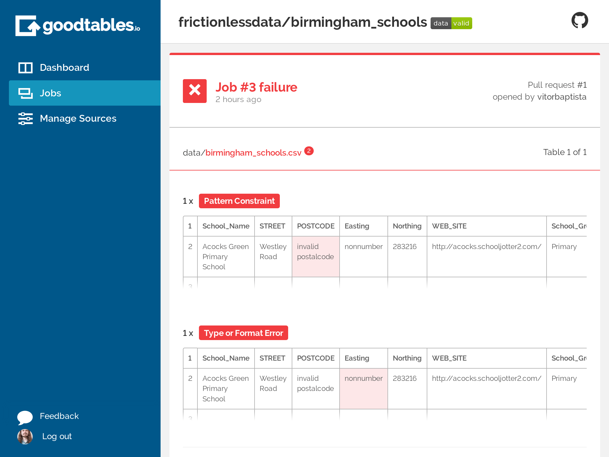
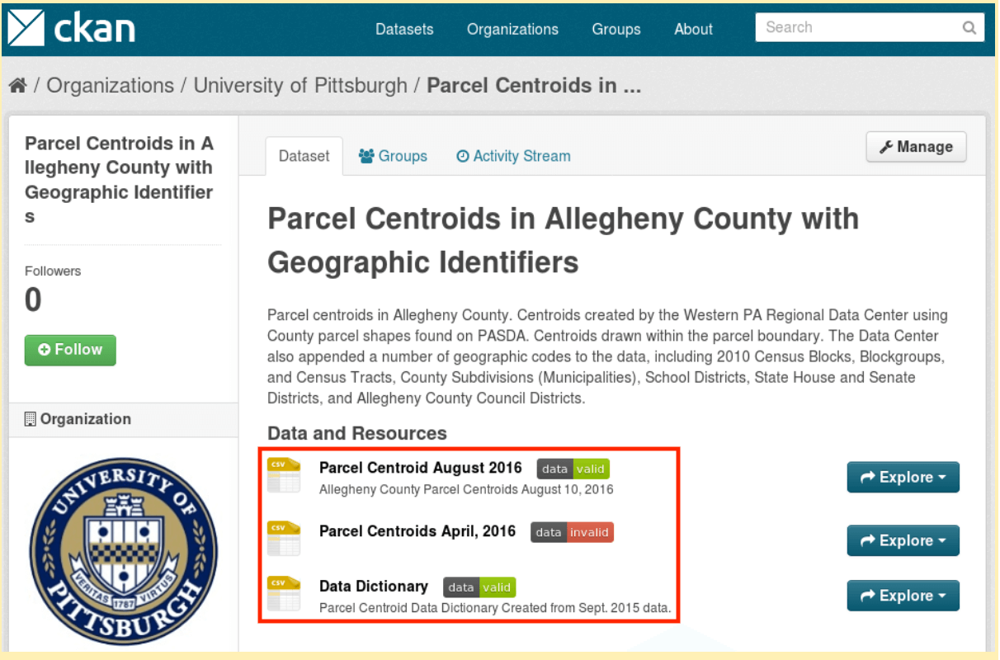

One-off validation of your tabular datasets can be hectic, especially where plenty of published data is maintained and updated fairly regularly.

Running continuous checks on data provides regular feedback and contributes to better data quality as errors can be flagged and fixed early on. This section introduces you to tools that continually check your data for errors and flag content and structural issues as they arise. By eliminating the need to run manual checks on tabular datasets every time they are updated, they make your data workflow more efficient.

In this section, you will learn how to setup automatic tabular data validation using goodtables, so your data is validated every time it's updated. Although not strictly necessary, it's useful to [know about Data Packages and Table Schema](/blog/2018/03/07/well-packaged-datasets/) before proceeding, as they allow you to describe your data in more detail, allowing more advanced validations.

We will show how to set up automated tabular data validations for data published on:

* [CKAN][ckan], an open source data publishing platform;
* [GitHub](https://github.com/), a hosting service;
* [Amazon S3](https://aws.amazon.com/s3/), a data storage service.

If you don't use any of these platforms, you can still setup the validation using [goodtables-py][gt-py], it will just require some technical knowledge

If you do use some of these platforms, the data validation report look like:

*Figure 1: Goodtables.io tabular data validation report.*

## Validate tabular data automatically on CKAN

[CKAN](https://ckan.org/) is an open source platform for publishing data online. It is widely used across the planet, including by the federal governments of the USA, United Kingdom, Brazil, and others.

To automatically validate tabular data on CKAN, enable the [ckanext-validation](https://github.com/frictionlessdata/ckanext-validation) extension, which uses goodtables to run continuous checks on your data. The [ckanext-validation](https://github.com/frictionlessdata/ckanext-validation) extension:

* Adds a badge next to each dataset showing the status of their validation (valid or invalid), and
* Allows users to access the validation report, making it possible for errors to be identified and fixed.

*Figure 2: Annotated in red, automated validation checks on datasets in CKAN.*

The installation and usage instructions for [ckanext-validation](https://github.com/frictionlessdata/ckanext-validation) extension are available on [Github](https://github.com/frictionlessdata/ckanext-validation).

## Validate tabular data automatically on GitHub

If your data is hosted on GitHub, you can use goodtables web service to automatically validate it on every change.

For this section, you will first need to create a [GitHub repository](https://help.github.com/articles/create-a-repo/) and add tabular data to it.

Once you have tabular data in your Github repository:

1. Login on [goodtables.io](https://goodtables.io/) using your GitHub account and accept the permissions confirmation.
1. Once we've synchronized your repository list, go to the [Manage Sources](https://goodtables.io/settings) page and enable the repository with the data you want to validate.
    * If you can't find the repository, try clicking on the Refresh button on the Manage Sources page

Goodtables will then validate all tabular data files (CSV, XLS, XLSX, ODS) and [data packages](https://specs.frictionlessdata.io/data-package/) in the repository. These validations will be executed on every change, including pull requests.

## Validate tabular data automatically on Amazon S3

If your data is hosted on Amazon S3, you can use [goodtables.io][gtio] to automatically validate it on every change.

It is a technical process to set up, as you need to know how to configure your Amazon S3 bucket. However, once it's configured, the validations happen automatically on any tabular data created or updated. Find the detailed instructions [here][gtio:s3].

## Custom setup of automatic tabular data validation

If you don't use any of the officially supported data publishing platforms, you can use [goodtables-py][gt-py] directly to validate your data. This is the most flexible option, as you can configure exactly when, and how your tabular data is validated. For example, if your data come from an external source, you could validate it once before you process it (so you catch errors in the source data), and once after cleaning, just before you publish it, so you catch errors introduced by your data processing.

The instructions on how to do this are technical, and can be found on [https://github.com/frictionlessdata/goodtables-py][gt-py].

[gtio]: https://goodtables.io/ "Goodtables.io"
[gtio:s3]: https://docs.goodtables.io/getting_started/s3.html "Goodtables.io Amazon S3 instructions"
[github]: https://github.com/ "GitHub"
[s3]: https://aws.amazon.com/s3/ "Amazon S3"
[s3-region-bug]: https://github.com/frictionlessdata/goodtables.io/issues/136 "Can't add S3 bucket with other region that Oregon (us-west-2)"
[howto-s3bucket]: https://docs.aws.amazon.com/AmazonS3/latest/user-guide/create-bucket.html "How do I create an S3 Bucket?"
[howto-s3upload]: https://docs.aws.amazon.com/AmazonS3/latest/user-guide/upload-objects.html "How do I upload files and folders to an S3 Bucket?"
[howto-iamuser]: http://docs.aws.amazon.com/IAM/latest/UserGuide/id_users_create.html?icmpid=docs_iam_console "Create an IAM User in your AWS account"
[bucket-overview]: https://s3.console.aws.amazon.com/s3/buckets/ "Amazon S3 Bucket list"
[gh-new-repo]: https://help.github.com/articles/create-a-repo/ "GitHub: Create new repository tutorial"
[gtio-managesources]: https://goodtables.io/settings "Goodtables.io: Manage sources"
[datapackage]: /data-package/ "Data Package"
[gtio-dataschema]: writing_data_schema.html "Writing a data schema"
[gtio-configuring]: configuring.html "Configuring goodtables.io"
[gt-py]: https://github.com/frictionlessdata/goodtables-py
[ckan]: https://ckan.org
