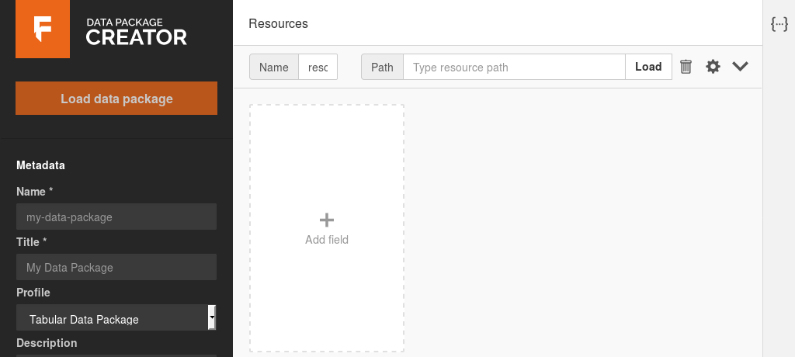
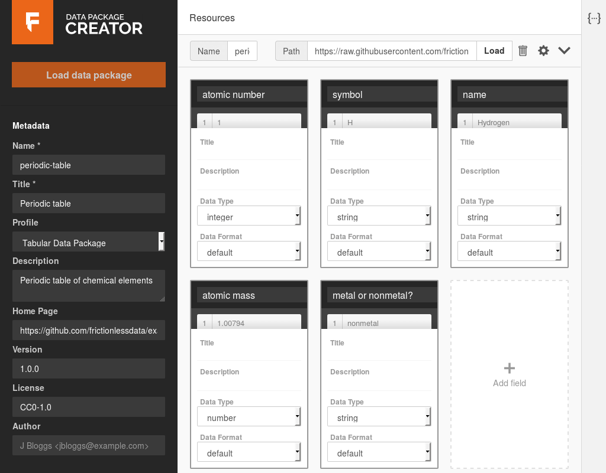
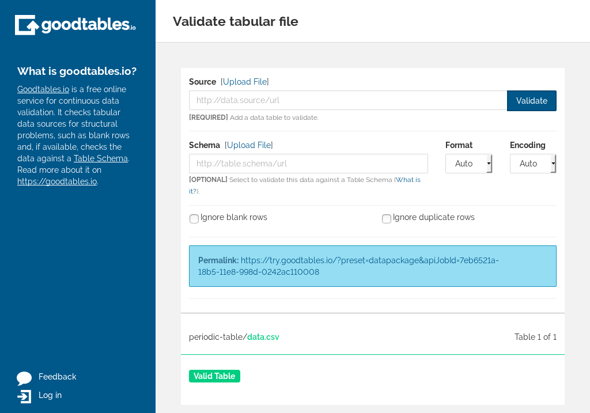
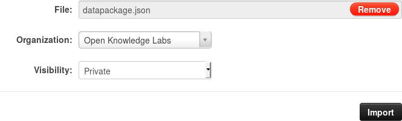
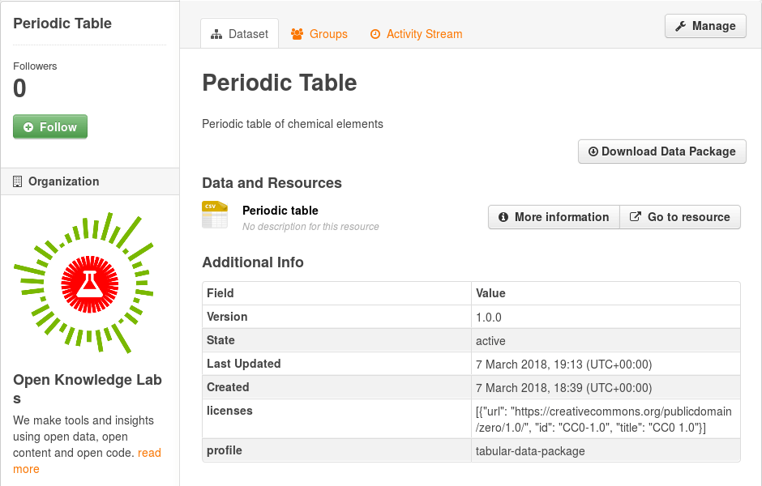

In this section, we will walk through the process of publishing, using a dataset of the periodic table of elements as an example. We will define its metadata by creating a data package, describe the structure of the CSV using a Table Schema, validate it on Goodtables, and finally publish to a public CKAN instance. Let's start.

First, let's look at the data. It is available as a CSV file on [this link][data.csv]. The first five rows look like:

| atomic number | symbol | name      | atomic mass | metal or nonmetal?   |
|           --- | ---    | ---       |         --- | ---                  |
|             1 | H      | Hydrogen  |     1.00794 | nonmetal             |
|             2 | He     | Helium    |    4.002602 | noble gas            |
|             3 | Li     | Lithium   |       6.941 | alkali metal         |
|             4 | Be     | Beryllium |    9.012182 | alkaline earth metal |
|             5 | B      | Boron     |      10.811 | metalloid            |

As we can see, there are some numeric fields, both integers (atomic number) and floating point (atomic mass), and others are textual with strings. Our first objective is to describe the metadata by creating a Data Package, and its contents by creating a Table Schema.

## Step 1. Package our data as a Data Package

The easiest way to create a data package is using the [Data Package Creator][dp:creator]. It provides a graphical interface to describe the data package's metadata, add resources, and define the schema for tabular resources. This is what you should see when you first open it:

*Data Package Creator*

The left side bar contains the metadata for the Data Package as a whole, and the main part on the right contains the metadata for each specific resource.

Let's add our CSV resource. On the main section of the page, fill the inputs with:

* **Name**: periodic-table
* **Path**: https://raw.githubusercontent.com/frictionlessdata/example-data-packages/d2b96aaed6ab12db41d73022a2988eeb292116e9/periodic-table/data.csv

Resource and data package names must be unique, lowercase, can contain only letters, numbers, and the characters ".", "-" and "_".

And click on the *Load* button. After a few seconds, a new box should appear with the text "Add all inferred fields (data has 5 extra column(s))". Click on it, and the fields will be created, with their data types and formats inferred from the data. This saves us time, as we don't need to start from scratch.

The Data Package Creator got almost all data types correctly, except the {atomic mass} column. It inferred the column as having integer values, but as we can see from the data, the numbers aren't whole, they have floating points. Just change the type to **number**, and that's it.

You can view a sample of the data in each column by hovering the mouse below its name.

Usually, we would now add titles and descriptions to each field. However, as this is a simple dataset, the field names should be enough. In the end, the fields are:

| Name               | Data type | Data format |
| ---                | ---       | ---         |
| atomic number      | integer   | default     |
| symbol             | string    | default     |
| name               | string    | default     |
| atomic mass        | number    | default     |
| metal or nonmetal? | string    | default     |

We can add more information about this resource by clicking on the gear icon to the left of the "Load" button. Add the following information:

* **Title**: Periodic table
* **Profile**: Tabular Data Resource
* **Format**: csv
* **Encoding**: (blank)
* **Description**: (blank)

After this, we're only missing metadata for the data package as a whole, available on the left side bar. Add:

* **Name**: periodic-table
* **Title**: Periodic table
* **Profile**: Tabular Data Package
* **Description**: Periodic table of chemical elements
* **Home Page**: https://github.com/frictionlessdata/example-data-packages/tree/master/periodic-table
* **Version**: 1.0.0
* **License**: CC0-1.0
* **Author**: (blank)

Let's validate the data package, to ensure we haven't missed anything. Just click on the *Validate* button on the bottom left, and you should see a green message "Data package is valid!". This means that the data package is valid, but not necessarily its contents (we'll check them in the next step).

Save the data package by clicking on the *Download* button. This will download a "datapackage.json" file that contains everything we added here. Our next step is to use it to validate the data.

## Step 2. Validate our data package and its contents

We now have a data package with our CSV file, including with a table schema describing the contents and types of its columns. Our final step before publishing is validating the data, so we can avoid publishing data with errors. To do so, we'll use goodtables.

[Goodtables][goodtables] is a tabular data validator that allows you to automatically check for errors such as blank headers, duplicate rows, data with the wrong type (e.g. should be a number but is a date), and others. As it supports data packages, we can simply load the one we created in the previous step. Let's do it.

1. Go to https://try.goodtables.io
1. On the *Source* input, click on the *Upload File* link.
1. Click on *Browse...* and select the *datapackage.json* file you downloaded in the previous step
1. Click on *Validate*

After a few seconds, you should see:

*try.goodtables*

This means that:

* The data package is valid
* The CSV file is valid
* There are no blank rows or headers, or duplicate rows
* The data is valid according to the table schema we created (numbers are numbers, and so on)

Although it can't tell you if your data is correct, for example if the Aluminium
atomic mass is 26.9815386, it does ensure you that all atomic mass values are
numbers, among the other validations.

Now that we've created a data package, described our data with a table schema,
and validated it, we can finally publish it.

## Step 3. Publish the data

Our final step is to publish the dataset. The specifics instructions will vary depend on where you're publishing to. In this example, we'll see how to publish to a public [CKAN][ckan] instance, the [Datahub](https://old.datahub.io). If you want to use it and don't have an account yet, you can request one via [our community page][datahub:request-org]. *(Note: this example is now out of date. See the [CKAN docs](https://docs.ckan.org/en/2.9/) for more updated information*). Let's start.

After you're logged in, go to the [datasets list page][datahub:dataset-list] and click on the `Import Data Package` button. On this form, click on "Upload", select the `datapackage.json` file we created in the previous step, and choose your organisation. We'll keep the visibility as private for now, so we can review the dataset before it's made public.

*Importing a data packate to the DataHub*

If you don't see the "Import Data Package" button in your CKAN instance, install the [ckanext-datapackager][ckanext-datapackager] extension to add support for importing and exporting your datasets as data packages.

You will be redirected to the newly created dataset on CKAN, with its metadata and resource extracted from the data package. Double check if everything seems fine, and when you're finished, click on the "Manage" button and change the visibility to "Public".

[][datahub:dataset]

That's it! CKAN supports data packages via the [ckanext-datapackager][ckanext-datapackager] extension, so importing (and exporting) data packages is trivial, as all the work on describing the dataset was done while creating the data package.

[data.csv]: https://raw.githubusercontent.com/frictionlessdata/example-data-packages/d2b96aaed6ab12db41d73022a2988eeb292116e9/periodic-table/data.csv
[dp:creator]: https://create.frictionlessdata.io/ "Data Package Creator"
[goodtables]: https://goodtables.io
[published-dataset]: https://datahub.ckan.io/dataset/period-table-9896953431
[ckan]: https://ckan.org
[datahub]: https://datahub.ckan.io
[datahub:request-org]: https://discuss.okfn.org/c/open-knowledge-labs/datahub
[datahub:dataset-list]: https://old.datahub.io/dataset
[datahub:import-dp]: https://datahub.ckan.io/import_datapackage
[datahub:dataset]: https://datahub.ckan.io/dataset/period-table-9896953431
[ckanext-datapackager]: https://github.com/frictionlessdata/ckanext-datapackager
