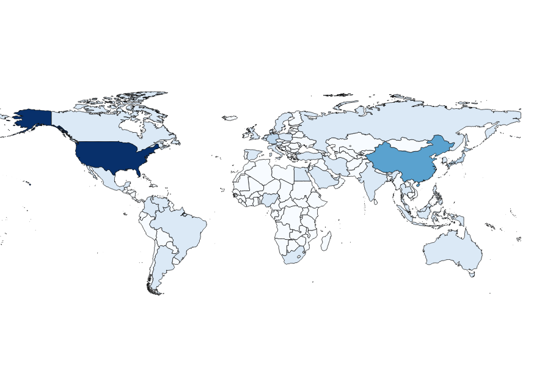

Joining multiple datasets on a common value or set of values is a common data wrangling task. For instance, one might have a dataset listing Gross Domestic Product (GDP) per country and a separate dataset containing geographic outlines of country borders.  If these independent datasets have a shared property (for instance, the three-letter country code as [defined in ISO 3166-1](https://en.wikipedia.org/wiki/ISO_3166-1_alpha-3)),we should be able to create one consolidated dataset to generate a map of GDP per country.  This guide will walk through this simple use case.

## Example Data

For this example, we are going to use two example Data Packages from our [example data packages repository](https://github.com/frictionlessdata/example-data-packages/) with the properties described above. The first is an example of Data Package containing a GeoJSON file. [GeoJSON](http://geojson.org/) is a format for representing geographical features in [JSON](http://json.org/).  This particular GeoJSON file lists countries on its `features` array and specifies the country code as a property on each "feature". In this case, the country code is stored on the key "ISO_A3" of the feature's `properties` object.

```json
{
  "type": "FeatureCollection",
  "features": [
    {
      "type": "Feature",
      "properties": {
        "ADMIN": "Ukraine",
        "ISO_A3": "UKR"
      },
      "geometry": {
        "type": "Polygon",
        "coordinates": [
        "..."
        ]
      }
    }
  ]
}
```

The second Data Package is a typical [Tabular Data Package](https://specs.frictionlessdata.io/tabular-data-package) containing a GDP measure for each country in the world for the year 2014. Country codes are stored, naturally, on the "Country Code" column.

|  Country Name                                   | Country Code | Year | Value             |
|-------------------------------------------------|--------------|------|-------------------|
|  Ukraine                                        | UKR          | 2014 | 131805126738.287  |
|  United Arab Emirates                           | ARE          | 2014 | 401646583173.427  |
|  United Kingdom                                 | GBR          | 2014 | 2941885537461.48  |
|  United States                                  | USA          | 2014 | 17419000000000    |
|  Uruguay                                        | URY          | 2014 | 57471277325.1312  |

## Reading and Joining Data

As in our [Using Data Packages in Python guide](/blog/2016/08/29/using-data-packages-in-python/), the first step before joining is to read the data for each Data Package onto our computer.  We do this by importing the `datapackage` library and passing the Data Package url to its `DataPackage` method. We are also importing the standard Python `json` library to read and write our GeoJSON file.

```python
import json
import datapackage

countries_url = 'https://raw.githubusercontent.com/frictionlessdata/example-data-packages/master/geo-countries/datapackage.json'
gdp_url = 'https://raw.githubusercontent.com/frictionlessdata/example-data-packages/master/gross-domestic-product-2014/datapackage.json'

countries_dp = datapackage.Package(countries_url)
gdp_dp = datapackage.Package(gdp_url)

world = json.loads(countries_dp.get_resource('countries').raw_read().decode('UTF-8'))

```

Learn more about creating data packages in Python [in this tutorial](/blog/2016/07/21/creating-tabular-data-packages-in-python/).

Our GeoJSON data is stored as a `bytes` object in the `data` attribute of the first (and only) element of the Data Package `resources` array. To create our `world` GeoJSON dict, we first need to decode this `bytes` object to a UTF-8 string and pass it to `json.loads`.

```python
world = json.loads(countries_dp.get_resource('countries').raw_read().decode('UTF-8'))
```

At this point, joining the data can be accomplished by iterating through each country in the `world['features']` array and adding a property "GDP (2014)" if "Country Code" on the `gdp_dp` Data Package object matches "ISO_A3" on the given GeoJSON feature.  The value of "GDP (2014)" is derived from the "Value" column on the `gdp_dp` Data Package object.

```python
for feature in world['features']:
    matches = [gdp['Value'] for gdp in gdp_dp.resources[0].data if gdp['Country Code'] == feature['properties']['ISO_A3']]
    if matches:
        feature['properties']['GDP (2014)'] = float(matches[0])
    else:
        feature['properties']['GDP (2014)'] = 0
```

Finally, we can output our consolidated GeoJSON dataset into a new file called "world_gdp_2014.geojson" using `json.dump` and create a new Data Package container for it.  For a more thorough walkthrough on creating a Data Package, please consult the
[Creating Data Packages in Python](/blog/2016/07/21/creating-tabular-data-packages-in-python/) guide.

```python
new_dp = datapackage.Package()
new_dp.descriptor['name'] = 'consolidated-dataset'
new_dp.descriptor['resources'] = [
  {
    'name': 'data',
    'path': 'world_gdp_2014.geojson'
  }
]
new_dp.commit()
new_dp.save('datapackage.zip')
```

We can now quickly render this GeoJSON file into a [chloropleth map](https://en.wikipedia.org/wiki/Choropleth_map) using [QGIS](http://qgis.org/en/site/):



Or we can rely on GitHub to render our GeoJSON for us.  When you click a country, it's property list will show up featuring "ADMIN", "ISO_A3", and the newly added "GDP (2014)" property.
