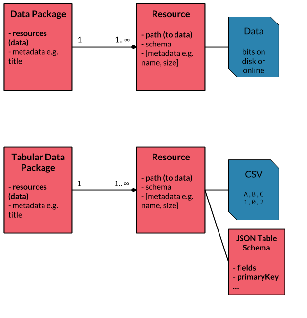
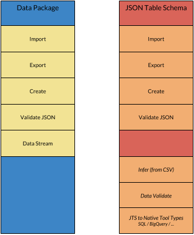
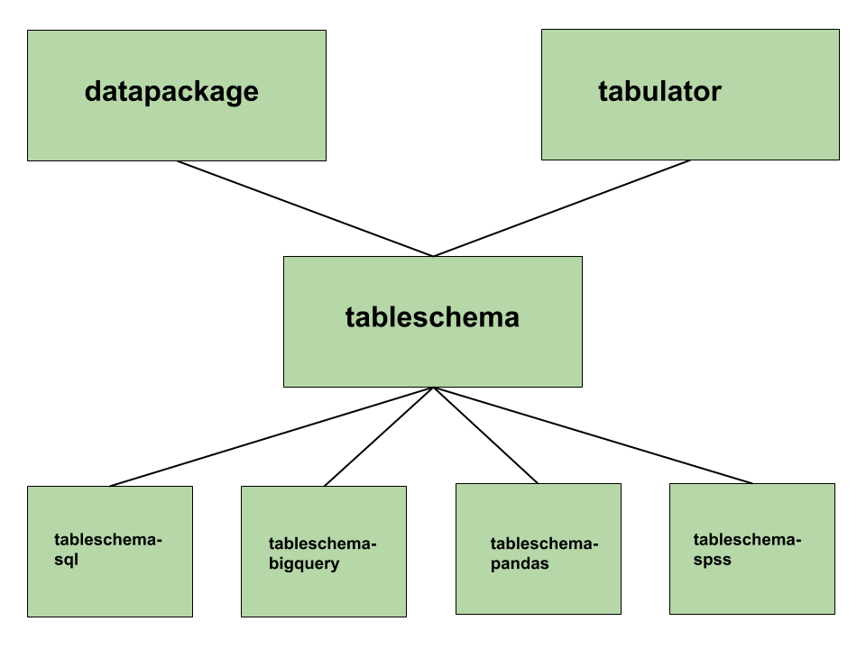

This guide introduces you to the Frictionless Data tool stack and how you can contribute to it. *Update note (2021): this blog is out of date. Please see the [contributing guide](/work-with-us/contribute/) for updated information.*

<!-- more -->

## Asking questions and getting help

If you have a question or want help the best way to get assistance is to join our public chat channel and ask there -- prompt responses are guaranteed:

<https://gitter.im/frictionlessdata/chat>


## Example and Test Data Packages

We have prepared a variety of example and test data packages for use in development:

* Standard test data packages in the Python test suite: <https://github.com/frictionlessdata/goodtables-py/tree/master/data>
* Exemplar data packages (used in tutorials): <https://github.com/frictionlessdata/example-data-packages>
* Core Data Packages -- variety of of high quality "real-world" reference and indicator datasets as data packages: <http://datahub.io/core>


## Key Concepts and Pre-requisites

This entity diagram gives an overview of how the main different objects fit together. The top row is a generic Data Package and the row below shows the case of Tabular Data Package.

This guide will focus on [Tabular Data Packages][spec-tdp] as that is the most commonly used form of Data Packages and is suited to most tools.


*overview of data packages and tabular data packages*

This guide will assume you already have some high-level familiarity with the [Data Package family of specifications][spec-dp]. Please a take a few minutes to take a look at the [overview][dp-main] if you are not yet familiar with those specs.

## Implementing a Data Package Tool Stack

Here's a diagram that illustrates some of the core components of a full Data Package implementation.

The *italicised items* are there to indicate that this functionality is less important and is often not included in implementations.


*core components of a full Data Package implementation*

### General Introduction

As a Developer the primary actions you want to support are:

* Importing data (and metadata) in a Data Package into your system
* Exporting data (and metadata) from your system to a Data Package

Addition actions include:

* Creating a Data Package from scratch
* Validating the data in a Data Package (is the data how it says it should be)
* Validating the metadata in a Data Package
* Visualizing the Data Package
* Publishing the Data Package to an online repository

### Programming Language

This is example pseudo-code for a Data Package library in a programming language like Python or Javascript.

**Importing a Data Package**

```
# location of Data Package e.g. URL or path on disk
var location = /my/data/package/

# this "imports" the Data Package providing a native DataPackage object to work with
# Note: you usually will not load the data itself
var myDataPackage = new DataPackage(location)
var myDataResource = myDataPackage.getResource(indexOrNameOfResource)

# this would return an iterator over row objects if the data was in rows
# optional support for casting data to the right type based on Table Schema
var dataStream = myDataResource.stream(cast=True)

# instead of an iterator you may want simply to convert to native structured data type
# for example, in R where you have a dataframe you would do something like
var dataframe = myDataResource.asDataFrame()
```

**Accessing metadata**

```
# Here we  access to Data Package metadata
# the exact accessor structure is up to you - here it an attribute called
# metadata that acts like a dictionary
print myDataPackage.descriptor['title']
```

**Exporting a Data Package**

A simple functional style approach that gets across the idea:

```
# e.g. a location on disk
var exportLocation = /path/to/where/data/package/should/go
export_data_package(nativeDataObject, exportLocation)
```

A more object-oriented model fitting with our previous examples would be:

```
var myDataPackage = export_data_package(nativeDataObject)
myDataPackage.save(exportLocation)

# if the native data is more like a table a data then you might have
var myDataPackage = new DataPackage()
myDataPackage.addResourceFromNativeDataObject(nativeDataObject)

# once exported to
myDataPackage.saveToDisk(path)

# You can also provide access to the Data Package datapackage.json
# That way clients of your library can decide how they save this themselves
var readyForJSONSaving  = myDataPackage.dataPackageJSON()
saveJson(readyForJSONSaving, '/path/to/save/datapackage.json')
```

**Creating a Data Package from scratch**

```
var myMetadata = {
  title: 'My Amazing Data'
}
var myDataPackage = new DataPackage(myMetadata)
```

**Data Validation**

This is Tabular Data specific.

```
var resource = myDataPackage.getResource()
# check the data conforms to the Table Schema
resource.validate()

# more explicit version might look like
var schema = resource.schemaAsJSON()
var tsValidator = new TSValidator(schema)
# validate a data stream
schema.validate(resource.stream())
```

**Validating Metadata**


### Specific Software and Platforms

For a particular tool or platform usually all you need is simple import or export:

```
# import into SQL (implemented in some language)
import_datapackage_into_sql(pathToDataPackage, sqlDatabaseInfo)

# import into Google BigQuery
import_datapackage_into_bigquery(pathToDataPackage, bigQueryInfo)
```

## Examples

### Python

The main Python library for working with Data Packages is `datapackage`:

See <http://github.com/frictionlessdata/datapackage-py>

Additional functionality such as TS and TS integration:

* <https://github.com/frictionlessdata/tableschema-py>
* <https://github.com/frictionlessdata/tableschema-sql-py>
* <https://github.com/frictionlessdata/tableschema-bigquery-py>

`tabulator` is a utility library that provides a consistent interface for reading tabular data:

<https://github.com/frictionlessdata/tabulator-py>

Here's an overview of the Python libraries available and how they fit together:


*how the different tableschema libraries in python fit together*

### Javascript

Following "Node" style we have partitioned the Javascript library into pieces, see this list of libraries:

* <https://github.com/frictionlessdata?language=javascript>

### SQL Integration

[Here's a walk-through](https://github.com/frictionlessdata/tableschema-sql-py) of the SQL integration for [Table Schema][spec-ts] written in python. This integration allows you to generate SQL tables, load and extract data based on [Table Schema][spec-ts] descriptors.

Related blog post: <http://okfnlabs.org/blog/2017/10/05/frictionless-data-specs-v1-updates.html>

[dp]: /data-package
[dp-main]: /introduction
[tdp]: /data-package/#tabular-data-package
[ts]: /table-schema/
[ts-types]: https://specs.frictionlessdata.io/table-schema/#field-descriptors
[csv]: /blog/2018/07/09/csv/
[json]: http://en.wikipedia.org/wiki/JSON

[spec-dp]: https://specs.frictionlessdata.io/data-package/
[spec-tdp]: https://specs.frictionlessdata.io/tabular-data-package/
[spec-ts]: https://specs.frictionlessdata.io/table-schema/
[spec-csvddf]: https://specs.frictionlessdata.io/csv-dialect/

[publish]: /docs/publish/
[pub-tabular]: /blog/2016/07/21/publish-tabular/
[pub-online]: /blog/2016/08/29/publish-online/
[pub-any]: /blog/2016/07/21/publish-any/
[pub-geo]: /blog/2016/04/30/publish-geo/
[pub-faq]: /blog/2016/04/20/publish-faq/

[dp-creator]: http://create.frictionlessdata.io
[dp-viewer]: http://create.frictionlessdata.io
