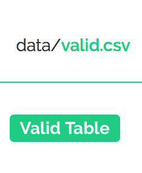

Errors in data are not uncommon. They also often get in the way of quick and timely data analysis for many data users. What if there was a way to quickly identify errors in your data to accelerate the process by which you fix them before sharing your data or using it for analysis?

In this section, we will learn how to carry out one-time data validation using
* a free web tool called [try.goodtables.io](https://try.goodtables.io),
* the goodtables command line tool which you use in your local machine.

Our working assumption is that you already know what a data schema and a data package are, and how to create them. If not, [start here](/blog/2018/03/07/well-packaged-datasets/).

## One-time data validation with try.goodtables.io

Now that you have your data package you may want to check it for errors. We refer to this process as data validation. Raw data is often ‘messy’ or ‘dirty’, which means it contains errors and irrelevant bits that make it inaccurate and difficult to quickly analyse and draw insight from existing datasets. **Goodtables** exists to identify structural and content errors in your tabular data so they can be fixed quickly. As with other tools mentioned in this field guide, goodtables aims to help data publishers improve the quality of their data before the data is shared elsewhere and used for analysis, or archived.

**Types of errors identified in the validation process**

Here are some of the errors that try.goodtables.io highlights. A more exhaustive list is available [here](https://github.com/frictionlessdata/goodtables-py#validation).

| **Structural Errors** |                                                                                 |
|-----------------------|---------------------------------------------------------------------------------|
| blank-header          | There is a blank header name. All cells in the header row must have a value.    |
| duplicate-header      | There are multiple columns with the same name. All column names must be unique. |
| blank-row             | Rows must have at least one non-blank cell.                                     |
| duplicate-row         | Rows can't be duplicated.                                                       |
| extra-value           | A row has more columns than the header.                                         |
| missing-value         | A row has less columns than the header.                                         |
| **Content Errors**    |                                                                                 |
| schema-error          | Schema is not valid.                                                            |
| non-matching-header   | The header's name in the schema is different from what's in the data.           |
| extra-header          | The data contains a header not defined in the schema.                           |
| missing-header        | The data doesn't contain a header defined in the schema.                        |
| type-or-format-error  | The value can’t be cast based on the schema type and format for this field.     |

**Load tabular data for one-time validation**

You can add a dataset for one-time validation on [try.goodtables.io](https://try.goodtables.io) in two ways:
* If your tabular data is publicly available online, obtain a link to the tabular data you would like to validate and paste it in the **{Source}** section.
* Alternatively, Click on the Upload file prompt in the **{Source}** section to load a tabular dataset from your local machine

**Validating data without a schema**

In this section we will illustrate how to check tabular data for structural errors on [try.goodtables.io](https://try.goodtables.io/) where a data schema is not available. For this tutorial we will use a [sample CSV file with errors](https://raw.githubusercontent.com/frictionlessdata/goodtables-py/bc6470a970aacf65f20a3ddb7f71eb05a2a31c70/data/invalid-on-structure.csv).

Copy and paste the file's URL to the **{Source}** input. When you click on the **{Validate}** button, [try.goodtables.io](https://try.goodtables.io/) presents an exhaustive list of structural errors in your dataset.

*Figure 1: Add dataset link in the Source field, or select the Upload file option.*

If needed, you can disable two types of validation checks:

 * Ignore blank rows
  Use this checkbox to indicate whether blank rows should be considered as errors, or simply ignored. Check this option if missing data is a known issue that cannot be fixed immediately i.e. if you are not the owner/publisher of the data.

 * Ignore duplicate rows
 Use this checkbox to indicate whether duplicate rows should be considered as errors, or simply ignored.

 We will leave all boxes unchecked for our example. On validate, we receive a list of 12 errors as we can see in figure 7 below.

*Figure 2: dataset errors outlined on try.goodtables.io.*

[try.goodtables.io](https://try.goodtables.io) points us to specific cells containing errors so they can be fixed easily. We can use this list as a guide to fix all errors in our data manually, and run a second validation test to confirm that all issues are resolved. If there no validations could be found, the ensuing message will be as in figure 8 below:

*Figure 3: valid data message on goodtables.io.*

Improving data quality is an iterative process that should involve data publishers and maintainers. Tools such as [try.goodtables.io](https://try.goodtables.io) allow you to focus on complex errors like if the presented data is correct, instead of wasting time with simple (but very common) errors like incorrect date formats.

**Validating tabular data with a schema**

A data schema contains information on the structure of your tabular data. Providing a data schema as part of the validation process on [try.goodtables.io](https://try.goodtables.io) makes it possible to check your dataset for content errors. For example, a schema contains information on fields and their assigned data types, making it possible to highlight misplaced data i.e. text in an amounts column where numeric data is expected. If you haven’t yet, learn how to create a data schema for your data collection before continuing with this section.

To test how this works, you can use:
* any of the data packages from [this Data Package collection on GitHub](https://github.com/frictionlessdata/example-data-packages), which comprises of example data packages curated by the Frictionless Data team  or
* [any of the Core Data Packages on DataHub](http://datahub.io/core/). The Core Data project provides essential data for data wranglers and data science community. Read more about it [here](https://datahub.io/docs/core-data).

In any given Data Package, the *datapackage.json* file contains the schema and the data folder contains tabular data to be validated against the schema.

Often, you will find that you may be working in workflows that involve many datasets, which are updated regularly. In cases such as this, one-time validation on try.goodtables.io is probably not the answer. But fear not! Goodtables has the ability to automate the validation process so that errors are checked for continually.  Find out more in our continuous and [automated data validation section](/blog/2018/03/12/automatically-validated-tabular-data).

## One-time data validation with goodtables command line tool

The same validations that we've done on try.goodtables.io, can also be done in your local machine using goodtables. This is especially useful for big datasets, or if your data is not publicly accessible online. However, this is a slightly technical task, which requires basic knowledge of the command line (CLI). If you don't know how to use the CLI, or are a bit rusty, we recommend you to read the [Introduction to the command-line tutorial](https://tutorial.djangogirls.org/en/intro_to_command_line/) before proceeding.

For this section, you will need:
* Python, a programming language which the goodtables command-line tool is written in - [[installation instructions](https://tutorial.djangogirls.org/en/python_installation/)]
* PIP, a tool that allows you to install packages written in Python. Installing Python automatically installs PIP, but in case not - [installation instructions]
* Basic knowledge on how to use the command-line (see the [Introduction to the command-line](https://tutorial.djangogirls.org/en/intro_to_command_line/) if you want to brush up your skills)

Once Python is set up, open your **Terminal** and install goodtables using the package manager, PIP. The command `pip install goodtables`.

*Figure 4: installing goodtables command-line tool with pip in Terminal.*

To validate a data file, type goodtables followed by the path to your file i.e. `goodtables path/to/file.csv`. You can pass multiple file paths one after the other, or even the path to a *datapackage.json* file.

For our first example, we will download and check [this simple location CSV data file](https://github.com/frictionlessdata/datapackage-py/blob/master/data/data.csv) for errors. In the second instance, we will validate this [Department of Data Expenses dataset, that contains errors](https://raw.githubusercontent.com/frictionlessdata/goodtables-py/bc6470a970aacf65f20a3ddb7f71eb05a2a31c70/data/invalid-on-structure.csv).

*Figure 5: Validating data files using goodtables in Terminal.*

You can see the list of options by running `goodtables --help`. The full documentation, including the list of validation checks that can be run, is available [on the goodtables-py repository on GitHub](https://github.com/frictionlessdata/goodtables-py).

Congratulations, you now know how to validate your tabular data using the command-line!

If you regularly update your data or maintain many different datasets, running the validations manually can be time-consuming. The solution is to automate this process, so the data is validated every time it changes, ensuring the errors are caught as soon as possible. Find out how to do it in the "[Automating the validation checks](/blog/2018/03/12/automatically-validated-tabular-data)" section.
