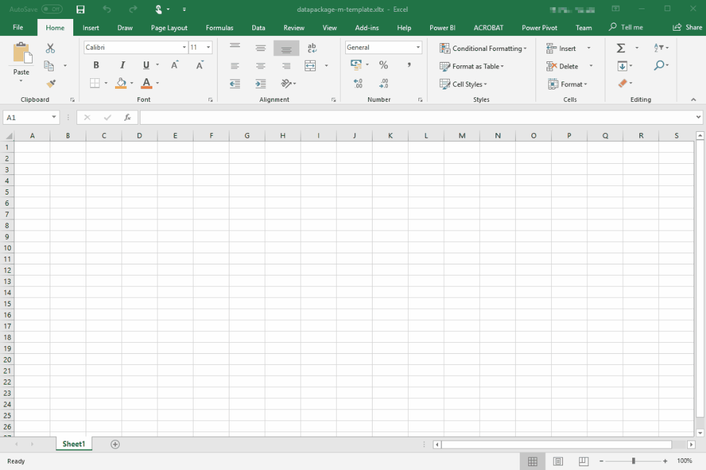

[Data Package M](https://github.com/nimblelearn/datapackage-m), also known as *datapackage-m*, is a set of functions written in [Power Query M](https://docs.microsoft.com/en-us/powerquery-m/) for working with Tabular Data Packages in [Power BI Desktop](https://powerbi.microsoft.com/en-us/desktop/) and [Power Query for Excel](https://support.office.com/en-us/article/introduction-to-microsoft-power-query-for-excel-6e92e2f4-2079-4e1f-bad5-89f6269cd605) (also known as 'Get & Transform Data' in Excel 2016).

datapackage-m makes use of the Data Package, Data Resource, Tabular Data Package, Tabular Data Resource, and Table Schema specifications, enabling you to go from data to insight in Power BI and Excel, faster.

In 2014, while searching the web for high quality open data, we stumbled across the Frictionless Data project. On learning about [Data Packages](/data-package/), we spent some time getting acquainted with the specs and began to use Tabular Data Packages for some internal projects. datapackage-m then started off as an internal tool at Nimble Learn for working with Tabular Data Packages.

*How datapackage-m works in Power BI*

datapackage-m now implements [v1 of the Frictionless Data specs](https://blog.okfn.org/2017/09/05/frictionless-data-v1-0/) from a Tabular Data Package consumption perspective. By implementing a broad number of the specs, datapackage-m is able to extract the tables from most [Tabular Data Packages](https://specs.frictionlessdata.io/tabular-data-package/), or Data Packages with tabular resources, in seconds. These tables can be quickly loaded into a Power BI Data Model or an Excel Worksheet (or Data Model), ready for you to analyse.  datapackage-m currently handles Gzip compressed resources and we’re looking into support for Zip. We have  successfully tested datapackage-m with several Data Packages from [Datahub](https://datahub.io/core) and the Frictionless Data [Example Data Packages](https://github.com/frictionlessdata/example-data-packages) GitHub repository.

In working with data, there are often many repetitive tasks required to get data into a state that can be analysed. Even when the requirement is just to profile and assess whether a new dataset is suitable for a given use case, a lot of time can be wasted getting it into good tabular shape. [Data Packages](/data-package/) are designed to alleviate this issue, and datapackage-m makes them available for use in Power BI and Excel.

We find that the Frictionless Data specs are simple to use from both a data publisher and data consumer perspective. We’ve seen a great number of other specifications that are feature-rich but too verbose. In contrast to these, the Frictionless Data specs are minimalist and support use cases where Data Packages are created using one’s favourite text editor.

*How datapackage-m works  in Excel*

There’s an ongoing discussion around a Data Resource compression pattern which is important from a data publishing perspective i.e. due to ongoing file storage and bandwidth costs. Once this pattern is agreed upon and published, it would be good to see this added to the [Data Resource](https://specs.frictionlessdata.io/data-resource/) and [Tabular Data Resource](https://specs.frictionlessdata.io/tabular-data-resource/) specs not too long after.

Other than this, we would like to see another Data Package profile that extends the Tabular Data Package with semantic layer metadata. In addition to the Tabular Data Profile properties, this ‘Semantic Data Package’ would have properties for measure definitions, attribute hierarchies, and other semantic layer metadata. Something like this could be used to programmatically generate [Semantic Data Models](https://en.wikipedia.org/wiki/Semantic_data_model) in a data analytics tool of choice and populate it with data from the tabular data directly.

[There are many existing use cases for Tabular Data Packages](http://okfnlabs.org/blog/2017/12/21/bootstrapping-data-standards-with-frictionless-data.html), and we see ‘Subject Area’ Tabular Data Packages as a significant additional use case that is worth exploring . By ‘Subject Area’,  we mean a Tabular Data Package that combines relevant Tabular Data Resources from other high quality Tabular Data Packages. This would help to reduce the time spent seeking out related/relevant data for a given area of analysis and could save researchers tonnes of time, for example.

In addition to datapackage-m, Nimble Learn is working on a public-facing project that is focused on publishing pre-integrated open data from various sources as subject area Tabular Data Packages.  In addition to this we  plan on extending datapackage-m to adopt more Frictionless Data specifications. Keep an eye out for all these updates [on GitHub](https://github.com/nimblelearn).
