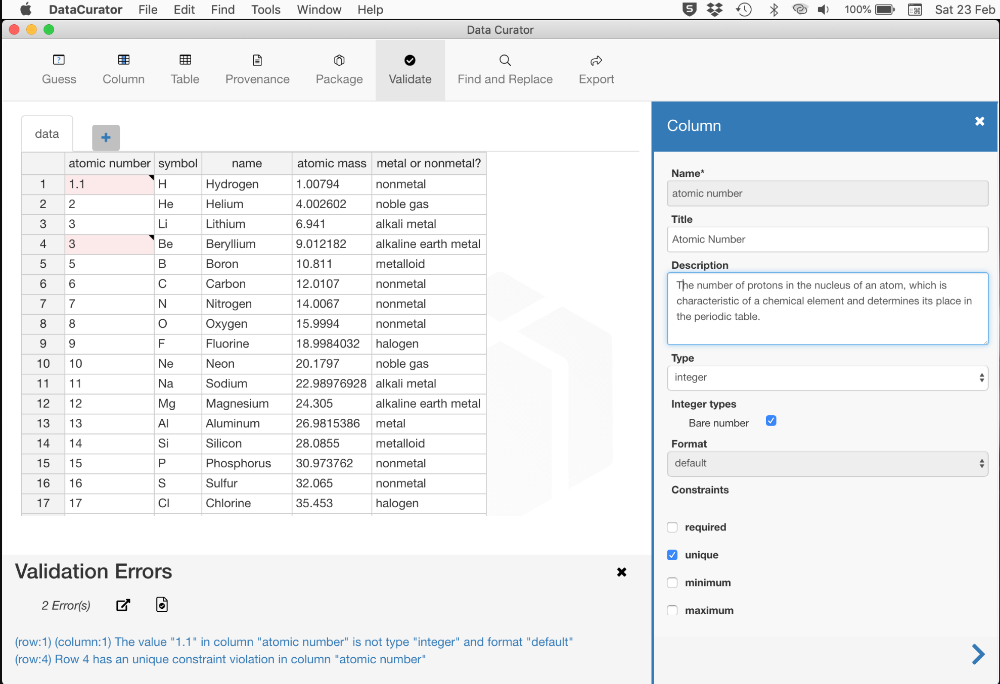
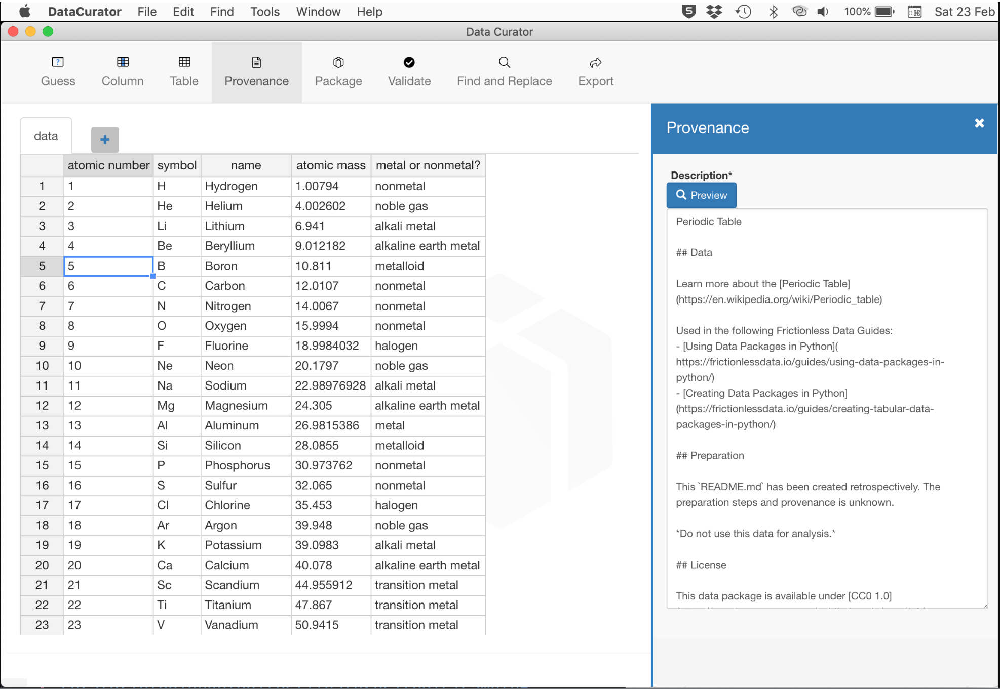
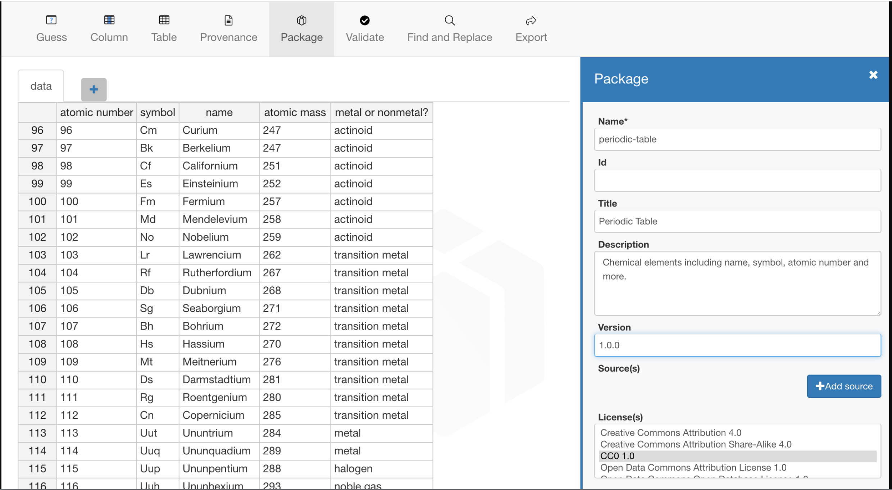

# Data Curator - share usable open data

Open data producers are increasingly focusing on improving open data so  it can be easily used to create insight and drive positive change.

Open data is more likely to be used if data consumers can:

-   understand the structure of the data
-   understand the quality of the data
-   understand why and how the data was collected
-   look up the meaning of codes used in the data
-   access the data in an open machine-readable format
-   know how the data is licensed and how it can be reused

Data Curator enables open data producers to define all this information using their desktop computer, prior to publishing it on the Internet.

Data Curator uses the [Frictionless Data specification](https://specs.frictionlessdata.io/) and software to package the data and supporting information in a [Tabular Data Package](https://specs.frictionlessdata.io/tabular-data-package/ "Tabular Data Package specification").

## Using Data Curator

Here's how to use Data Curator to share usable open data in a data package:

1. Download [Data Curator](https://github.com/ODIQueensland/data-curator/releases/latest "Download Data Curator for Windows or macOS") for Windows or macOS
2. In Data Curator, either:
   - create some data
   - open an Excel sheet
   - open a separated value file (e.g. CSV, TSV)
4. Follow the steps below...

### Describe the data

The Frictionless Data specification allows you to describe tabular data using a [Table Schema](https://specs.frictionlessdata.io/table-schema/ "Table Schema specification").  A Table Schema allows each field in the data to be given:
- a `name`, `title` and `description`
- a data `type` (e.g. `string`, `integer`) and `format` (e.g. `uri`, `email`) 
- one or more `constraints` (e.g. `required`, `unique`) to limit data values and improve data validation

The Table Schema also allows you to describe the characters used to represent missing values (e.g. `n/a`, `tba`), primary keys, and foreign key relationships.

After adding data in Data Curator, to create a Table Schema:

- Give your data a header row, if it doesn't have one
- Set the header row to give each field a `name`
- Guess column properties to give each field a  `type` and `format`
- Set column properties to improve the data `type` and `format` guesses, and add a `title`, `description` and `constraints` 
- Set table properties to give the table a `name`,  define missing values, a primary key, and foreign keys.

### Validate the data

Using Data Curator, you can validate if the data complies with the field's `type`, `format` and `contraints`. Errors found can be filtered in different ways so you can correct errors by row, by column or by error type. 

In some cases data errors cannot be corrected, as they should be corrected in the source system and not as part of the data packaging process. If you're happy to publish the data with errors, the error messages can be appended to the provenance information.

### Provide context

Data Curator lets you add provenance information to help people understand why and how the data was collected and determine if it is fit for their purpose. 

Provenance information can be entered using [Markdown](http://commonmark.org "Markdown specification"). You can preview the Markdown formatting in Data Curator.  

You should follow the [Readme FAQ](/blog/2016/04/20/publish-faq/ "Publishing Data Packages - FAQ") when writing provenance information or, even easier, cut and paste from this [sample](https://github.com/ODIQueensland/data-curator/blob/develop/test/features/tools/sample-provenance-information.md "Sample Provenance Information Markdown file on GitHub").

### Explain the meaning of codes

Data Curator supports foreign key relationships between data. Often a set of codes is used in a column of data and the list of valid codes and their description is in another table. The Frictionless Data specification enables linking this data within a table or across two tables in the same data package. 

We've implemented the [Foreign Keys to Data Packages pattern](https://specs.frictionlessdata.io/patterns/#table-schema:-foreign-keys-to-data-packages "The Foreign Keys to Data Packages pattern") so you can have foreign key relationships across two data packages. This is really useful if you want to share code-lists across organisations.

You can define foreign key relationships in Data Curator in the table properties and the relationships are checked when you validate the data.

### Save the data in an open format

Data Curator lets you save data as a comma, semicolon, or tab separated value file. A matching [CSV Dialect](https://specs.frictionlessdata.io/csv-dialect/ "The CSV Dialect specification") is added to the data package.

### Apply an open license 

Applying a license, waiver, or public domain mark to a [data package](https://specs.frictionlessdata.io/data-package/#licenses "The licenses property in the Data Package specification") and its [resources](https://specs.frictionlessdata.io/data-resource/#optional-properties "The licenses property in the Data Resource specification") helps people understand how they can use, modify, and share the contents of the data package.

Although there are many ways to [apply a licence, waiver or public domain mark](/blog/2018/03/27/applying-licenses/ "Guide to applying licenses, waivers or public domain marks to data packages") to a data package, Data Curator only allows you to use open licences - after all, its purpose is to share usable open data.

### Export the data package

To ensure only usable open data is shared, Data Curator applies some checks before allowing a data package to be exported. These go beyond the mandatory requirements* in the Frictionless Data specification.

To export a tabular data package, it must have:
- a header row
- a table schema*
- a table (resource) `name`*
- a data package `name`*
- provenance information
- an open licence applied to the data package

If a data package `version` is used, it must follow the [data package version pattern](https://specs.frictionlessdata.io/patterns/#data-package-version "Data Package Version pattern").

Before exporting a data package you should:
- add a `title` and `description` to each field, table and data package
- acknowledge any data sources and contributors
- validate the data and add any known errors to the provenance information

The data package is exported as a `datapackage.zip` file that contains the:

- data files in a `/data` directory
- data package, table (resource), table schema, and csv dialect properties in a`datapackage.json` file
- provenance information in a `README.md` file 

### Share the data

Share the `datapackage.zip` with open data consumers by publishing it on the Internet or on an open data platform. Some platforms support uploading, displaying, and downloading data packages.

Open data consumers will be able to read the data package with one of the many applications and software libraries that work with data packages, including Data Curator.

## Get Started

**[Download Data Curator](https://github.com/ODIQueensland/data-curator/releases/latest "Download Data Curator for Windows or macOS")** for Windows or macOS and start sharing usable open data.

## Who made Data Curator?

Data Curator was made possible with funding from  the [Queensland Government](https://www.qld.gov.au) and the guidance of the Open Data Policy team within the Department of Housing and Public Works. We're grateful for the ideas and testing provided by open data champions in the  Department of Environment and Science, and the  Department of Transport and Main Roads. 

The project was led by [Stephen Gates](https://theodi.org/article/open-data-pathway-introducing-country-level-statistics/) from the [ODI Australian Network](https://www.linkedin.com/company/odiaustraliannetwork/about/). Software development was coordinated by Gavin Kennedy and performed by Matt Mulholland from the [Queensland Cyber Infrastructure Foundation](https://www.qcif.edu.au) (QCIF).

Data Curator uses the Frictionless Data software libraries maintained by [Open Knowledge International](https://okfn.org) and we're extremely grateful for the support provided by [the team](https://github.com/orgs/frictionlessdata/teams/core/members).

Data Curator started life as [Comma Chameleon](http://comma-chameleon.io "Comma Chameleon - A desktop CSV editor for data publishers
"), an [experiment](https://youtu.be/wIIw0cTeUG0 "Stuart Harrison explains Comma Chameleon at CSVConf") by [the ODI](https://theodi.org "The Open Data Institute"). The ODI and the ODI Australian Network agreed to take the software in [different directions](https://theodi.org/article/odi-toolbox-application-experiments-from-comma-chameleon-to-data-curator/ "Stephen Fortune explains why Data Curator is a fork of Comma Chameleon").
