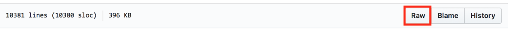

## Include a data schema

Simply put, a schema is a blueprint that tells us how your data is structured, and what type of content is to be expected in it. You can think of it as a data dictionary. Having a table schema at hand makes it possible to run more precise validation checks on your data, both at a structural and content level.

For this section, we will use the [Data Package Creator](https://create.frictionlessdata.io) and [Gross Domestic Product dataset for all countries (1960 - 2014)](http://datahub.io/core/gdp).

**Data Package** is a format that makes it possible to put your data collection and relevant information that provides context about your data in one container before you share it. All contextual information, such as metadata and your data schema, is published in a JSON file named *datapackage.json*.

**Data Package Creator** is an online service that facilitates the creation and editing of data packages. The service automatically generates a *datapackage.json* file for you as you add and edit data that is part of your data collection. We refer to each piece of data in a data collection as a **data resource**.

[Data Package Creator](https://create.frictionlessdata.io) loads with dummy data to make it easy to understand how metadata and sample resources help generate the *datapackage.json* file. There are three ways in which a user can add data resources on [Data Package Creator](https://create.frictionlessdata.io):

1. Provide a hyperlink to your data resource (highly recommended).

  If your data resource is publicly available, like on GitHub or in a data repository, simply obtain the URL and paste it in the **Path** section. To learn how to publish your data resource online, check the publish your dataset section.

2. Create your data resource within the service.

  If your data resource isn't published online, you'll have to define its fields from scratch. Depending on how complex is your data, this can be time consuming, but it's still easier than creating the descriptor JSON file from scratch.This option is time consuming, as a user has to manually create each field of a data resource. However, this is simpler than learning how to create a JSON file from scratch.

3. **Load a Data Package** option

  With this option, you can load a pre-existing *datapackage.json* file to view and edit its metadata and resource fields.

Our [Gross Domestic Product dataset for all countries (1960 - 2014)](https://github.com/frictionlessdata/example-data-packages/blob/master/gross-domestic-product-all/data/gdp.csv) dataset is publicly available on GitHub.

Obtain a link to the raw CSV file by clicking on the Raw button at the top right corner of the GitHub file preview page, as shown in figure 1 below. The resulting hyperlink looks like https://raw.githubusercontent.com/datasets/continent-codes/master/data/continent-codes.csv


*Figure 1: Above, raw button highlighted in red.*

Paste your hyperlink in the *Path* section and click on the *Load* button. Each column in your table translates to a *field*. You should be prompted to add all fields identified in your data resource, as in Figure 2 below. Click on the prompt to load the fields.


*Figure 2: annotated in red, a prompt to add all fields inferred from your data resource.*

The page that follows looks like Figure 3 below. Each column from the GDP dataset has been mapped to a *field*. The data type for each column has been inferred correctly, and we can preview data under each field by hovering over the field name. It is also possible to edit all sections of our data resource’s fields as we can see below.


*Figure 3: all fields inferred from your data resource.*

You can now edit data types and formats as necessary, and optionally add titles and descriptive information to your fields. For example, the data type for our {Year} field should be ***year*** and not ***integer***. Our {Value} column has numeric information with decimal places.

By definition, values under the ***integer*** data type are whole numbers. The ***number*** data type is more appropriate for the {Value} column. When in doubt about what data type to use, consult the [Table Schema data types cheat sheet](https://specs.frictionlessdata.io/table-schema/#types-and-formats).

Click on the  icon to pick a suitable profile for your data resource. [Here’s more information about Frictionless Data profiles](https://specs.frictionlessdata.io/profiles/).

If your dataset has other data resources, add them by scrolling to the bottom of the page, clicking on Add Resource, and repeating the same process as we just did.

If your dataset has other data resources, add them by scrolling to the bottom of the page, clicking on **Add Resource**, and repeating the same process as we just did.


*Figure 4: Prompt to add more data resources.*


----


## Add descriptive metadata

In the previous section, we described metadata for each of our datasets, but we're still missing metadata for our collection of datasets. You can add it via the **Metadata** section on the left side bar, describing things like the dataset name, description, author, license, etc.


The **Profile** section under metadata allows us to specify what kind of data collection we are packaging.
* *Data Package*
This is the base, more general profile. Use it if your dataset contains resources of mixed formats, like tabular and geographical data. The base requirement for a valid Data Package profile is the *datapackage.json* file. See the [Data Package specification](https://specs.frictionlessdata.io/data-package/) for more information.

* *Tabular Data Package*
If your data contains only tabular resources like CSVs and spreadsheets, use the Tabular Data Package profile. See the [Tabular Data Package specification](https://specs.frictionlessdata.io/tabular-data-package/) for more information.
* *Fiscal Data Package*
If your data contains fiscal information like budgets and expenditure data, use the  Fiscal Data Package profile. See the [Fiscal Data Package specification](https://specs.frictionlessdata.io/fiscal-data-package/) for more information.

In our example, as we only have a CSV data resource, the *Tabular Data Package* profile is the best option.

In the **Keywords** section, you can add any keywords that helps make your data collection more discoverable. For our dataset, we might use the keywords *GDP, National Accounts, National GDP, Regional GDP*. Other datasets could include the country name, dataset area (e.g. "health" or "environmental"), etc.

Now that we have created a Data Package, we can **Validate** or **Download** it. But first, let’s see what our datapackage.json file looks like. With every addition and modification, the [Data Package Creator](https://create.frictionlessdata.io) has been populating the *datapackage.json* file for us. Click on the **{···}** icon to view the *datapackage.json* file. As you can see below, any edit we make to the description of the Value field reflects on the JSON file in real time.

The **Validate** button allows us to confirm whether we chose the correct Profile for our Data Package. The two possible outcomes at this stage are:


This message appears when there is some validation error like if we miss some required attribute (e.g. the data package name), or have picked an incorrect profile (e.g. Tabular Data Package with geographical data).. Review the metadata and profiles to find the mistake and try validating again.


All good! This message means that your data package is valid, and we can download it.


----


## Create Data Packages

As we said earlier, the base requirement for a valid Data Package profile is the *datapackage.json* file, which contains your data schema and metadata. We call this the descriptor file. You can download your descriptor file by clicking on the **Download** button.

* If your data resources, like ours, were linked from an online public source, sharing the *datapackage.json* file is sufficient, since it contains URLs to your data resources.

* If you manually created a data resource and its fields, remember to add all your data resources and the downloaded *datapackage.json* file in one folder before sharing it.

The way to structure your dataset depends on your data, and what extra artifacts it contains (e.g. images, scripts, reports, etc.). In this section, we'll show a complete example with:

* **Data files**: The files with the actual data (e.g. CSV, XLS, GeoJSON, ...)
* **Documentation**: How was the data collected, any caveats, how to update it, etc.
* **Metadata**: Where the data comes from, what's in the files, what's their source and license, etc.
* **Scripts**: Software scripts that were used to generate, update, or modify the data.

Your final Data Package file directory should look like this:

```
data/
    dataresource1.csv
    dataresource2.csv
datapackage.json
```
* **data/**: All data files are contained in this folder. In our example, there is only one: `data/gdp.csv` .

* **datapackage.json**: This file describes the dataset's metadata. For example, what is the dataset, where are its files, what they contain, what each column means (for tabular data), what's the source, license, and authors, and so on. As it's a machine-readable specification, other software can import and validate your files.

Congratulations! You have now created a schema for your data, and combined it with descriptive metadata and your data collection to create your first data package!


----


## Validate your packaged data automatically

Running continuous checks on data provides regular feedback and contributes to better data quality as errors can be flagged and fixed early on.

In this section, you will learn how to setup automatic tabular data validation using goodtables, so your data is validated every time it's updated. Although not strictly necessary, it's useful to [know about Data Packages and Table Schema](/blog/2018/03/07/well-packaged-datasets/) before proceeding, as they allow you to describe your data in more detail, allowing more advanced validations.

We will show how to set up automated tabular data validations for data published on:

* [CKAN](https://ckan.org/), an open source platform for publishing data in the open, that makes it easy to discover, use and share data;
* [GitHub](https://github.com/), a web platform for collaborating on projects as well as publishing, sharing and storing resources, such as data files;
* [Amazon S3](https://aws.amazon.com/s3/), a data storage service by Amazon.

Even if you don't use any of these platforms, you can still setup the validation using [goodtables-py][gt-py], it will just require some technical knowledge

### Validate tabular data automatically on CKAN

[CKAN](https://ckan.org/) is an open source platform for publishing data online. It is widely used across the planet, including by the federal governments of the USA, United Kingdom, Brazil, and others.

To automatically validate tabular data on CKAN, enable the [ckanext-validation](https://github.com/frictionlessdata/ckanext-validation) extension, which uses goodtables to run continuous checks on your data. The [ckanext-validation](https://github.com/frictionlessdata/ckanext-validation) extension:

* Adds a badge next to each dataset showing the status of their validation (valid or invalid), and
* allows users to access the validation report, making it possible for errors to be identified and fixed.


*Figure 8: annotated in red, automated validation checks on datasets in CKAN.*

The installation and usage instructions for [ckanext-validation](https://github.com/frictionlessdata/ckanext-validation) extension are available on [Github](https://github.com/frictionlessdata/ckanext-validation).


### Validate tabular data automatically on GitHub

If your data is hosted on GitHub, you can use [https://goodtables.io][gt.io] to automatically validate it on every change.

For this section, you will first need to create a [GitHub repository](https://help.github.com/articles/create-a-repo/) and add tabular data to it.

Once you have tabular data in your Github repository:

1. Login on [goodtables.io][gt.io] using your GitHub account and accept the permissions confirmation.
1. Once we've synchronized your repository list, go to the [Manage Sources](https://goodtables.io/settings) page and enable the repository with the data you want to validate.
    * If you can't find the repository, try clicking on the Refresh button on the Manage Sources page

Goodtables will then validate all tabular data files (CSV, XLS, XLSX, ODS) and [data packages](/data-package/) in the repository. These validations will be executed on every change, including pull requests.

### Validate tabular data automatically on Amazon S3

If your data is hosted on Amazon S3, you can use [https://goodtables.io][gt.io] to automatically validate it on every change.

It is a technical process to set up, as you need to know how to configure your Amazon S3 bucket. However, once it's configured, the validations happen automatically on any tabular data created or updated. Find the detailed instructions [here][gt.io:s3].

### Custom setup of automatic tabular data validation

If you don't use any of the oficially supported data publishing platforms, you can use [goodtables-py][gt-py] directly to validate your data. This is the most flexible option, as you can configure exactly when, and how your tabular data is validated. For example, if your data come from an external source, you could validate it once before you process it (so you catch errors in the source data), and once after cleaning, just before you publish it, so you catch errors introduced by your data processing.

The instructions on how to do this are technical, and can be found on [https://github.com/frictionlessdata/goodtables-py][gt-py].

----


## Publish packaged data

Creating and Sharing Data Packages is important for both data publishers and data users because it provides a common and open specification to describe your dataset's metadata. This facilitates data reuse, as users don't need to understand each data publisher's specific metadata format, and as the specification is machine-readable, it also allows tools to parse the metadata. This enables software to:

* Import the data packages into different tools and languages, like Python and R
* Validate the data contents according to the schema described in the data package
* Convert the data package into other formats, for example loading it into a SQL database for further analysis

Although these reasons are not unique to publishing data as data packages, here's why we think data publishers should consider publishing in this format:

* Archiving data collections using data packages ensure data publishers can update data  more efficiently at any time. The associated schema is a guide on existing data fields and acceptable data types for individual tabular data resources and can be easily built upon.

* Sharing data with descriptive metadata and its associated schema provides context for your data no matter where it is used, and significantly cuts down on time spent researching data provenance before using acquired data.

* Data Packages allow for accountability and enrich the feedback process as data publishers can add metadata with contact information for users to reach out to them and licensing to spell out accepted use of published data.

If don't need your own data portal, there are many platforms where you can publish your data (if you need your own, check [CKAN](https://ckan.org/)). In the section below, we dive into a few options. Read along and decide what option is most suitable:

### Publish packaged data in our community CKAN instance

CKAN is an open source platform for publishing data that makes it easy to discover, use and share data. [datahub.ckan.io][ckan-datahub] is a public instance of CKAN that allows anyone to publish their data.

Here’s why you should consider creating an organization on [datahub.ckan.io][ckan-datahub] and publishing datasets therein:
* [datahub.ckan.io][ckan-datahub] is free for all to use! The file upload size limit on the platform is currently 100mb.
* The decision on whether to publicly or privately publish datasets rests with data publishers.
* [datahub.ckan.io][ckan-datahub] organizations allow for multiple users to collaborate with varied privileges:
 * **Admin**: Can add/edit and delete datasets, as well as manage organization members.
 * **Editor**: Can add and edit datasets, but not manage organization members.
 * **Member**: Can view the organization's private datasets, but not add new datasets.

To publish data on [datahub.ckan.io][ckan-datahub]:

1. Request for a new Organization to be created on the platform for you via [our community page](https://discuss.okfn.org/c/open-knowledge-labs/datahub).
     This is required only to ensure spammers don’t take up space and hog resources on the platform.

     The request format is simple and requires:
    * **Title**: This will be the name of your Organization on [datahub.ckan.io][ckan-datahub] i.e.<br/>
      *My New Organization*

    * **Slug**: This is an acronym, word or hyphenated phrase that will be added to the end of the [datahub.ckan.io][ckan-datahub] url to uniquely identify your Organization and associate your data collections with it i.e.<br/>
    	*my-new-organization*

    * **Username**: The username you provide is associated with an email address on [datahub.ckan.io][ckan-datahub] and allows us to give you admin access to your Organization on [datahub.ckan.io][ckan-datahub].

2. Log In and add new datasets

  Adding datasets on [datahub.ckan.io][ckan-datahub] is no different from using any other CKAN platform, but [here’s a good guide by Dan Fowler](http://okfnlabs.org/blog/2016/07/25/publish-data-packages-to-datahub-ckan.html) for first timers.

3.Publish and share public datasets widely.

  On [datahub.ckan.io][ckan-datahub], you can either publish datasets privately, meaning only members of your organization have access to them, or publicly, as open data. [Find out more](http://okfnlabs.org/blog/2016/07/25/publish-data-packages-to-datahub-ckan.html).


### Publish packaged data on DataHub.io

DataHub.io is a platform for finding, sharing and publishing high quality data online.

[DataHub.io][datahub] and [datahub.ckan.io][ckan-datahub] share the same name for historical reasons. [Datahub.ckan.io][ckan-datahub] used to be the DataHub, but was moved to its current address, and the current DataHub uses new software developed from scratch.

1. Set up a data publisher / user account on [DataHub.io][datahub]

  Join the [datahub.io community group](https://gitter.im/datahubio/chat), introduce yourself and request for an account.

2. Publish Datasets on [DataHub.io][datahub]

  [This post](http://datahub.io/docs/getting-started/publishing-data) provides helpful information on publishing datasets on [DataHub.io][datahub].


### Publish packaged data on GitHub

GitHub is the largest repository of source code, with [more than 20 million
users](https://github.com/blog/2345-celebrating-nine-years-of-github-with-an-anniversary-sale). Although the focus is on hosting source code, any type of file can be hosted. Documents, thesis, images, shapefiles, you can even host an entire static website with [GitHub Pages](https://pages.github.com/).

By using GitHub, you get all the advantages of using a version control system as Git, where every modification to your files is tracked. You also get an issue ticketing system, wiki pages, milestones tracking, and other useful
collaboration tools.

** What types of datasets can be hosted on GitHub?**

Although GitHub offers many useful functionalities, not all datasets are a good fit for it. The main limitations are:

* Individual files have less than 100 MB
* Entire repository have less than 1 GB
  * The repository size includes not only the current files, but all of their previous versions.

You can store larger files using [git-lfs](https://git-lfs.github.com/), but we won't go in details about it in this section.

It's also useful if your data files use text-based file formats like CSV or GeoJSON, as then git is able to show you exactly what changed between two versions of the files. However, even if you use binary file formats like XLS, GitHub is still useful.

** Step 1. Organise your dataset folder structure **

The way to structure your dataset depends on your data, and what extra artifacts it contains (e.g. images, scripts, reports, etc.). In this section, we'll show a complete example with:

* **Data files**: The files with the actual data (e.g. CSV, XLS, GeoJSON, ...)
* **Documentation**: How was the data collected, any caveats, how to update it, etc.
* **Metadata**: Where the data comes from, what's in the files, what's their source and license, etc.
* **Scripts**: Software scripts that were used to generate, update, or modify the data.

Even though we'll see an example that has all of these different types of files, this isn't always the case. For example, datasets that were manually collected might not have any scripts.

Consider this folder structure:

```
data/
    schools.csv
    cities.csv
docs/
    screenshot.png
scripts/
    clean_data.py
Makefile
datapackage.json
README.md
```

* **data/**: All data files are contained in this folder. In our example, there are two: `data/schools.csv` and `data/cities.csv`.
* **docs/**: Images, sample analysis, and other documentation files regarding the dataset. The main documentation is in `README.md`, but in this folder you can add any images used in the README, and other writings about the dataset.
* **scripts/**: All scripts are contained in this folder. There could be scripts to scrape the data, join different files, clean them, etc. Depending on the programming language you use, you might also add requirements files like `requirements.txt` for Python, or `package.json` for NodeJS.
* **Makefile**: The scripts are only part of the puzzle, we also need to know how to run them. In which order they should be executed, which one should I run to update the data, and so on. You could document this information textually in the `README.md` file, but the `Makefile` allows you to have executable documentation. You can think of it as a script to run the scripts. If you have never written a Makefile, read [Why Use Make](https://bost.ocks.org/mike/make/).
* **datapackage.json**: This file describes the dataset's metadata. For example, what is the dataset, where are its files, what they contain, what each column means (for tabular data), what's the source, license, and authors, and so on. As it's a machine-readable specification, other software can import and validate your files. See [how to create a data package](/blog/2018/03/07/well-packaged-datasets/) on instructions on writing this file.
* **README.md**: This is where the dataset is described for humans. We recommend the following sections:
  * **Introduction**: A short description of the dataset, what it contains, the time or geographical area it covers
  * **Data**: What the data structure? Does it use any codes? How do you define missing values (e.g. 'N/A' or '-1')
  * **Preparation**: How was the data collected? How do I update the data? Was it modified in any way? If you have a `Makefile`, this section will mostly document how to run it. Otherwise you can describe how to run the scripts, or how to collect the data manually.
  * **License**: There are two issues here: the license of the data itself, and the license of the package you are creating (including any scripts). Our recommendation is to license the package you created as [CC0][cc0], and add any relevant information or disclaimers regarding the source data's license.

To summarize, these are the folders, files, and their respective contents in this structure:

| Path             | Type          | Contents                                                                              |
| ---              | ---           | ---                                                                                   |
| data/            | Data          | Dataset's data files.                                                                 |
| docs/            | Documentation | Images, analysis, and other documentation files.                                      |
| scripts/         | Scripts       | Scripts used for creating, modifying, or analysing the dataset.                       |
| Makefile         | Scripts       | Executable documentation on how to run the scripts.                                   |
| datapackage.json | Metadata      | Data Package descriptor file.                                                         |
| README.md        | Documentation | Textual description of the dataset with description, preparation steps, license, etc. |

** Step 2. Upload the dataset to GitHub **

1. Login (or create) a new account on GitHub
1. Create [a new repository][gh:newrepo]
    * Write a short description about the dataset
1. On your repository page, click on the "Upload files" link
1. Upload the files you created in the previous step
    * If your have files larger than 25 MB, you'll need to either [upload using the command line][gh:addfiles-cli], or the [GitHub Desktop client][gh:desktop].

** (Optional) Step 3. Enable automatic tabular data validation **

You can automatically validate your tabular data files using [goodtables.io][gt.io]. This will take only a few minutes, and will ensure you'll always know when there are errors with your dataset, maintaining its quality. [Read the walkthrough here](/blog/2018/03/12/automatically-validated-tabular-data).

The sample datasets used in this example, that is, List of schools in Birmingham, UK are available [in this repository](https://github.com/vitorbaptista/birmingham_schools).


----


## Share packaged data effectively

Publishing packaged data is not enough. To avoid hiding useful information in open archives online, it is necessary to engage communities that could be interested in your data. Community engagement should not be viewed as a one-off assignment, but rather, as a continuous effort to increase the impact of your data publishing work.

Some best practices:

1. Publish quickly, update often.
  The true value of published data lies in its use and reuse by open data communities. Publish data as soon as possible and update it regularly so users have  access  to the latest information.

2. Set up feedback loops.
  Your data publishing platform should aim to get community “buy in”, by encouraging participatory processes. Feedback loops are important because:

  * they allow data users to ask for clarifications and request for additional information about specific datasets, if need be.
  * they allow data publishers to understand what communities need and publish data driven by user demand, increasing the chance it'll be used
  * they provide an avenue for data publishers to learn how their data is used, so they can gauge its impact.


  Examples of feedback loops that data publishers can set up include:


  * Adding a comments section in a data platform. Needless to say, the comments section should be monitored closely to ensure that responses are sent in time, and that discussions remain respectful and on topic.
  * A dedicated social platform channel, such as a Google Group or Facebook group, with a prominently placed link from the data platform for sharing updates, collating and responding to feedback.
  * An e-mail address where users can contact the people responsible for the datasets for clarifications, suggestions, or to report errors.


3. Meet open data communities in the places they already meet

  Communities thrive when there’s continued discourse over similar interests.
  Data publishers should be active in existing networks, as supporters and collaborators in community data initiatives. Some of the ways this can be done, leveraging on Open Knowledge communities and others, include:

  * Kickstarting and joining discussions in online forums
   * Blogs
     As a data publisher, running a data blog is a great way to create awareness about the data you publish, and an avenue to highlight how data users are drawing insight from it. This encourages use and reuse of your data. If you don’t run a data blog, there are plenty of open data blogs that welcome external contributions i.e. [here’s how](https://blog.okfn.org/submit/) you can contribute guest posts on [blog.okfn.org](http://blog.okfn.org).

   * Open Knowledge Discuss
     The Open Knowledge discussion platform is a great place to invoke and contribute to conversation on specific subjects. [Dive in](https://discuss.okfn.org)!

   * Gitter
     Gitter is a chat platform that’s well suited for more technical discussions around open data. If you are looking to engage technical data users, consider joining our [Open Knowledge Foundation channel](https://gitter.im/okfn/chat) or the [Frictionless Data project channel](https://gitter.im/frictionlessdata/chat).

   * In-person meetups
     Organizing and participating in meetups, hackathons and domain-specific conferences is a good way to engage with communities.

   * Community calls, webinars and podcasts

Finally, to maintain an active community of data users as a data publisher:
* Keep your datasets updated and highlight changes that might be of interest to the community. For example, if the changes are relevant to a specific data request, reach out and let the user know.
* Have a human representative play an active role in community activities. Bots can be fun and efficient, but they are limited and can get in the way of meaningful interactions.
* Be flexible and transparent. Listen to your community needs and respond appropriately and in timely fashion i.e. consider publishing datasets that are in high demand first, or more regularly. Archive, rather than delete datasets, but if one must be deleted, issue a forewarning and explain why.
* Set up a sharing system to regularly showcase notable data use cases by the the community i.e. fortnightly to inspire other community members.


[why-make]: https://bost.ocks.org/mike/make/ "Why use Make"
[publish-faq]: /guides/publish-faq/ "Publishing Data Packages - FAQ"
[gt.io]: https://goodtables.io
[gt.io:github]: https://docs.goodtables.io/getting_started/github.html "Validating data on GitHub"
[gt.io:s3]: https://docs.goodtables.io/getting_started/s3.html "Validating data on Amazon S3"
[gt-py]: https://github.com/frictionlessdata/goodtables-py "Goodtables.py"
[cc0]: https://creativecommons.org/publicdomain/zero/1.0/ "Creative Commons Public Domain Dedication"
[ckan]: https://ckan.org
[ckan-datahub]: https://datahub.ckan.io
[datahub]: https://datahub.io
[gh:newrepo]: https://github.com/new "GitHub New Repository"
[gh:desktop]: https://desktop.github.com/
[gh:addfiles]: https://help.github.com/articles/adding-a-file-to-a-repository/ "Adding a file to a repository"
[gh:addfiles-cli]: https://help.github.com/articles/adding-a-file-to-a-repository-using-the-command-line/ "Adding a file to a repository using the command line"
[gtio]: https://goodtables.io/ "Goodtables.io"
[github]: https://github.com/ "GitHub"
[s3]: https://aws.amazon.com/s3/ "Amazon S3"
[s3-region-bug]: https://github.com/frictionlessdata/goodtables.io/issues/136 "Can't add S3 bucket with other region that Oregon (us-west-2)"
[howto-s3bucket]: https://docs.aws.amazon.com/AmazonS3/latest/user-guide/create-bucket.html "How do I create an S3 Bucket?"
[howto-s3upload]: https://docs.aws.amazon.com/AmazonS3/latest/user-guide/upload-objects.html "How do I upload files and folders to an S3 Bucket?"
[howto-iamuser]: http://docs.aws.amazon.com/IAM/latest/UserGuide/id_users_create.html?icmpid=docs_iam_console "Create an IAM User in your AWS account"
[bucket-overview]: https://s3.console.aws.amazon.com/s3/buckets/ "Amazon S3 Bucket list"
[gh-new-repo]: https://help.github.com/articles/create-a-repo/ "GitHub: Create new repository tutorial"
[gtio-managesources]: https://goodtables.io/settings "Goodtables.io: Manage sources"
[datapackage]: /data-package/ "Data Package"
[gtio-dataschema]: writing_data_schema.html "Writing a data schema"
[gtio-configuring]: configuring.html "Configuring goodtables.io"
