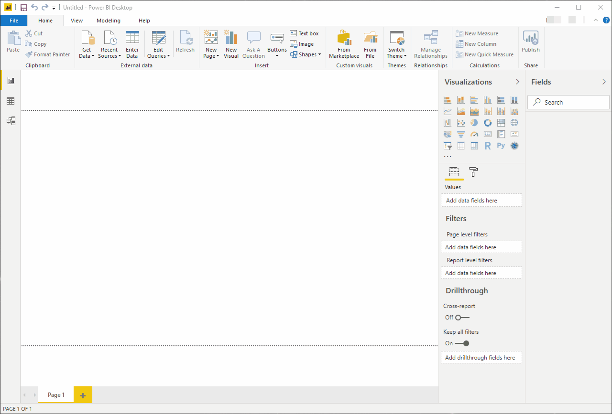
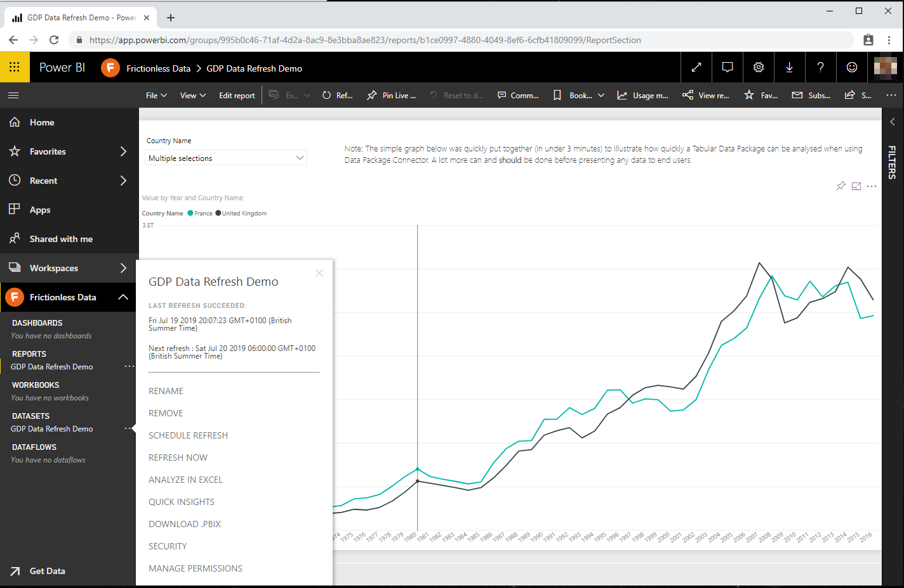

[Data Package Connector](https://github.com/nimblelearn/datapackage-connector), also known as datapackage-connector, is a [Power BI Custom Connector](https://docs.microsoft.com/en-us/power-bi/desktop-connector-extensibility) that enables you to quickly load one or more tables from Tabular Data Packages into Power BI. It builds on top of one of our other Frictionless Data projects, [Data Package M](/blog/2018/07/20/nimblelearn/) (also known as datapackage-m), and provides a user friendly Power BI ‘Get Data’ experience and also allows these Power BI tables to be refreshed directly from Tabular Data Packages within the Power BI Service. This has been a sought after capability because the Data Package M functions alone don’t currently support this scenario.

When we first created datapackage-m, we thought it would be quite powerful if it was possible to include a ‘Get Data’ experience in Power BI for Tabular Data Packages, but this wasn’t possible with Power Query M functions alone. For those of you not too familiar with Power BI, the ‘Get Data’ experience is a user interface (UI) wizard that guides you through some simple steps to  get data from supported data sources in Power BI. With datapackage-connector, we’ve introduced a ‘Get Data’ experience for Tabular Data packages which makes it easier to build Power BI reports and dashboards from Tabular Data Packages. This is especially useful when a Tabular Data Package has several tables that you’d like to load into Power BI in one go.

*How datapackage-connector works in Power BI*

datapackage-m has one major limitation from a Power BI perspective: it doesn’t support the ability to refresh data from within the Power BI service and this means the data refreshes must be done from Power BI Desktop. datapackage-connector,  being a Power BI connector, doesn’t have this limitation. This unlocks a new usage scenario where Power BI reports and dashboards can be built directly on top of Tabular Data Packages and kept up-to-date through scheduled data refreshes.

*datapackage-connector supports data refresh in the Power BI service*

datapackage-connector reuses the same Power Query M functions from datapackage-m and this means that it has the same level of Frictionless Data specs support. We’ll be keeping these two 
projects aligned as we further expand their support for the specs. Read more about datapackage-m [here](/blog/2018/07/20/nimblelearn/), and check out the documentation for datapackage-connector on our [GitHub repo](https://github.com/nimblelearn/datapackage-connector).
