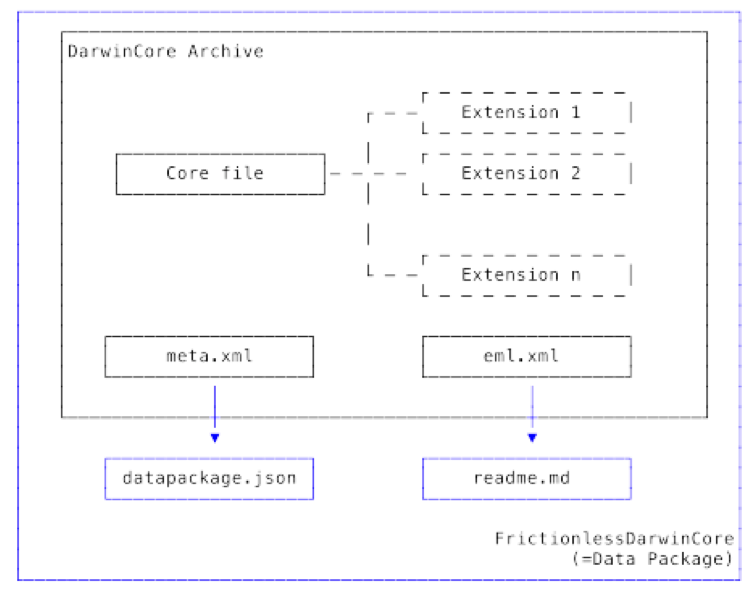
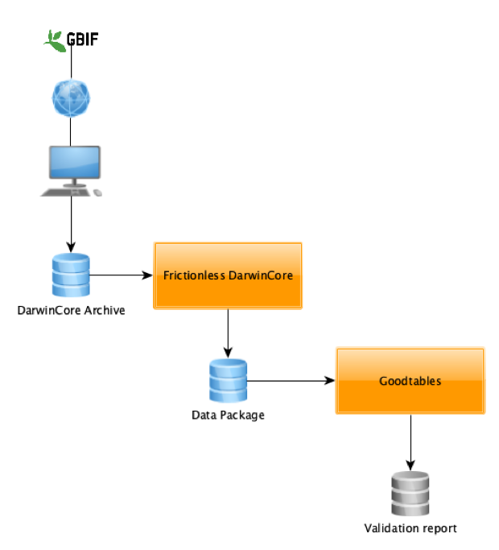

This blog is part of a series showcasing projects developed during the 2019 Frictionless Data Tool Fund.

<!-- more -->

Originally published [https://blog.okfn.org/2019/12/09/andre-heughebaert-frictionless-darwincore/](https://blog.okfn.org/2019/12/09/andre-heughebaert-frictionless-darwincore/)

*The 2019 Frictionless Data Tool Fund provided four mini-grants of $5,000 to support individuals or organisations in developing an open tool for reproducible research built using the Frictionless Data specifications and software. This fund is part of the Frictionless Data for Reproducible Research project, which is funded by the Sloan Foundation. This project applies our work in Frictionless Data to data-driven research disciplines, in order to facilitate reproducible data workflows in research contexts.*

André Heughebaert is an open biodiversity data advocate in his work and his free time. He is an IT Software Engineer at the Belgian Biodiversity Platform and is also the Belgian GBIF (Global Biodiversity Information Facility) Node manager. During this time, he has worked with the Darwin Core Standards and Open Biodiversity data on a daily basis. This work inspired him to apply for the Tool Fund, where he has developed a tool to convert DarwinCore Archives into Frictionless Data Packages.

The DarwinCore Archive (DwCA) is a standardised container for biodiversity data and metadata largely used amongst the GBIF community, which consists of more than 1,500 institutions around the world. The DwCA is used to publish biodiversity data about observations, collections specimens, species checklists and sampling events. However, this domain specific standard has some limitations, mainly the star schema (core table + extensions), rules that are sometimes too permissive, and a lack of controlled vocabularies for certain terms. These limitations encouraged André to investigate emerging open data standards. In 2016, he discovered Frictionless Data and published his first data package on historical data from 1815 Napoleonic Campaign of Belgium. He was then encouraged to create a tool that would, in part, build a bridge between these two open data ecosystems.

As a result, the Frictionless DarwinCore tool converts DwCA into Frictionless Data Packages, and also gives access to the vast Frictionless Data software ecosystem enabling constraints validation and support of a fully relational data schema.  Technically speaking, the tool is implemented as a Python library, and is exposed as a Command Line Interface. The tool automatically converts:

* DwCA data schema into datapackage.json
* EML metadata into human readable markdown readme file
* data files are converted when necessary, this is when default values are described

The resulting zip file complies to both DarwinCore and Frictionless specifications. 

   *Frictionless DarwinCore Flow*

André hopes that bridging the two standards will give an excellent opportunity for the GBIF community to provide open biodiversity data to a wider audience. He says this is also a good opportunity to discover the Frictionless Data specifications and assess their applicability to the biodiversity domain. In fact, on 9th October 2019, André presented the tool at a GBIF Global Nodes meeting. It was perceived by the nodes managers community as an exploratory and pioneering work. While the command line interface offers a simple user interface for non-programmers, others might prefer the more flexible and sophisticated Python API. André encourages anyone working with DarwinCore data, including all data publishers and data users of GBIF network, to try out the new tool. 

“I’m quite optimistic that the project will feed the necessary reflection on the evolution of our biodiversity standards and data flows.”

To get started, installation of the tool is done through a single pip install command (full directions can be found in the project README). Central to the tool is a table of DarwinCore terms linking a Data Package type, format and constraints for every DwC term. The tool can be used as CLI directly from your terminal window or as Python Library for developers. The tool can work with either locally stored or online DwCA. Once converted to Tabular DataPackage, the DwC data can then be ingested and further processed by software such as Goodtables, OpenRefine or any other Frictionless Data software.

André has aspirations to take the Frictionless DarwinCore tool further by encapsulating the tool in a web-service that will directly deliver Goodtables reports from a DwCA, which will make it even more user friendly. Additional ideas for further improvement would be including an import pathway for DarwinCore data into Open Refine, which is a popular tool in the GBIF community. André’s long term hope is that the Data Package will become an optional format for data download on GBIF.org.

  

Further reading:

Repository: https://github.com/frictionlessdata/FrictionlessDarwinCore

Project blog: https://andrejjh.github.io/fdwc.github.io/
