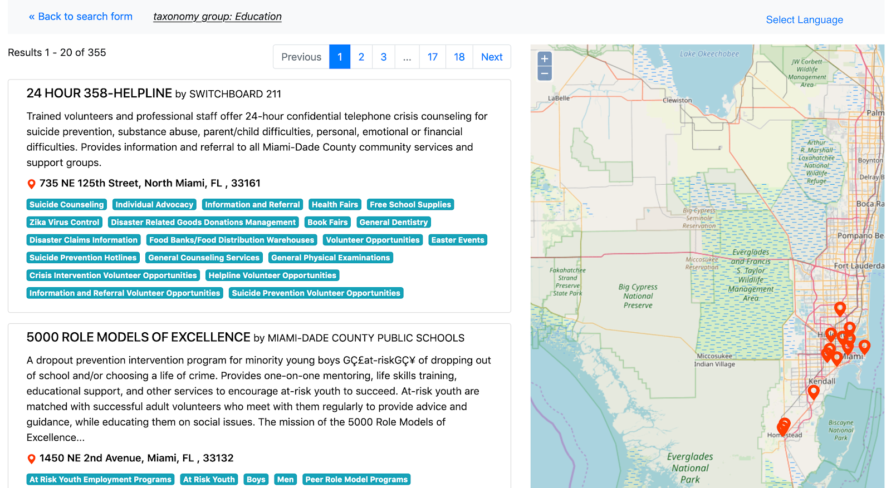

This blog is part of a series showcasing projects developed during the 2019 Tool Fund.
<!-- more -->
Originally published at [https://blog.okfn.org/2020/01/15/frictionless-data-tool-fund-update-shelby-switzer-and-greg-bloom-open-referral/](https://blog.okfn.org/2020/01/15/frictionless-data-tool-fund-update-shelby-switzer-and-greg-bloom-open-referral/)

*The 2019 Tool Fund provided four mini-grants of $5,000 to support individuals or organisations in developing an open tool for reproducible research built using the Frictionless Data specifications and software. This Fund is part of the Frictionless Data for Reproducible Research project, which is funded by the Sloan Foundation. This project applies our work in Frictionless Data to data-driven research disciplines, in order to facilitate reproducible data workflows in research contexts.*

Open Referral creates standards for health, human, and social services data -- the data found in community resource directories used to help find resources for people in need. In many organizations, this data lives in a multitude of formats, from handwritten notes to Excel files on a laptop to Microsoft SQL databases in the cloud. For community resource directories to be maximally useful to the public, this disparate data must be converted  into an interoperable format. Many organizations have decided to use Open Referral’s  Human Services Data Specification (HSDS) as that format. However, to accurately represent this data, HSDS uses multiple linked tables, which can be challenging to work with. To make this process easier, Greg Bloom and Shelby Switzer from Open Referral decided to implement datapackage bundling of their CSV files using the Frictionless Data Tool Fund. 

In order to accurately represent the relationships between organizations, the services they provide, and the locations they are offered, Open Referral aims to use their Human Service Data Specification (HSDS) makes sense of disparate data by linking multiple CSV files together by foreign keys.  Open Referral used Frictionless Data’s datapackage to specify the tables’ contents and relationships in a single machine-readable file, so that this standardized format could transport HSDS-compliant data in a way that all of the teams who work with this data can use: CSVs of linked data. 

In the Tool Fund, Open Referral worked on their HSDS Transformer tool, which enables a group or person to transform data into an HSDS-compliant data package, so that it can then be combined with other data or used in any number of applications. The HSDS-Transformer is a Ruby library that can be used during the extract, transform, load (ETL) workflow of raw community resource data. This library extracts the community resource data, transforms that data into HSDS-compliant CSVs, and generates a datapackage.json that describes the data output. The Transformer can also output the datapackage as a zip file, called HSDS Zip, enabling systems to send and receive a single compressed file rather than multiple files. The Transformer can be spun up in a docker container — and once it’s live, the API can deliver a payload that includes links to the source data and to the configuration file that maps the source data to HSDS fields. The Transformer then grabs the source data and uses the configuration file to transform the data and return a zip file of the HSDS-compliant datapackage. 

   *A demo app consuming the API generated from the HSDS Zip*

The Open Referral team has also been working on projects related to the HSDS Transformer and HSDS Zip. For example, the HSDS Validator checks that a given datapackage of community service data is HSDS-compliant.  Additionally, they have used these tools in the field with a project in Miami. For this project, the HSDS Transformer was used to transform data from a Microsoft SQL Server into an HSDS Zip. Then that zipped datapackage was used to populate a Human Services Data API with a generated developer portal and OpenAPI Specification.  

Further, as part of this work, the team also contributed to the original source code for the datapackage-rb Ruby gem. They added a new feature to infer a datapackage.json schema from a given set of CSVs, so that you can generate the json file automatically from your dataset.

Greg and Shelby are eager for the Open Referral community to use these new tools and provide feedback.  To use these tools currently, users should either be a Ruby developer who can use the gem as part of another Ruby project, or be familiar enough with Docker and HTTP APIs to start a Docker container and make an HTTP request to it. You can use the HSDS Transformer as a Ruby gem in another project or as a standalone API. In the future, the project might expand to include hosting the HSDS Transformer as a cloud service that anyone can use to transform their data, eliminating many of these technical requirements.

Interested in using these new tools? Open Referral wants to hear your feedback. For example, would it be useful to develop an extract-transform-load API, hosted in the cloud, that enables recurring transformation of nonstandardized human service directory data source into an HSDS-compliant datapackage? You can reach them via their GitHub repos.

Further reading:

Repository: https://github.com/openreferral/hsds-transformer
HSDS Transformer: https://openreferral.github.io/hsds-transformer/ 
