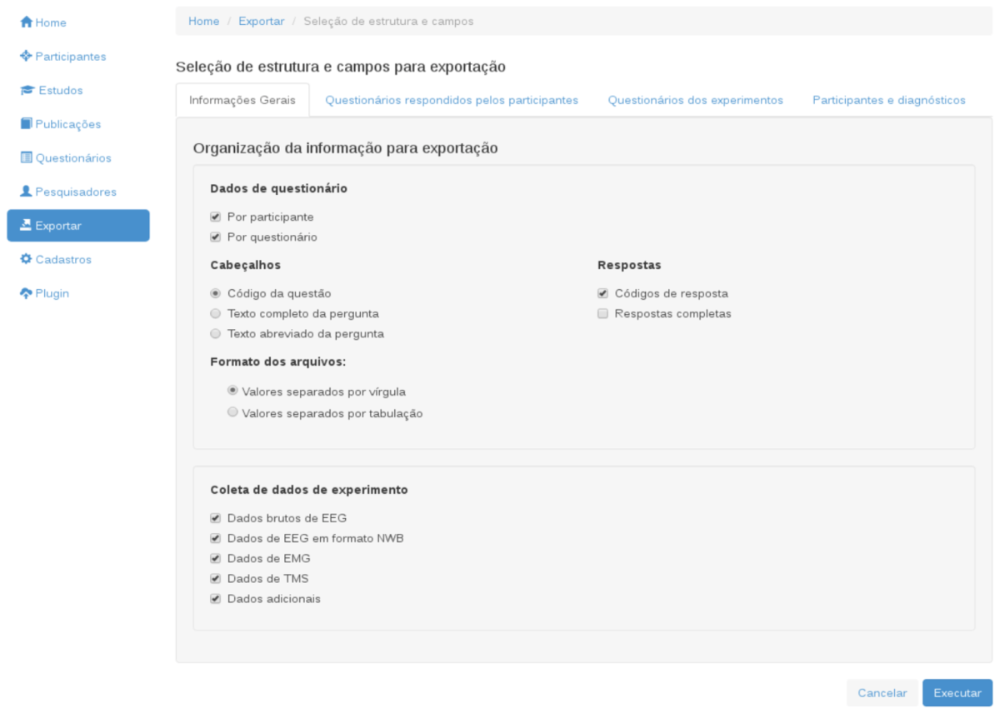
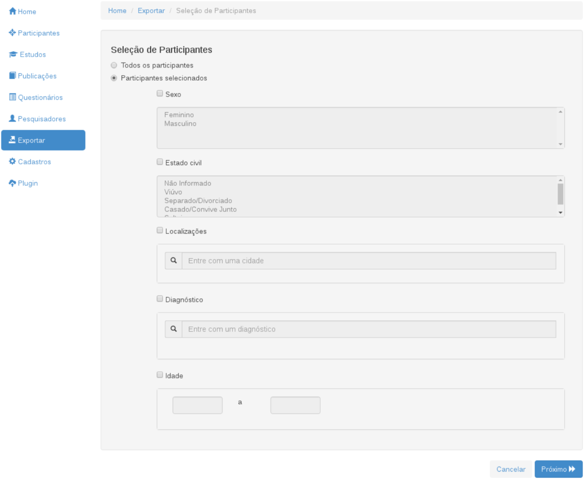
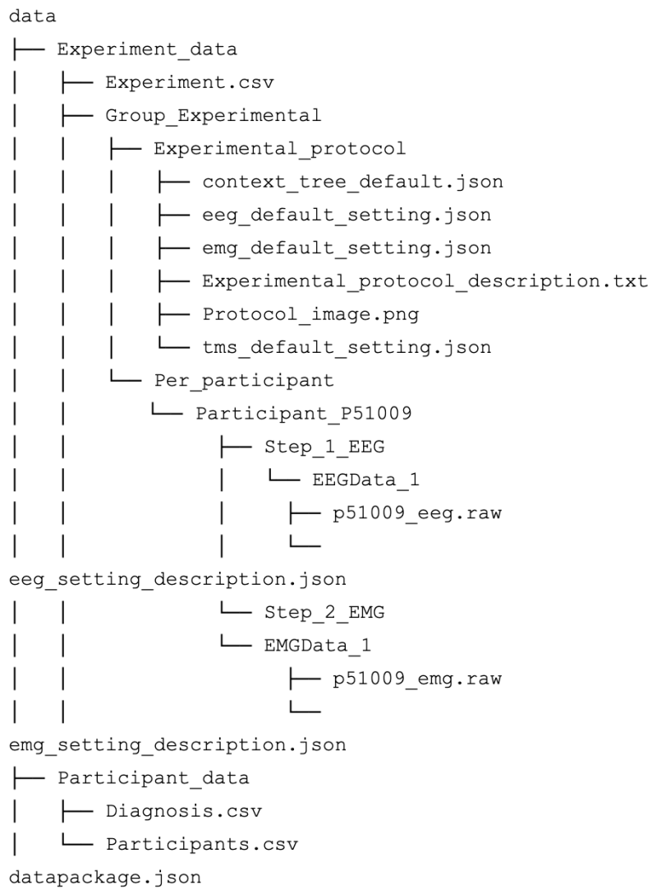

This blog is part of a series showcasing projects developed during the 2019 Tool Fund.
 <!-- more -->

Originally published at [https://blog.okfn.org/2019/12/16 neuroscience-experiments-system-frictionless-tool/](https://blog.okfn.org/2019/12/16/neuroscience-experiments-system-frictionless-tool/)

*The 2019 Tool Fund provided four mini-grants of $5,000 to support individuals or organisations in developing an open tool for reproducible research built using the Frictionless Data specifications and software. This Fund is part of the Frictionless Data for Reproducible Research project, which is funded by the Sloan Foundation. This project applies our work in Frictionless Data to data-driven research disciplines, in order to facilitate reproducible data workflows in research contexts.*

The Research, Innovation and Dissemination Center for Neuromathematics (RIDC NeuroMat) is a research center established in 2013 by the São Paulo Research Foundation (FAPESP) at the University of São Paulo, in Brazil. A core mission of NeuroMat is the development of open-source computational tools to aid in scientific dissemination and advance open knowledge and open science. To this end, the team has created the Neuroscience Experiments System (NES), which is an open-source tool to assist neuroscience research laboratories in routine procedures for data collection. To more effectively understand the function and treatment of brain pathologies, NES aids in recording data and metadata from various experiments, including clinical data, electrophysiological data, and fundamental provenance information. NES then stores that data in a structured way, allowing researchers to seek and share data and metadata from those neuroscience experiments.  For the 2019 Tool Fund, the NES team, particularly João Alexandre Peschanski, Cassiano dos Santos and Carlos Eduardo Ribas, proposed to adapt their existing export component to conform to the Frictionless Data specifications.

Public databases are seen as crucial by many members of the neuroscientific community as a means of moving science forward. However, simply opening up data is not enough; it should be created in a way that can be easily shared and used. For example, data and metadata should be readable by both researchers and machines, yet they typically are not. When the NES team learned about Frictionless Data, they were interested in trying to implement the specifications to help make the data and metadata in NES machine readable.  For them, the advantage of the Frictionless Data approach was to be able to standardize data opening and sharing within the neuroscience community.

Before the Tool Fund, NES had an export component that set up a file with folders and documents with information on an entire experiment (including data collected from participants, device metadata, questionnaires, etc. ), but they wanted to improve this export to be more structured and open. By implementing Frictionless Data specifications, the resulting export component includes the Data Package (datapackage.json) and the folders/files inside the archive, with a root folder called data. With this new “frictionless” export component, researchers can transport and share their export data with other researchers in a recognized open standard format (the Data Package), facilitating the understanding of that exported data. They have also implemented Goodtables into the unit tests to check data structure.

The RIDC NeuroMat team’s expectation is that many researchers,  particularly neuroscientists and experimentalists, will have an interest in using the freely available NES tool. With the anonymization of sensitive information, the data collected using NES can be publicly available through the NeuroMat Open Database, allowing any researcher to reproduce the experiment or simply use the data in a different study. In addition to storing collected experimental data and being a tool for guiding and documenting all the steps involved in a neuroscience experiment, NES has an integration with the Neuroscience Experiment Database, another NeuroMat project, based on a REST API, where NES users can send their experiments to become publicly available for other researchers to reproduce them or to use as inspiration for further experiments.

   *Screenshot of the export of an experiment*
   *Screenshot of the export of data on participants*
   *Picture of a hypothetical export file tree of type Per Experiment after the Frictionless Data implementation*

## Further reading

* Repository: https://github.com/neuromat/nes
* User manual: https://nes.readthedocs.io/en/latest/
* NeuroMat blog: https://neuromat.numec.prp.usp.br/
* Post on NES at the NeuroMat blog: https://neuromat.numec.prp.usp.br/content/a-pathway-to-reproducible-science-the-neuroscience-experiments-system/
