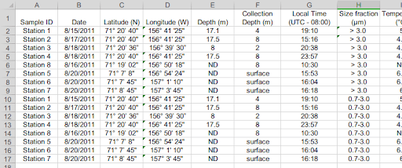
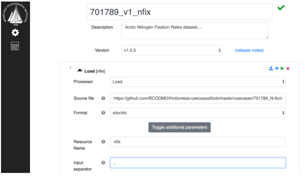
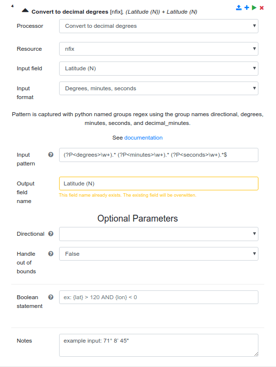
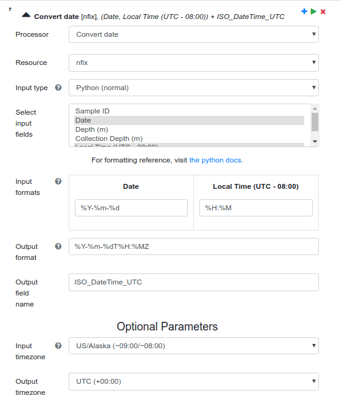
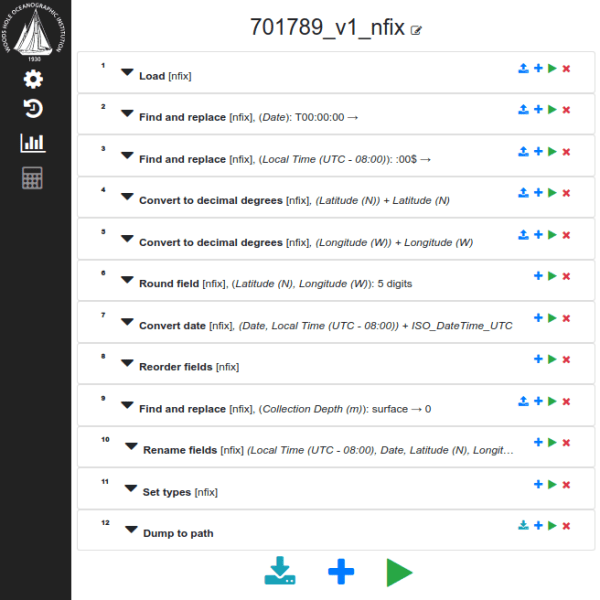
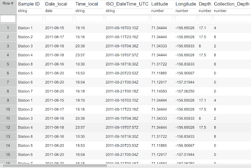

This blog post describes a Frictionless Data Pilot with the Biological and Chemical Oceanography Data Management Office (BCO-DMO). Pilot projects are part of the [Frictionless Data for Reproducible Research project](https://frictionlessdata.io/reproducible-research/). Written by the BCO-DMO team members Adam Shepherd, Amber York, Danie Kinkade, and development by Conrad Schloer.

<!-- more -->

Scientific research is implicitly reliant upon the creation, management, analysis, synthesis, and interpretation of data. When properly stewarded, data hold great potential to demonstrate the reproducibility of scientific results and accelerate scientific discovery. [The Biological and Chemical Oceanography Data Management Office (BCO-DMO)](https://www.bco-dmo.org/) is a publicly accessible earth science data repository established by the National Science Foundation [(NSF)](https://www.nsf.gov/) for the curation of biological, chemical, and biogeochemical oceanographic data from research in coastal, marine, and laboratory environments. With the groundswell surrounding the [FAIR data principles](https://doi.org/10.1038/sdata.2016.18), BCO-DMO recognized an opportunity to improve its curation services to better support reproducibility of results, while increasing process efficiencies for incoming data submissions. **In 2019, BCO-DMO worked with the Frictionless Data team at Open Knowledge Foundation to develop a web application called Laminar for creating Frictionlessdata Data Package Pipelines that help data managers process data efficiently while recording the provenance of their activities to support reproducibility of results.**

The mission of BCO-DMO is to provide investigators with data management services that span the full data lifecycle from data management planning, to data publication, and archiving.

BCO-DMO provides free access to oceanographic data through a web-based catalog with tools and features facilitating assessment of fitness for purpose. The result of this effort is a database containing over **9,000 datasets from a variety of oceanographic and limnological measurements** including those from: in situ sampling, moorings, floats and gliders, sediment traps; laboratory and mesocosm experiments; satellite images; derived parameters and model output; and synthesis products from data integration efforts. The project has worked with over 2,600 data contributors representing over 1,000 funded projects. 

As the catalog of data holdings continued to grow in both size and the variety of data types it curates, BCO-DMO needed to retool its data infrastructure with three goals. First, to improve the transportation of data to, from, and within BCO-DMO’s ecosystem. Second, to support reproducibility of research by making all curation activities of the office completely transparent and traceable. Finally, to improve the efficiency and consistency across data management staff. Until recently, data curation activities in the office were largely dependent on the individual capabilities of each data manager. While some of the staff were fluent in Python and other scripting languages, others were dependent on in-house custom developed tools. These in-house tools were extremely useful and flexible, but they were developed for an aging computing paradigm grounded in physical hardware accessing local data resources on disk. While locally stored data is still the convention at BCO-DMO, the distributed nature of the web coupled with the challenges of big data stretched this toolset beyond its original intention. 

In 2015, we were introduced to the idea of data containerization and the Frictionless Data project in a [Data Packages BoF](https://www.rd-alliance.org/data-packages-bof-p6-bof-session.html) at the [Research Data Alliance](https://www.rd-alliance.org/) conference in Paris, France. After evaluating the Frictionless Data specifications and tools, BCO-DMO developed a strategy to underpin its new data infrastructure on the ideas behind this project.

While the concept of data packaging is not new, the simplicity and extendibility of the Frictionless Data implementation made it easy to adopt within an existing infrastructure. **BCO-DMO identified the Data Package Pipelines (DPP) project in the Frictionless Data toolset as key to achieving its data curation goals.** DPP implements the philosophy of declarative workflows which trade code in a specific programming language that tells a computer how a task should be completed, for imperative, structured statements that detail what should be done. These structured statements abstract the user writing the statements from the actual code executing them, and are useful for reproducibility over long periods of time where programming languages age, change or algorithms improve. This flexibility was appealing because it meant the intent of the data manager could be translated into many varying programming (and data) languages over time without having to refactor older workflows. In data management, that means that one of the languages a DPP workflow captures is provenance – a common need across oceanographic datasets for reproducibility. DPP Workflows translated into records of provenance explicitly communicates to data submitters and future data users what BCO-DMO had done during the curation phase. Secondly, because workflow steps need to be interpreted by computers into code that carries out the instructions, it helped data management staff converge on a declarative language they could all share. This convergence meant cohesiveness, consistency, and efficiency across the team if we could implement DPP in a way they could all use.

**In 2018, BCO-DMO formed a partnership with Open Knowledge Foundation (OKF) to develop a web application that would help any BCO-DMO data manager use the declarative language they had developed in a consistent way.** Why develop a web application for DPP? As the data management staff evaluated DPP and Frictionless Data, they found that there was a learning curve to setting up the DPP environment and a deep understanding of the Frictionlessdata ‘Data Package’ specification was required. The web application abstracted this required knowledge to achieve two main goals: 1) consistently structured Data Packages (datapackage.json) with all the required metadata employed at BCO-DMO, and 2) efficiencies of time by eliminating typos and syntax errors made by data managers.  Thus, the partnership with OKF focused on making the needs of scientific research data a possibility within the Frictionless Data ecosystem of specs and tools.

[Data Package Pipelines](https://github.com/frictionlessdata/datapackage-pipelines) is implemented in Python and comes with some built-in processors that can be used in a workflow. BCO-DMO took its own declarative language and identified gaps in the built-in processors. For these gaps, BCO-DMO and OKF developed Python implementations for the missing declarations to support the curation of oceanographic data, and the result was a new set of processors made available on [Github](https://github.com/BCODMO/bcodmo_processors).

Some notable BCO-DMO processors are:

[boolean_add_computed_field](https://github.com/BCODMO/bcodmo_processors#bcodmo_pipeline_processorsboolean_add_computed_field)– Computes a new field to add to the data whether a particular row satisfies a certain set of criteria.
Example: Where Cruise_ID = ‘AT39-05’ and Station = 6, set Latitude to 22.1645.

[convert_date](https://github.com/BCODMO/bcodmo_processors#bcodmo_pipeline_processorsconvert_date) – Converts any number of fields containing date information into a single date field with display format and timezone options. Often data information is reported in multiple columns such as `year`, `month`, `day`, `hours_local_time`, `minutes_local_time`, `seconds_local_time`. For spatio-temporal datasets, it’s important to know the UTC date and time of the recorded data to ensure that searches for data with a time range are accurate. Here, these columns are combined to form an ISO 8601-compliant UTC datetime value.

[convert_to_decimal_degrees](https://github.com/BCODMO/bcodmo_processors#bcodmo_pipeline_processorsconvert_to_decimal_degrees) –  Convert a single field containing coordinate information from degrees-minutes-seconds or degrees-decimal_minutes to decimal_degrees. The standard representation at BCO-DMO for spatial data conforms to the decimal degrees specification.

[reorder_fields](https://github.com/BCODMO/bcodmo_processors#bcodmo_pipeline_processorsreorder_fields) –  Changes the order of columns within the data. This is a convention within the oceanographic data community to put certain columns at the beginning of tabular data to help contextualize the following columns. Examples of columns that are typically moved to the beginning are: dates, locations, instrument or vessel identifiers, and depth at collection. 

The remaining processors used by BCO-DMO can be found at https://github.com/BCODMO/bcodmo_processors. 

How does Laminar work?
In our collaboration with OKF, BCO-DMO developed use cases based on real-world data submissions. One such example is a recent Arctic Nitrogen Fixation Rates dataset.

The original dataset shown above needed the following curation steps to make the data more interoperable and reusable:

Convert lat/lon to decimal degrees
Add timestamp (UTC) in ISO format
‘Collection Depth’ with value “surface” should be changed to 0
Remove parenthesis and units from column names (field descriptions and units captured in metadata).
Remove spaces from column names
The web application, named Laminar, built on top of DPP helps Data Managers at BCO-DMO perform these operations in a consistent way. First, Laminar prompts us to name and describe the current pipeline being developed, and assumes that the data manager wants to load some data in to start the pipeline, and prompts for a source location.

After providing a name and description of our DPP workflow, we provide a data source to load, and give it the name, ‘nfix’.

In subsequent pipeline steps, we refer to ‘nfix’ as the resource we want to transform. For example, to convert the latitude and longitude into decimal degrees, we add a new step to the pipeline, select the ‘Convert to decimal degrees’ processor, a proxy for our custom processor convert_to_decimal_degrees’, select the ‘nfix’ resource, select a field form that ‘nfix’ data source, and specify the Python regex pattern identifying where the values for the degrees, minutes and seconds can be found in each value of the latitude column.

Similarly, in step 7 of this pipeline, we want to generate an ISO 8601-compliant UTC datetime value by combining the pre-existing ‘Date’ and ‘Local Time’ columns. This step is depicted below:

After the pipeline is completed, the interface displays all steps, and lets the data manager execute the pipeline by clicking the green ‘play’ button at the bottom. This button then generates the pipeline-spec.yaml file, executes the pipeline, and can display the resulting dataset.

The resulting DPP workflow contained 223 lines across this 12-step operation, and for a data manager, the web application reduces the chance of error if this pipelines was being generated by hand. Ultimately, our work with OKF helped us develop processors that follow the DPP conventions.

Our goal for the pilot project with OKF was to have BCO-DMO data managers using the Laminar for processing 80% of the data submissions we receive. The pilot was so successful, that data managers have processed 95% of new data submissions to the repository using the application.

This is exciting from a data management processing perspective because the use of Laminar is more sustainable, and acted to bring the team together to determine best strategies for processing, documentation, etc. This increase in consistency and efficiency is welcomed from an administrative perspective and helps with the training of any new data managers coming to the team.

The OKF team are excellent partners, who were the catalysts to a successful project. The next steps for BCO-DMO are to build on the success of The Frictionlessdata Data Package Pipelines by implementing the Frictionlessdata Goodtables specification for data validation to help us develop submission guidelines for common data types. Special thanks to the OKF team – Lilly Winfree, Evgeny Karev, and Jo Barrett.
