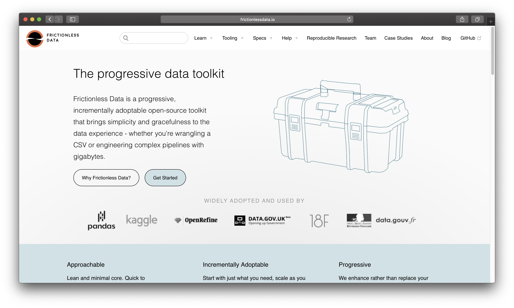
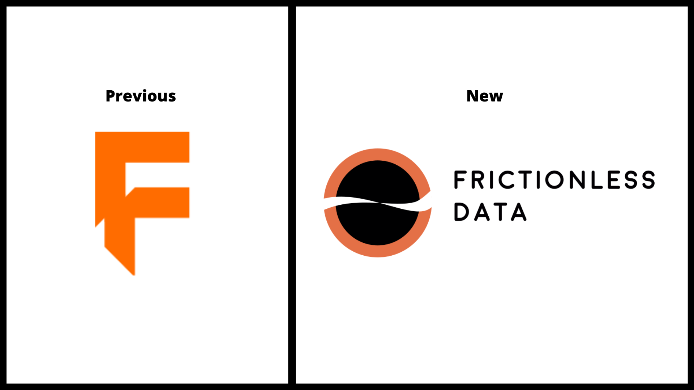
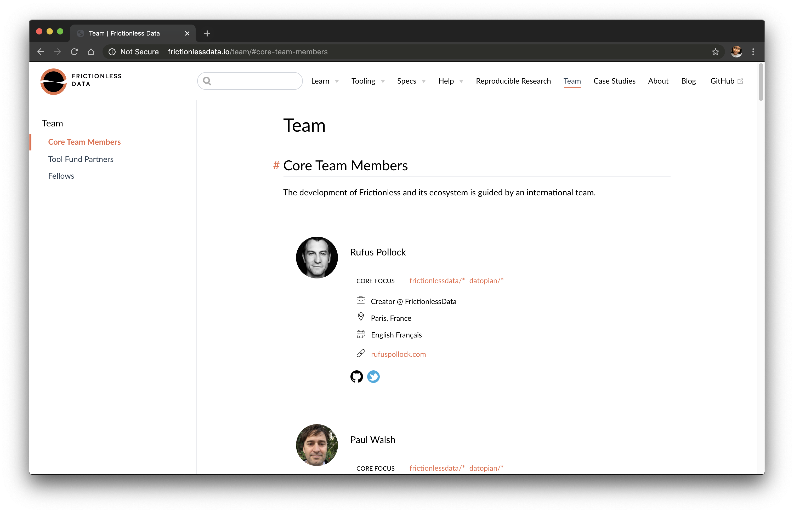

We’re excited to announce the launch of our newly designed Frictionless Data website. The goal of the rebranding was to better communicate our brand values and improve the user experience. We want Frictionless Data to be wildly successful – we want people to not only know about us, but also also use our tools by default.

<figure>
  
  <figcaption style="text-align: center">Screenshot of Frictionless Data Homepage</figcaption>
</figure>

We’ve improved the layout of our content, done some general changes on our brand logo, design, as well as on the whole site structure - the navigation is now more accessible with a sidebar option integrated so you can access key items easily and you get more from a quick read.

<figure>
  
  <figcaption style="text-align: center">Revamped Frictionless Brand Logo</figcaption>
</figure>

We have a new [Team page](https://frictionlessdata.io/team/) with a list of Core Team Members, Tool Fund Partners, and Reproducible Research Fellows contributing effort to the project. There are also many other smaller, but impactful changes, all aiming to make the experience of the Frictionless Data website much better for you.

<figure>
  
  <figcaption style="text-align: center">Frictionless Data Team Page</figcaption>
</figure>

In our bid to increase the adoption of our tooling and specifications, we are also working on rewriting our documentation. The current effort involved will birth a new subpage called the [Guide](https://frictionlessdata.io/guide/) - it's first section is even already published on the website. Furthermore, we'll be releasing different How-to's sections that'll walk our users through the steps required to solve a real-world data problem.

We hope you find our new website fresher, cleaner and clearer. If you have any feedback and/or improvement suggestions, please let us know on our [Discord Channel](https://discordapp.com/invite/Sewv6av) or on [Twitter](https://twitter.com/frictionlessd8a).
