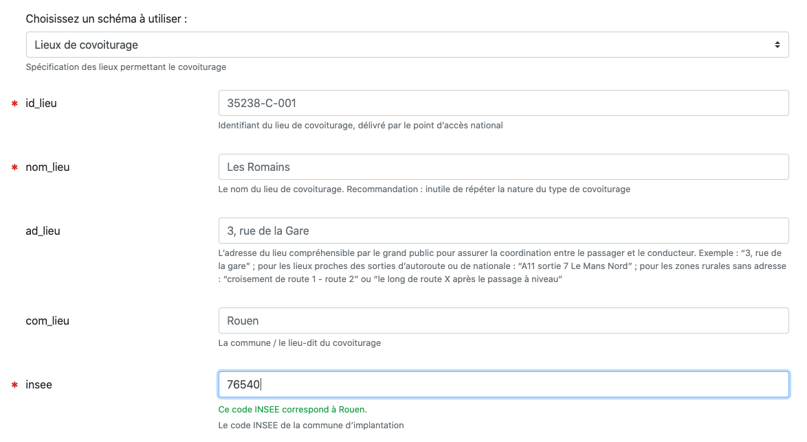

In June 2019, [Etalab](https://etalab.gouv.fr), a department of the French interministerial digital service (DINUM), launched [schema.data.gouv.fr](https://schema.data.gouv.fr), a platform listing schemas for France. It could be described as what Johan Richer recently called a [schema catalog](https://frictionlessdata.io/blog/2020/04/23/table-schema-catalog/). This project is an initiative of data.gouv.fr, the French open data platform, which is developed and maintained by Etalab.

## What's a schema?

A schema declares a data model in a clear and precise manner, the various fields and types in a structured and consistent manner, according to a specification. For example, [Table Schema](https://specs.frictionlessdata.io/table-schema/) is a simple language to declare a schema for tabular data.

Schemas are well suited for a wide range of applications: validating data against a schema, documenting a data model, consolidating data from multiple sources, generating example datasets, or proposing tailored input forms. This wide range of applications makes schemas an important tool for both producers and reusers.

## Advancing open data quality
A common complaint of open data reusers has been the lack of quality of the data and data structure changes over time, without notice. The OKFN spoke about this issue in mid-2017 in a blog post, [Open data quality – the next shift in open data?](https://blog.okfn.org/2017/05/31/open-data-quality-the-next-shift-in-open-data/)

With [schema.data.gouv.fr](schema.data.gouv.fr), Etalab promotes high-quality open data: producers are encouraged to discuss and come up with an appropriate schema for the data they want to publish, and to document it with a recognised specification. Producers will then be able to make sure that the data they publish conforms to the schema over time. Reusers benefit from high-quality documentation, a stable data structure, and increased quality of the data.

## Impacts
The first impact of the launch of [schema.data.gouv.fr](https://schema.data.gouv.fr) has **put at the forefront the challenge of open data quality**. It acknowledges that this is not a solved problem and that producers should embrace schemas, validators, documentation, automated testing to raise the quality of the data they publish. It's also a recognition of the efforts already made by the community, for example the "Socle commun des données locales" (Common Ground of Local Data) by [OpenDataFrance](http://www.opendatafrance.net).

To help producers discover schemas and how it can be helpful for them, we published in March 2020 a [long guide](https://guides.etalab.gouv.fr/producteurs-schemas/) going over steps producers are encouraged to follow when creating a schema: discovery, discussions, implementation, publication and finally referencing the schema on schema.data.gouv.fr.

Since the launch, producers worked with their reusers and published various schemas: [carpooling places](https://schema.data.gouv.fr/etalab/schema-lieux-covoiturage/latest.html) or [defibrillators](https://schema.data.gouv.fr/arsante/schema-dae/latest.html) to name a few. People had in-depth discussions about their data model, encouraged by the thoroughness of the Table Schema specification. Producers worked hard to clean their data and finally reached a point where their dataset is 100% aligned with the schema, without any errors.

## What's next

Here are a few things we are working on and hope to be able to finish in the coming years.

### Improved data models defined in the law

Right now, when data models are introduced by law, the data model is often described by a table. We'd like to offer a schema when these laws are published, to ease adoption by the community and improve discoverability.

### Integration with data.gouv.fr

The schema.data.gouv.fr initiative is mainly based on published datasets on the French open data platform data.gouv.fr. However, these tools are still quite separated today. In the coming months, we would like to strengthen the link between schema.data.gouv.fr and data.gouv.fr by promoting existing schemas directly on the open data platform. 

First, we would like to inform users of the existence of a consolidated dataset based on an existing schema and provide them with its quality report. Such a feature is newly available on schema.data.gouv.fr. The same feature will arrive soon on data.gouv.fr.

Second, we're looking into integrating schemas into the data publishing process on data.gouv.fr. We could help users by letting them know that a schema corresponding to their dataset already exists. We could suggest them what changes to make to get their data directly validated. We already started doing this with a simple implementation: we post comments on datasets which are supposed to follow a schema, letting producers know if the data is valid and if not, enabling them to access a report to troubleshoot.

Another possibility would be to offer a new service on data.gouv.fr such as the generation of data from an automatically generated form. This is the goal of the ongoing development of [CSV-GG](https://csv-gg.etalab.studio/?schema=etalab%2Fschema-lieux-covoiturage) allowing to generate a form from an existing Table Schema. This could help users to directly produce validated data.

### Automation

In the longer term, we also plan to automate data consolidation based on a schema as much as possible. For that, we need to better know and understand available resources on the platform. This could be done by systematically analyzing the content of a new resource and try to fetch metadata such as headers or type of data for each column.

These metadata could then be used to identify datasets with similar structures and link them to an existing schema or propose to create a new one if it does not already exist. 

We could also take advantage of the tool [CSVAPI](https://github.com/etalab/csvapi) which is actually in use on data.gouv.fr to preview data of a specific dataset. CSVAPI could evolve to offer new features such as highlighting quality problems directly in the dataset or navigating through different datasets with same - or partial - structures. The schema associated with a dataset could also help having a better preview by associating a type to each field. For example, a postal code could be recognized as such and the leading zero would not be cropped.

## Conclusion

All of the features mentioned in this article are intended to promote the usefulness and the value of schemas and lead to the creation of new ones. We hope this will result in an increase of the overall quality of the data hosted on data.gouv.fr.

Furthermore, we strongly believe that these features will help to link different users and producers with similar interests and therefore be in line with the community-based nature of data.gouv.fr.
