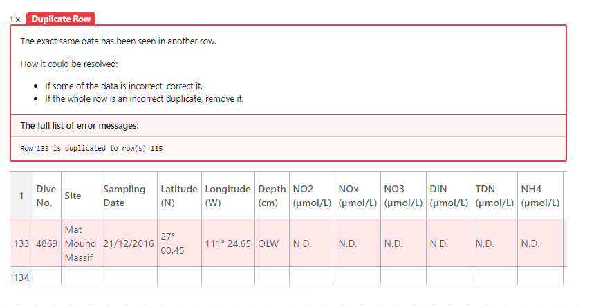
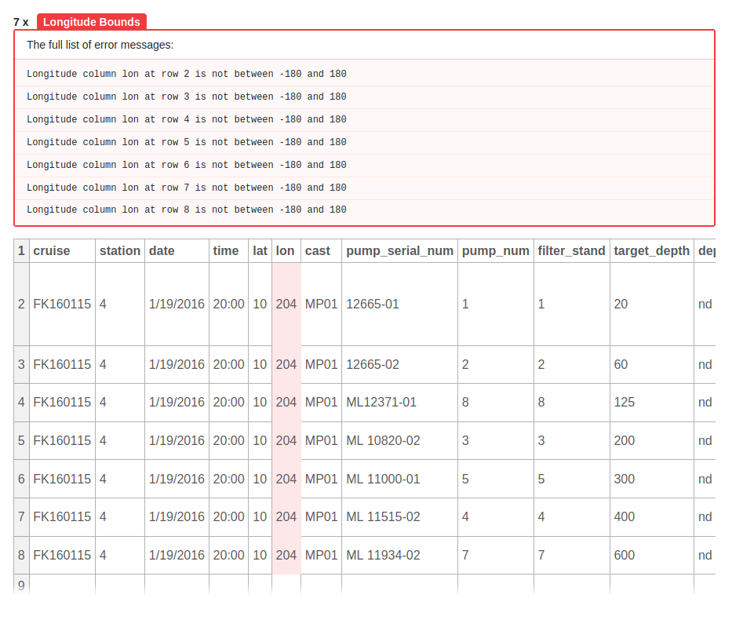

*This post was originally published on the [BCO-DMO blog](https://blog.bco-dmo.org/2020/09/14/goodtables).*

Earlier this year, the [Biological and Chemical Oceanography Data Management Office (BCO-DMO)](https://www.bco-dmo.org/) completed a pilot project with the [Open Knowledge Foundation (OKF)](https://okfn.org/) to [streamline the data curation processes for oceanographic datasets using Frictionless Data Pipelines (FDP)](https://blog.okfn.org/2020/02/10/frictionless-data-pipelines-for-ocean-science/). The goal of this pilot was to construct reproducible workflows that transformed the original data submitted to the office into archive-quality, [FAIR-compliant](https://doi.org/10.1038/sdata.2016.18) versions. FDP lets a user define an order of processing steps to perform on some data, and the project developed new processing steps specific to the needs of these oceanographic datasets. These ordered processing steps are saved into a configuration file that is then available to be used anytime the archived version of the dataset must be reproduced. The primary value of these configuration files is that they capture and make the curation process at BCO-DMO transparent. Subsequently, we found additional value internally by using FDP in three other areas. First, they made the curation process across our data managers much more consistent versus the ad-hoc data processing scripts they individually produced before FDP. Second, we found that data managers saved time because they could reuse pre-existing pipelines to process newer versions submitted for pre-existing datasets. Finally, the configuration files helped us keep track of what processes were used in case a bug or error was ever found in the processing code. This project exceeded our goal of using FDP on at least 80% of data submissions to BCO-DMO to where we now use it almost 100% of the time.

As a major deliverable from BCO-DMO’s [recent NSF award](https://www.nsf.gov/awardsearch/showAward?AWD_ID=1924618) the office planned to refactor its entire data infrastructure using techniques that would allow BCO-DMO to respond more rapidly to technological change. Using Frictionless Data as a backbone for data transport is a large piece of that transformation. Continuing to work with OKF, both groups sought to continue our collaboration by focusing on how to improve the data submission process at BCO-DMO.

*Goodtables noticed a duplicate row in an uploaded tabular data file.*

Part of what makes BCO-DMO a successful data curation office is our hands-on work helping researchers achieve compliance with the [NSF’s Sample and Data Policy coming from their Ocean Sciences division](https://www.nsf.gov/pubs/2017/nsf17037/nsf17037.jsp). Yet, a steady and constant queue of data submissions means that it can take some weeks before our data managers can thoroughly review data submissions and provide necessary feedback to submitters. In response, BCO-DMO has been creating a lightweight web application for submitting data while ensuring such a tool preserves the easy experience of submitting data that presently exists. Working with OKF, we wanted to expedite the data review process by providing data submitters with as much immediate feedback as possible by using Frictionless Data’s [GoodTables project](https://goodtables.io/).

Through a data submission platform, researchers would be able to upload data to BCO-DMO and, if tabular, get immediate feedback from Goodtables about whether it was correctly formatted or any other quality issues existed. With these reports at their disposal, submitters could update their submissions without having to wait for a BCO-DMO data manager to review. For small and minor changes this saves the submitter the headache of having to wait for simple feedback. The goal is to catch submitters at a time where they are focused on this data submission so that they don’t have to return weeks later and reconstitute their headspace around these data again. We catch them when their head is in the game.

Goodtables provides us a framework to branch out beyond simple tabular validation by developing data profiles. These profiles would let a submitter specify the type of data they are submitting. Is the data a bottle or CTD file? Does it contain latitude, longitude time or depth observations? These questions, optional for submitters to answer, would provide even further validation steps to get improved feedback immediately. For example, specifying that a file contains latitude or longitude columns could detect whether all values fall within valid bounds. Or that a depth column contains values above the surface. Or that the column pertaining to the time of an observation has inconsistent formatting across some of the rows. BCO-DMO can expand on this platform to continue to add new and better quality checks that submitters can use.

*Goodtables noticed a longitude that is outside a range of -180 to 180. This happended because BCO-DMO recommends using decimal degrees format between -180 to 180 and defined a Goodtables check for longitude fields.*