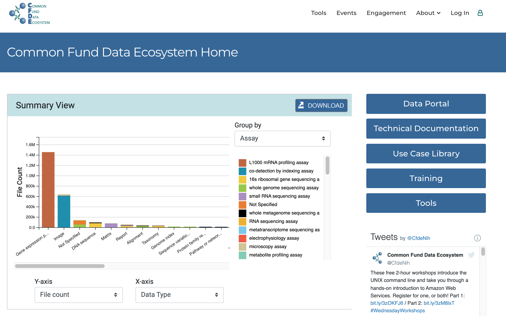
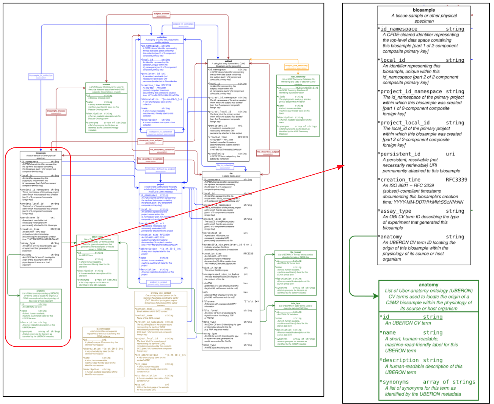
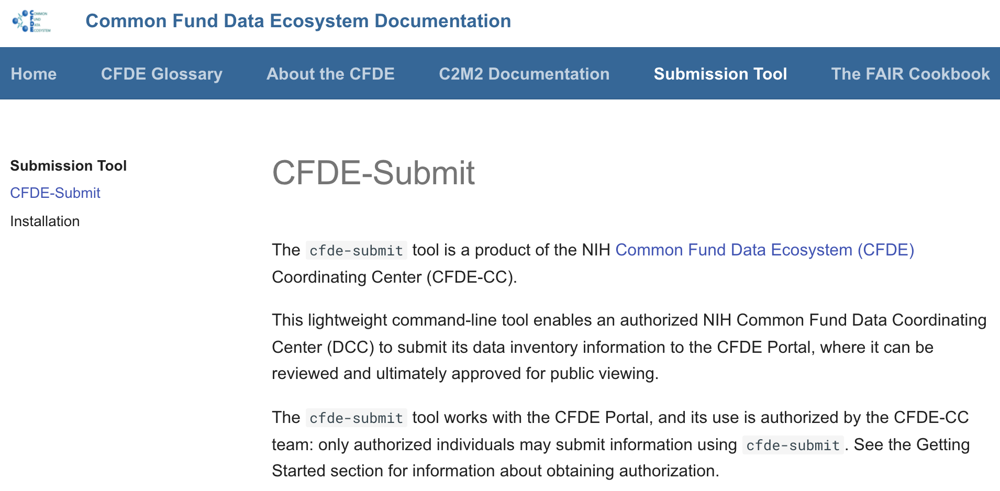

Scientific work produces a wealth of data every year - ranging from electrical signals in neurons to maze-running in mice to hospital readmission counts in patients. Taken as a whole, this data could be queried to discover new connections that could lead to new breakthroughs – how does that increased neuronal activity lead to better memory performance in a mouse, and does that relate to improved Alzheimer's outcomes in humans? The data is there, but it is often difficult to find and mobilize. 

A main reason that this data is under-utilized is because datasets are often created in fragmented, domain-specific, or proprietary formats that aren’t easily used by others. The Frictionless Data team has been working with Dr. Philippe Rocca-Serra on some of these key challenges – increasing data set discoverability and highlighting how disparate data can be combined. Establishing a dataset catalogue, or index, represents a solution for helping scientists discover data. But, this requires some level of data standardization from different sources. To accomplish this, Dr. Rocca-Serra with the NIH Common Fund Data Ecosystem (NIH CFDE) opted for the Frictionless Data for Reproducible Research Project at the Open Knowledge Foundation (OKF). 

The [NIH Common Fund Data Ecosystem](https://www.nih-cfde.org) project launched in 2019 with the aim of providing a data discovery portal in the form of a single venue where all data coordinating centers (DCC) funded by the NIH would index their experimental metadata. Therefore, the [NIH-CFDE](https://www.nih-cfde.org) is meant to be a data catalogue (Figure 1), allowing users to search the entire set of NIH funded programs from one single data aggregating site. Achieving this goal is no mean feat, requiring striking a balance between functional simplicity and useful detail. Data extraction from individual coordinating centers (for example LINCS DCC) into the selected format should be as straightforward as possible yet the underlying object model needs to be rich enough to allow meaningful structuring of the information.  

&NewLine;
> **Figure 1** shows the landing page of the NIH-CFDE data portal which welcomes visitors to a histogram detailing the datasets distribution based on data types and file counts by default. This settings may be changes to show sample counts, species or anatomical location for instance. 
url: https://www.nih-cfde.org/  
&NewLine;

Furthermore, it is highly desirable to ensure that structural and content validation is performed prior to upload, so only valid submissions are sent to the Deriva-based NIH CFDE catalogue. How could the team achieve these goals while keeping the agility and flexibility required to allow for iterations to occur, adjustments to be made, and integration of user feedback to be included without major overhauls?

Owing to the nature of the defined backend, the Deriva System, and the overall consistency of data stored by most DCCs, an object model was built around key objects, connected together via linked tables, very much following the [RDBMS / OLAP cubes paradigm](https://en.wikipedia.org/wiki/OLAP_cube).

With this as a background, the choice of using [OKF Frictionless data packages framework](https://frictionlessdata.io/standards/) came to the fore. The Frictionless specifications are straightforward to understand, supported by libraries available in different languages, allowing creation, I/O operations and validations of objects models as well as instance data.

Frictionless specifications offer several features which assist several aspects of data interoperation and reuse. The tabular data is always shipped with a JSON-formated definition of the field headers. Each field is typed to a data type but can also be marked-up with an RDFtype. Terminology harmonization relies on 4 resources, NCBI Taxonomy for species descriptions, UBERON for anatomical terms, OBI for experimental methods, and EDAM for data types and file format. Regular expression can be specified by the data model for input validation, and last but not least, the declaration of missing information can be made explicit and specific. The CFDE CrossCut Metadata Model (C2M2) relies on Frictionless specifications to define the objects and their relations (Figure 2).

&NewLine;
> **Figure 2** shows the latest version of the NIH CFDE data models where the central objects to enable data discovery are identified. Namely, study, biomaterial, biosample, file, each coming with a tight, essential set of attributes some of which associated to controlled vocabularies. url: https://docs.nih-cfde.org/en/latest/c2m2/draft-C2M2_specification/  
&NewLine;

Researchers can submit their metadata to the portal via the [Datapackage Submission System](https://docs.nih-cfde.org/en/latest/cfde-submit/docs/index.html)(Figure 3). By incorporating Frictionless specifications to produce a common metadata model and applying a thin layer of semantic harmonization on core biological objects, we are closer to the goal of making available an aggregated data index that increases visibility, reusability and clarity of access to a wealth of experimental data. The NIH CFDE data portal currently indexes over 2 million data files, mainly from RNA-Seq and imaging experiments from 9 major NIH programs: a treasure trove for data miners.

&NewLine;
> **Figure 3** shows the architecture of the software components supporting the overall operation, from ETL from the individual DCC into the NIH CFDE data model to the validation and upload component. 
url: https://docs.nih-cfde.org/en/latest/cfde-submit/docs/  
