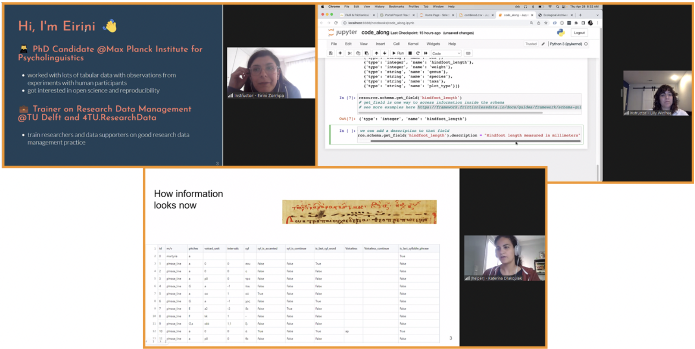
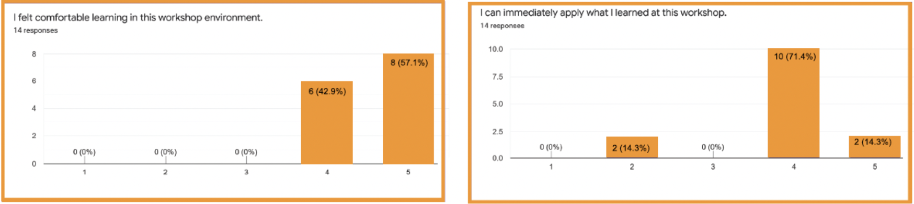

*Originally published on: https://community.data.4tu.nl/2022/05/19/workshop-on-fair-and-frictionless-workflows-for-tabular-data/*

4TU.ResearchData and Frictionless Data joined forces to organize the workshop [“FAIR and frictionless workflows for tabular data”](https://community.data.4tu.nl/2022/03/22/workshop-fair-and-frictionless-workflows-for-tabular-data-online/). The workshop took place on 28 and 29 April 2022 in an online format

On 28 and 29 April we ran the workshop “FAIR and frictionless workflows for tabular data” in collaboration with members of the [Frictionless Data project team](https://frictionlessdata.io/). 

This workshop was envisioned as a pilot to create training on reproducible and FAIR tools that researchers can use when working with tabular data, from creation to publication. The programme was a mixture of presentations, exercises and hands-on live coding sessions. We got a lot of inspiration from [The Carpentries](https://carpentries.org/) style of workshops and tried to create a safe, inclusive and interactive learning experience for the participants.

The workshop started with an introduction to Reproducible and FAIR research given by [Eirini Zormpa](https://www.tudelft.nl/library/research-data-management/r/support/data-stewardship/contact/eirini-zormpa) (Trainer at 4TU.ResearchData), who also introduced learners to best practices for data organization of tabular data based on the [Data Carpentry for Ecologists lesson](https://datacarpentry.org/spreadsheet-ecology-lesson/). You can have a look at [Eirini’s slides here](https://4turesearchdata-carpentries.github.io/frictionless-data-workshop/data-organisation.html#1).

The introduction was followed by a hands-on session exploring the [Frictionless Data framework](https://framework.frictionlessdata.io/). The Frictionless Data project has developed a full data management framework for Python to describe, extract, validate, and transform tabular data following the FAIR principles. [Lilly Winfree](https://www.linkedin.com/in/lilly-winfree-phd/) used Jupyter Notebook to introduce learners to the different tools, as it helps visualizing the steps of the workflow. You can access the presentation and the notebook (and all the materials of the workshop) used by Lilly in [this GitHub repository](https://github.com/4TUResearchData-Carpentries/FAIR-and-Frictionless-workflows-for-tabular-data-).

During the hands-on coding session, the learners practiced what they were learning on an example dataset from ecology (source of the dataset: [Data Carpentry for Ecologists](https://datacarpentry.org/ecology-workshop/)). Later in the workshop, Katerina Drakoulaki, Frictionless Data fellow and helper, also gave an example of how to apply the framework tools to a [dataset coming from the computational musicology field](https://github.com/4TUResearchData-Carpentries/FAIR-and-Frictionless-workflows-for-tabular-data-/blob/main/03_Frictionless%20Data-MBn%20presentation_28-4-2022.pdf).

We concluded the workshop with a presentation about [Data Publication](https://github.com/4TUResearchData-Carpentries/FAIR-and-Frictionless-workflows-for-tabular-data-/blob/main/04_FAIRandFRictionless%20workflows_Data_Publication.pdf) by [Paula Martinez Lavanchy](https://www.tudelft.nl/staff/p.m.martinezlavanchy/?cHash=38d458b8cd0f7bc5562cd130725220c6), Research Data Officer at 4TU.ResearchData. The presentation focused on why researchers should publish their data, how to select the data to publish and how to choose a good data repository that helps implement the FAIR principles to the researchers’ data. Paula also briefly demoed the features of 4TU.ResearchData using the [repository sandbox](https://sandbox.data.4tu.nl/).

Besides the instructors, we also had a great team of helpers that were there in case the learners encountered any technical problems or had questions during the live coding session. We would like to give a big thank you to: Nicolas Dintzner – TU Delft Data Steward of the Faculty of Technology, Policy & Management, Katerina Drakoulaki – Postdoctoral researcher, at NKUA & Frictionless Data Fellow, Aleksandra Wilczynska – Data Manager at TU Delft Library & the Digital Competence Center and Sara Petti – Project Manager at Open Knowledge Foundation.

&NewLine;
> **Image:** Top-left: Eirini Zormpa -Trainer of RDM and Open Science at TU Delft Library & 4TU.ResearchData, Top-right: Lilly Winfree – Product Manager of Frictionless Data at the Open Knowledge Foundation, Bottom: Katerina Drakoulaki – Postdoctoral researcher at NKUA & Frictionless Data fellow.
&NewLine;

Nineteen learners joined the workshop. The audience had a broad range of backgrounds with both researchers and support staff (e.g. data curator, research data manager, research software engineer, data librarian, etc.) represented. The workshop received quite positive feedback. Most of the learner’s expectations were fulfilled (79%) and they would recommend the workshop to other researchers (93%). It was also nice to know that most of the learners felt that they can apply what they learned immediately and they felt comfortable learning in the workshop.

&NewLine;
> **Images:** Feedback training event
&NewLine;

This feedback from the learners has helped us to start thinking about how to improve future runs of the workshop. For example, we used less time than we had planned, which creates the opportunity to provide instruction on more features of the framework or to add more exercises or practice time. The learners also indicated they would have liked to have a common document (e.g. Google doc or HackMD) to share reference material and to document the code that the instructor was typing in case they got lost.

Even though there is room for improvement, the learners appreciated  the highly practical approach of the workshop, the space they had to practice what they learned and the overall quality of the Frictionless Data framework tools. Here are some of the strengths that learners mentioned:

*‘Hands-on, can start using what I learned immediately’*

*‘Practical experience with the framework and working on shared examples.’*

*‘Machine readable data and packaging for interoperability through frictionless’*

*‘Very clear content. Assured assistance in case of technical problems. Adherence to timelines with breaks. Provided many in-depth links. Friendly atmosphere.’*

We at the 4TU.ResearchData team greatly enjoyed this collaboration that allowed us to help build the skills that researchers and other users of the repository need to make research data findable, accessible, interoperable and reproducible (FAIR). 
