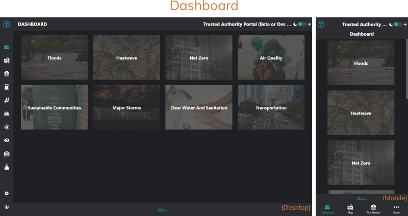
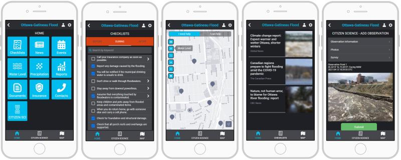
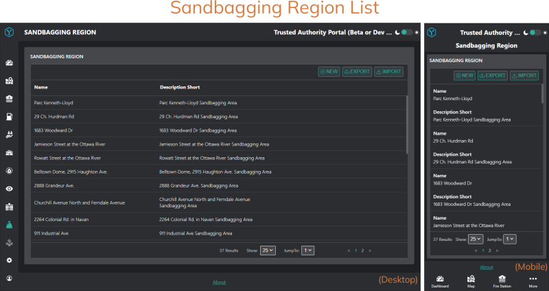
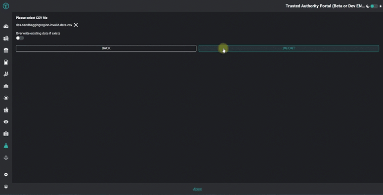

# Our Climate Change Research and Development Program
We’re Canadian software developers passionate about space and the Earth.
Since 2019, we have been working with hundreds of students, citizens, NGOs, scientists, and government officials to identify top communication problems getting citizens to act on climate change risks. We are exploring ways software can help authorities and ordinary citizens communicate better and prepare for, respond to, and recover from climate change impacts and natural disasters.
We have gathered unprecedented insights into how software can help and are now building a prototype to put these insights into practice and help individuals and communities before, during, and after a climate change impact or natural disaster. 
 
# Our Climate Change Software Prototype
The prototype is based on historic floods that occurred in Ottawa-Gatineau in 2017 and 2019, and is intended to demonstrate ways that software can help emergency responders and local government officials communicate better with the general public. 
It isn't intended to replace any emergency alert or other government systems. Instead, its focus is on communicating, collaborating with, and supporting individuals and communities as they prepare, respond, and recover from disasters and impacts.
The prototype is modular and organized into different sections, grouped by the intended main audience: 
## "Trusted Authorities" web portal
This audience includes emergency responders, government officials at the municipal, provincial, and federal levels, officials and staff at hydro-electric stations and municipal infrastructure, and other groups who would have authority over the planning, response, and recovery efforts. They produce and consume official data sources, and can share some of that information with the general public or citizen scientist audiences. The web portal contains sensitive, non-public information and therefore requires a secure login for verified users.
This is an example of the Trusted Authority Dashboard (showing other prototype"modules" in addition to the flooding): 
 

 
## General public (anonymous website)
The audience for this section of the prototype is the members of the public who are impacted by the flood, or likely to be. They consume official data sources but do not produce any of their own (in our current prototype). This section is a public, read-only website which does not require any login.
The information the public will see includes a variety of data sources including: checklists for disaster preparation, response, and recovery; curated news and social media information on the disaster; useful resources including emergency and insurance information; and more.
 
 
 
# What Data Does the Prototype Need?
As you can see from the screens above, the prototype needs to manage a wide variety of flood disaster-related data sets, from all kinds of providers and with varying degrees of reliability and quality.
Some of this data we consider to be"official" and "static" (meaning it exists before a disaster occurs). This kind of data include official government-sourced open data, such as a list of hospitals, police stations, and municipal infrastructure. 
Obviously these lists wouldn't change in the middle of a disaster, and would be prepared ahead of time.
However, there would also be a set of ad-hoc lists created to suit the particular needs of the disaster response and community involvement. This is data that is highly subjective to the particular circumstances of the disaster, cannot be known ahead of time, and is likely to evolve over the course of the disaster. 
Examples of such "dynamic data" include locations where sandbags are prepared, locations of emergency shelters, lists of emergency supplies and so on. 
 
 

Our software prototype allows users to upload CSV files as part of a data import process to make it easy and quick to populate the system with static or dynamic data. 
Ensuring the quality of ad-hoc data sets is of particular concern, since there are likely to be fewer quality checks for data generated rapidly in response to urgent need.
 
# Why Do We Need Frictionless Data?
Therefore, the prototype needs to ensure the users can only upload data that is considered valid according to the Frictionless schema. So before completing the import we have to check every file a user uploads. If it isn't valid, we need to display a detailed error message to the user so they can fix any errors and retry. 
This prevents a user from accidentally entering invalid information and potentially causing corrupt or incomplete records. 
It may appear that adding a validation check slows things down. However, this is actually a significantly faster and more user-friendly data import process. From a technical perspective, we can make an asynchronous RESTful call to the Frictionless Data validation service and the response is quick. From a process perspective, without Frictionless Data validation a user might not find out about issues until after the import, and would then have to waste valuable time and effort cleaning up data integrity errors.
Since the prototype is intended to help with a flood disaster response, it is critical to avoid any such delays or data integrity risks!
 
# How We Use Frictionless Data
To achieve the benefits above, we use the [Python Frictionless SDK](https://framework.frictionlessdata.io/) hosted in the Amazon Web Services (AWS) cloud. 
The code is written in Python programming language. The main Frictionless elements we use currently are the `Resource` schema and the `validate()` feature. The Python code is deployed as a Lambda layer behind an AWS API Gateway service.
This technical architecture allows us to easily call the Frictionless Data validation feature from our software solutions via simple REST methods calls. The feature can be deployed, secured, and scaled independently of the other prototype components.
Of course the code needs to know what schemas to validate against. We create and store Deploy Solutions frictionless schemas for the data sets we described above. There is one schema created for each type of data that we allow a user to import. We store these in a single AmazonS3 bucket, that can only be accessed by the Lambda layer.
When a user uploads a CSV file into our prototype, they have to choose which type of data they are saving so we know which schema to validate against (depending on which page they're on, we can usually make this choice for them). 
For example, if a user was uploading a list of Sandbag assembly locations, the software would know to validate against _the dss-sandbaggingregion_schema.json_ Frictionless schema.
We then create a Frictionless Resource file which consists of the uploaded CSV and the matching schema. Using this Resource file, our software calls the Frictionless `validate()` method and receives the validation report back.
If errors are found, these need to be returned back to the user. In our front-end web client (we use Angular), we format the raw report into table display. The report tells the user precisely which row, column and cell requires fixing, saving them valuable time and eliminating more errors!
You can see the result in the animated GIF below.
 

 
Obviously the technical complexities mentioned above are hidden away and the user just sees a very simple and intuitive set of validation messages - or hopefully just a success message!
You can see a full video of this process on our video showcase page: https://showcase.oasis.climatechange.ca
 
# Want to Learn More About Our Software Prototype and Climate Change Software R&D?
We've created a new service to share our climate change software development knowledge. It's called "OASIS: Software Solutions for Climate Change Problems".
The OASIS service includes a free weekly newsletter and premium subscription service. It shares unique insights, content, resources, and guidance on how to use software and data from Earth and space to build solutions for climate change problems.
Learn more, and subscribe to the free newsletter, at https://oasis.climatechange.ca.
